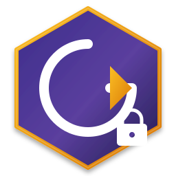
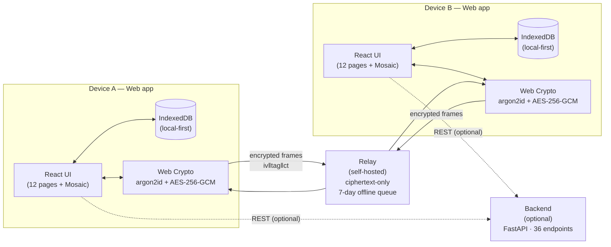

<div align="center">

<picture>
  <source media="(prefers-color-scheme: dark)" srcset="docs/assets/logo.svg">
  
</picture>

# Goto

**A local-first, end-to-end-encrypted personal time asset manager.**
Your to-do list doesn't have to live on someone else's server.

[](LICENSE)
[](#quality-bar)
[](#quality-bar)
[](#quality-bar)
[](#quality-bar)
[](#end-to-end-encrypted-sync)
[](SECURITY.md)
[](#running-it)
[](https://gitcode.com/badhope/goto/issues)

**English** · [中文](README.zh-CN.md)

[Quick start](#running-it) · [Architecture](#architecture) · [Security](#security) · [Docs](#documentation) · [Report a bug](https://gitcode.com/badhope/goto/issues)

</div>

---

## TL;DR

```bash
git clone https://gitcode.com/badhope/goto.git
cd goto/desktop && npm install && npm run dev
# → http://localhost:5173  ·  set a master password  ·  start writing tasks
```

Optional self-hosted relay (for cross-device sync):

```bash
cd goto/relay && docker compose up -d
```

That's it. No account, no cloud, no telemetry. Your data stays in your browser's IndexedDB, encrypted with Web Crypto under a master password only you know.

---

## Why this exists

Most task managers pick one of two lanes: pure-local (great on one device,
useless the moment you switch laptops) or cloud-synced (convenient, but
every plan, habit and note you keep ends up on someone else's disk).
Goto takes the third path — **data lives on your devices by default,
and when it syncs across devices it's end-to-end encrypted**. The relay
server only ever sees ciphertext frames.

I started it because I wanted a todo app I could actually use on the
train (no network), on my laptop (full keyboard), without mailing my
life to a SaaS. The interesting parts, in my opinion:

- **Three components, one data model.** A browser web app (the `desktop/`
  directory — Vite + React), an optional Python backend, and a
  self-hostable relay. Every persisted object carries `updatedAt`, so the
  same record flows across local storage, the backend, and paired devices.
- **E2EE sync that's cross-platform.** The web app uses the Web Crypto
  API; the relay is transport-only and never decrypts. Records are
  AES-256-GCM sealed under a Sync Master Key exchanged during pairing.
  The test suite includes sync-protocol and interop cases.
- **Local-first by default, not as a marketing tag.** No Goto
  account exists. The relay can't read your data. If you never pair a
  second device, nothing ever leaves the first one.
- **Auto-tag suggestions (keyword-based).** A built-in plugin matches
  keywords in task titles (shopping / work / health / study) and
  auto-applies tags. Statistical AI engine and LLM features described in
  earlier docs are **not yet implemented** — see roadmap.

## Architecture



Three components, one data model — every record carries `updatedAt`, so the same object flows across local storage, the optional backend, and paired devices. The relay only ever sees ciphertext.

## What's in the box

| Component | Stack | What it does |
| --- | --- | --- |
| **Web app** (`desktop/`) | Vite · React 18 · Zustand 4 · TypeScript 5 | Local-first browser task manager. Persists to IndexedDB, encrypts the vault with Web Crypto (argon2id), and encrypts JSON backups with argon2id (m=64MB t=3 p=4) + AES-256-GCM (legacy PBKDF2 backups read-only compatible). **12 pages + Mosaic timeline view** (Today / Calendar / Projects / Project detail / Categories / Tags / Search / Vault / Settings / Kanban / Insights / Weekly Review), reminders, recurrence, subtasks, NLP quick-add, bulk ops, drag-reorder, vim shortcuts, PWA installable, 6-section Settings (Security / Appearance / Shortcuts / Data / Sync / Danger zone). |
| **Relay** | Node.js 18+ (≥20) · WebSocket · express-rate-limit · Docker | Forwards ciphertext frames only, with an offline queue (7-day TTL). LAN-first, relay as fallback. |
| **Backend** | Python 3.11+ · FastAPI · PyGit2 | Optional: task/project/category/tag API, git management, plugin system. Decoupled from the sync path. **36 REST endpoints.** |

The web app syncs across devices over an encrypted P2P session via the
relay; the relay is just a porter that never decrypts.

## Pages

The web app ships **12 pages** — Today, Calendar, Projects, **Project detail**
(`/projects/:id`), Categories, Tags, Search, Vault, Settings, **Kanban**,
**Insights** (statistics dashboard with Karma score), **Weekly Review** —
plus a Mosaic timeline view. The Gantt / Timeline / TimeBlock / Table /
MindMap views and Templates / Automation / Notes / Analytics / Goals /
Habits pages are **not yet implemented** — see
[docs/ROADMAP.md](docs/ROADMAP.md) for the roadmap.

Task dependencies (`blockedBy` / `blocks`) stop you marking a task done
when something it's waiting on is still open.

## Settings & shortcuts

The Settings page is split into **Security / Appearance / Shortcuts /
Data / Sync / Danger zone**:

- **Security**: unlock method (master password only (no biometric — Web platform has no usable WebAuthn landing yet)), auto-lock duration (off / 1 / 5 / 15 / 30 / 60 min,
  upgraded from the old fixed 5-min toggle), screenshot/recording protection
  (effective inside the desktop shell, marked as best-effort on Web),
  **change master password** (validates the old password, derives a new
  verifier, clears the key cache; previously exported backups still need
  the old password), **3-strikes password cooldown** (30 s lockout after
  three consecutive wrong passwords).
- **Appearance**: theme (light / dark / system), **font size** (small /
  medium / large) — scales every rem-based element via a root
  `data-font-size` attribute.
- **Shortcuts**: a `?` shortcut opens a help overlay listing every
  registered binding (`?` / `Mod+L` / `Mod+B` / `Mod+K` / `/` / `Mod+N` /
  `Esc`); the Settings page also has a "view all shortcuts" button.
- **Data**: encrypted backup export/import (argon2id +
  AES-256-GCM) and plaintext JSON export/import (vault excluded from JSON
  for credential safety).
- **Sync**: relay URL, device identity, pairing (host / join), paired
  device list, revocation.
- **Danger zone** (red-bordered, two-step confirm): **clear all data**
  (tasks / vault / projects / categories / tags / search history / sync
  identity, but keeps the master password and existing backups) and
  **factory reset** (also deletes the master password and security
  settings, then reloads to first-run state; existing encrypted backups
  still recover with the old password).

## End-to-end encrypted sync

This is where most of the time went. Two devices handshake before
syncing, verify each other's identity, derive a pair of
direction-isolated session keys, then every record flows under
AES-256-GCM. The relay sees bytes, not content.

```
identity    Ed25519 long-term keypair per device, private key in the
            web app's secure storage (IndexedDB + Web Crypto)
            deviceId = sha256(raw SPKI pubkey), first 16 hex
handshake   X25519 ephemeral keys do ECDH; both sides Ed25519-sign the
            transcript (MITM resistance)
derive      HKDF-SHA256 → sendKey / receiveKey, info bound by direction
records     Sync Master Key (SMK) does AES-256-GCM, wire = iv[12]‖tag[16]‖ct
conflict    updatedAt (LWW) first, version vectors break same-ms ties
transport   9 message types, frame = mode[1]‖length[4 BE]‖payload
            sequence number + sliding window for replay protection
```

Pairing is an 8-digit code, 5-minute TTL, one-shot. SMK is generated by
the host and transferred to the joiner over the encrypted pairing
session, then compared in constant time — if it doesn't match, pairing
is rejected rather than silently continuing into a state where every
later sync would fail to decrypt. Device revocation is a four-step
orchestration: kill the runtime session, drop the device record, clear
its outbox, and only reset the SMK when no paired devices remain.

## Features at a glance

| Area | What you get |
| --- | --- |
| **Local-first** | Data in IndexedDB. No account, no cloud, no telemetry. |
| **E2EE sync** | AES-256-GCM under a Sync Master Key; relay only sees ciphertext. |
| **Vault** | Field-level AES-256-GCM for sensitive entries. Password generator included. |
| **Backups** | Encrypted JSON export: argon2id + AES-256-GCM. Plaintext export excludes vault. |
| **Master password** | argon2id verifier only; password never persisted. Changeable in Settings. |
| **Brute-force cooldown** | 3 wrong passwords → 30 s lockout. |
| **Auto-lock** | Off / 1 / 5 (default) / 15 / 30 / 60 min, or lock-on-blur. |
| **Privacy shell** | Lock screen, privacy mode (hide vault), clipboard auto-clear (default 30 s, configurable). |
| **Danger zone** | Clear all data (keep password & backups) / Factory reset (wipe password, reload to first-run). |
| **Appearance** | Light / dark / system + font size (small / medium / large). |
| **Shortcuts** | `?` opens a help overlay. `Mod+L` lock, `Mod+B` sidebar, `Mod+K` search, `/` focus new task, `Mod+N` new task, `Esc` close. **Vim-style** `j`/`k`/`e`/`x`/`d`/`gg`/`G` in task list. |
| **Mosaic view** | A "time tape" rendering of all tasks — timeline-as-mosaic. |
| **Auto-tag** | Keyword-based plugin (shopping / work / health / study). |
| **Task deps** | `blockedBy` / `blocks` prevent marking a task done while upstream is open. |
| **Reminders** | Per-task `reminderDate` triggers a browser Notification (PWA installable, SW wakes in background). |
| **Recurrence** | Full `RecurrenceRule` editor (daily / weekly / monthly / yearly + interval + daysOfWeek + end-by date/count). Completing a recurring task auto-generates the next instance. |
| **Subtasks** | Per-task subtask list — add / delete / check / rename in card or editor. |
| **NLP quick add** | Type "明天 3点 高! 30分钟 #工作 +项目" — parser fills dueDate / priority / estimatedTime / tags / project. |
| **Bulk ops** | Multi-select tasks → complete / delete / change priority / move to project. |
| **Drag reorder** | `@dnd-kit`-powered drag to reorder tasks (PointerSensor + KeyboardSensor for a11y). |
| **Kanban view** | 5 columns (todo / in-progress / waiting / delegated / completed) — drag across columns to change status. |
| **Insights** | Karma score (Todoist-style 7d×10 + 14d×5, capped at 1000), 14-day completion trend, breakdowns by priority / status / project. |
| **Weekly review** | Week-at-a-glance (completed / stalled / overdue / due this week / per-project progress) + reflection notes + archive-30d-old button. |
| **PWA** | Installable (manifest + SVG icons + shortcuts). Workbox caching: assets CacheFirst, app shell NetworkFirst, /api & /ws never cached. |
| **Plugin system** | Registry + built-in plugins. Backend extends with custom plugins. |
| **Tests** | 771 total: 550 unit + 26 skipped + 108 e2e + 104 backend + 9 relay. |

## Running it

### Web app (`desktop/`)

```bash
cd desktop
npm install
npm run dev       # Vite dev server, opens http://localhost:5173
```

For a deployable static bundle:

```bash
npm run build     # writes dist/renderer/ (static SPA) — serve that dir
```

### Relay (self-hosted)

```bash
cd relay
docker compose up -d   # uses relay/docker-compose.yml
```

TLS, Nginx reverse proxy and ACME notes are in
[docs/relay-deployment.md](docs/relay-deployment.md). The relay only
needs to reach the public internet; it never sees plaintext.

### Backend (optional)

```bash
cd backend
python -m venv .venv && source .venv/bin/activate
pip install -r requirements.txt
uvicorn app.main:app --reload
```

OpenAPI spec is auto-generated and CI-validated — see
[backend/docs/openapi.json](backend/docs/openapi.json) (36 endpoints).

## Project layout

```
desktop/                 # pure-browser web app (Vite + React 18 + Zustand 4)
  src/renderer/          # React UI (task pages, vault, sync settings, ...)
  src/shared/
    api/                 # backend REST client (tasks/projects/categories/tags)
    store/               # Zustand store, state lives in slices/
    sync/                # E2EE sync stack (Web Crypto, talks to the relay)
    utils/               # secure storage (IndexedDB + Web Crypto / argon2id)
  src/renderer/lib/      # webAPI: local IndexedDB implementation
                         # (local-first data access, no native bridge)
relay/                   # self-hostable WebSocket relay + Docker
backend/                 # optional FastAPI service
docs/                    # roadmap, relay deployment, developer guide
```

The web app keeps two data paths: `shared/api/*` talks to the optional
backend over REST, while `lib/webAPI.ts` persists locally to IndexedDB.
The E2EE sync stack in `shared/sync/*` pairs devices through the relay.

## Quality bar

```bash
# web app (desktop/)
cd desktop && npm run typecheck && npm run lint && npm test

# backend
cd backend && python -m ruff check app && python -m mypy app && python -m pytest tests/ -q

# relay
cd relay && npx tsc --noEmit && npm test
```

I aim for "0 errors" on all three. The test baseline is **771 tests**
(web app unit 550 + 26 skipped | web app e2e 108 | backend 104 | relay 9),
all green on `main`. The 5000-record end-to-end sync benchmark lands at
649 ms (7699 rec/s) — that figure used to be 52 s before fixing a
REQUEST-chunking bug and batching the inserts into one transaction.

## Security

Security measures in place: CORS allowlist, Bearer-token auth, log
redaction, path validation, DNS-rebinding defense, argon2id verifier.
Vulnerability reporting is private — see
[SECURITY.md](SECURITY.md).

## Deployment

The repo ships `ci.yml` — desktop lint/typecheck/test/build + e2e +
backend ruff/mypy/pytest + relay vitest, all on every push and PR.

The GitHub Pages site is only an introduction page; the web app itself
is a static SPA you can host anywhere.

## Documentation

| Doc | What it covers |
| --- | --- |
| [ARCHITECTURE.md](ARCHITECTURE.md) | Layering, state model, sync protocol stack |
| [QUICK_START.md](QUICK_START.md) | Three paths to a running app |
| [docs/ROADMAP.md](docs/ROADMAP.md) | What's done and what's next |
| [docs/DEVELOPER_GUIDE.md](docs/DEVELOPER_GUIDE.md) | Dev workflow, commands, sync strategy |
| [docs/relay-deployment.md](docs/relay-deployment.md) | Self-hosting the relay, TLS, Nginx |
| [docs/fuzzing.md](docs/fuzzing.md) | Property-based fuzzing with Hypothesis |
| [CHANGELOG.md](CHANGELOG.md) | Per-phase change log |
| [FAQ.md](FAQ.md) | Stuff people actually run into |
| [SECURITY.md](SECURITY.md) | Supported versions, private disclosure |
| [SUPPORT.md](SUPPORT.md) | Where to get help, report issues, sponsor |
| [PRIVACY.md](PRIVACY.md) | Privacy policy — local-first, E2EE, GDPR Article 9 |
| [TERMS.md](TERMS.md) | Terms of service — UGC responsibility, E2EE safe harbor |

## Mirrors

项目主要托管在 GitCode（国内可访问），所有 Issue 和 PR 请在 GitCode 提交。

| Host | Repo |
| --- | --- |
| GitCode | `gitcode.com/badhope/goto` |

## Known caveats

- The web build is a single SPA bundle under `desktop/dist/renderer` —
  fine for static hosting / GitHub Pages. Run `npm run build` in
  `desktop/` and check `dist/renderer/` for the current size.
- Voice input is web-only.
- The web app has a privacy mode (hides the vault) but no OS-level
  screenshot blocking — that requires a native shell, which this web
  build does not have.
- Cross-device sync requires a relay (self-hosted or official) for
  pairing. Once paired, LAN-direct is preferred when reachable; the
  relay is fallback.

## FAQ — things people actually ask

- **Can I recover a forgotten master password?** No. The password is never persisted — only an argon2id verifier is. Write it down somewhere safe, or use encrypted backups.
- **What does the relay see?** Ciphertext frames + your device ID. It cannot decrypt anything.
- **What if I lose all my devices?** Restore an encrypted backup on a new device (you still need the password). Without a backup or a paired device, the data is gone — that's the cost of E2EE.
- **Can I sync without a relay?** No — pairing requires a relay to ferry the handshake. Once paired, LAN-direct is preferred when both devices are on the same network.
- **Why is "factory reset" in a red danger zone?** It deletes your master password verifier and reloads to first-run state. Existing encrypted backups still recover with the old password.

Full FAQ: [FAQ.md](FAQ.md).

## Roadmap

See [docs/ROADMAP.md](docs/ROADMAP.md) for the full roadmap. Highlights:

- ✅ Local-first web app (Mosaic + 12 base pages), E2EE sync, vault, encrypted backups, 6-section Settings, 771 tests green.
- ✅ Reminders, recurrence, subtasks, full-field editor, NLP quick-add, bulk ops, drag-reorder, PWA, vim shortcuts, project detail page, Kanban, Insights, Weekly Review. See [CHANGELOG](CHANGELOG.md).
- 🚧 Multi-device sync hardening, plugin marketplace, Mosaic interactions, Filter DSL, Cmd+K, calendar drag-to-schedule.
- 🔮 Optional LLM-assisted tagging (local model).

## License

CNCL-1.0. See [LICENSE](LICENSE).

---

<div align="center">

**[Quick start](#tldr)** · **[Architecture](#architecture)** · **[Security](#security)** · **[Docs](#documentation)** · **[Changelog](CHANGELOG.md)** · **[Roadmap](docs/ROADMAP.md)**

Made with care. Your data, your devices, your rules.

</div>
