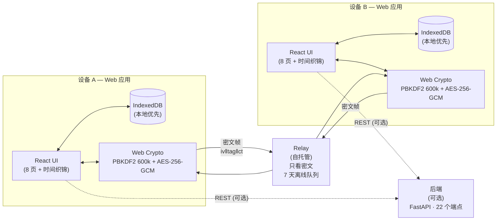

<div align="center">

<picture>
  <source media="(prefers-color-scheme: dark)" srcset="docs/assets/logo.svg">
  
</picture>

# Goto

**本地优先、端到端加密的私人时间资产管理器。**
你的待办清单不必交给别人保管。

[](LICENSE)
[](#质量门槛)
[](#质量门槛)
[](#质量门槛)
[](#质量门槛)
[](#端到端加密同步)
[](SECURITY.md)
[](#跑起来)
[](https://gitcode.com/badhope/goto/issues)
[](docs/security/SECURITY_TRACKER.md)

[English](README.md) · **中文**

[快速开始](#跑起来) · [架构](#架构) · [安全](#安全) · [文档](#文档导航) · [提 Bug](https://gitcode.com/badhope/goto/issues)

</div>

---

## TL;DR

```bash
git clone https://gitcode.com/badhope/goto.git
cd goto/desktop && npm install && npm run dev
# → http://localhost:5173  ·  设置主密码  ·  开始写任务
```

可选:自托管 relay(用于跨设备同步):

```bash
cd goto/relay && docker compose up -d
```

就这些。没有账号、没有云、没有遥测。数据始终在你的浏览器 IndexedDB 里,用 Web Crypto 在主密码下加密。

---

## 为什么做这个

市面上的任务管理工具大致分两类：一类是纯本地待办，单机好用，换设备就抓瞎；
另一类是云同步，方便，但你每一项计划、习惯、笔记最后都落到别人服务器上。
Goto 走第三条路——**数据默认在你的设备上，跨设备同步时端到端加密**，
中继服务器只搬运密文，看不到任何内容。

我做它最初的动机很简单：想要一个在地铁上（没网）能用、在笔记本上（全键盘）能用的
待办应用，又不想把生活细节寄给某个 SaaS。所以最后做成了现在这个形态，几个我自己
觉得还算有意思的点：

- **三个组件，一套数据模型。** 浏览器 Web 应用（`desktop/` 目录 —— Vite + React）、
  可选的 Python 后端、可自托管的 relay 中继。每个持久化对象都带 `updatedAt`，
  同一条记录能在本地存储、后端、已配对设备之间流转。
- **E2EE 同步是跨平台的。** Web 应用用 Web Crypto API；relay 只做传输、永远不解密。
  记录用配对时交换的同步主密钥（SMK）做 AES-256-GCM 密封。测试套件包含同步协议与互操作用例。
- **本地优先是默认行为，不是营销话术。** 没有 Goto 账号这回事，relay
  读不到你的数据。如果你从不配对第二台设备，数据一辈子不离开第一台。
- **自动标签是关键词匹配式的。** 内置插件匹配任务标题关键词(购物 / 工作 / 健康 / 学习)
  自动打标签。早期文档提过的统计式 AI 与 LLM 功能**当前未实现**,见路线图。

## 架构



三个组件,一套数据模型 —— 每个持久化对象都带 `updatedAt`,同一条记录能在本地存储、可选后端、已配对设备之间流转。relay 全程只看到密文。

## 仓库里有什么

| 组件 | 技术栈 | 干什么 |
| --- | --- | --- |
| **Web 应用**（`desktop/`） | Vite · React 18 · Zustand 4 · TypeScript 5 | 本地优先的浏览器任务管理。持久化到 IndexedDB,用 Web Crypto(PBKDF2)加密保险库;JSON 备份用 PBKDF2-SHA256 600k + AES-256-GCM 加密。**12 个页面 + 时间织锦视图**(Today / Calendar / Projects / 项目详情 / Categories / Tags / Search / Vault / Settings / 看板 / 统计仪表盘 / 每周回顾)、提醒、重复任务、子任务、NLP 快速添加、批量操作、拖拽排序、vim 快捷键、可安装 PWA、6 分区设置页(安全 / 外观 / 快捷键 / 数据 / 同步 / 危险区)。 |
| **中继 Relay** | Node.js 18+（≥20）· WebSocket · express-rate-limit · Docker | 只转发密文帧，带离线队列（7 天 TTL）。LAN 优先，relay 兜底。 |
| **后端** | Python 3.11+ · FastAPI · PyGit2 | 可选组件:任务 / 项目 / 分类 / 标签 API、Git 管理、插件系统。与同步链路解耦。**22 个 REST 端点**。 |

Web 应用通过 relay 建立加密 P2P 会话跨设备同步；relay 只是个搬运工，全程不解密。

## 页面与视图

Web 应用提供这些页面（Today、Calendar、Projects、**项目详情**、Categories、Tags、
Search、Vault、Settings、**看板**、**统计仪表盘**、**每周回顾**）以及一个时间织锦（Mosaic）视图。

> 早期文档提到过的 Gantt / Timeline / TimeBlock / Table / MindMap 视图
> 与 Templates / Automation / Notes / Analytics / Goals / Habits 页面**当前未实现**,
> 转向计划见 [docs/GOTO_PIVOT_PLAN.md](docs/GOTO_PIVOT_PLAN.md) 与
> [docs/PRODUCT_EVOLUTION_PLAN_v1.md](docs/PRODUCT_EVOLUTION_PLAN_v1.md)。

任务依赖（`blockedBy` / `blocks`）会拦着你：被依赖的任务没完成前，不让你点完成。

## 设置与快捷键

设置页分为 **安全 / 外观 / 快捷键 / 数据 / 同步 / 危险区** 六个分区:

- **安全**:解锁方式(主密码;仅当平台暴露生物识别时显示)、自动锁定时长
  (关闭 / 1 / 5 / 15 / 30 / 60 分钟,从原固定 5 分钟开关升级)、截图/录屏保护
  (仅在桌面壳内生效,Web 端标注为 best-effort)、**修改主密码**(验证旧密码 →
  生成新 verifier → 清空密钥缓存;此前生成的加密备份仍需用旧密码恢复)、
  **3 次错误密码 cooldown**(连续 3 次输错密码后锁 30 秒)。
- **外观**:主题(浅色 / 深色 / 跟随系统)、**字体大小**(小 / 中 / 大)——
  通过 root `data-font-size` 属性等比例缩放所有 rem-based 元素。
- **快捷键**:任意位置按 `?` 弹出快捷键浮层,列出所有已注册快捷键
  (`?` / `Mod+L` / `Mod+B` / `Mod+K` / `/` / `Mod+N` / `Esc`);设置页也有
  "查看所有快捷键"按钮入口。
- **数据**:加密备份导出/导入(PBKDF2-SHA256 600k + AES-256-GCM)、明文 JSON
  导出/导入(保险库不进 JSON,避免凭据泄露)。
- **同步**:relay 地址、设备身份、配对(host / join)、已配对设备列表、吊销。
- **危险区**(红框,二次确认):**清空所有数据**(任务 / 保险库 / 项目 / 分类 /
  标签 / 搜索历史 / 同步身份,但保留主密码和已生成的备份文件)与**恢复出厂设置**
  (在清空数据基础上额外删除主密码与安全设置,1 秒后 reload 回首次安装状态;
  已生成的加密备份文件不受影响,仍可用旧密码恢复)。

## 端到端加密同步

这是花时间最多的一块。两台设备同步前先握手，互相验明身份，协商出一对
方向隔离的会话密钥，之后所有记录都走 AES-256-GCM。relay 看到的是字节流，
不是内容。

```
identity    每台设备一对 Ed25519 长期密钥，私钥存 Web 应用的安全存储
            （IndexedDB + Web Crypto）
            deviceId = sha256(原始 SPKI 公钥) 前 16 hex
handshake   X25519 临时密钥做 ECDH，双方对 transcript 做 Ed25519 签名（防 MITM）
derive      HKDF-SHA256 → sendKey / receiveKey，info 按方向绑定
records     同步主密钥（SMK）做 AES-256-GCM，线格式 = iv[12]‖tag[16]‖ct
conflict    先比 updatedAt（LWW），时间戳相等时用版本向量判因果
transport   9 种消息类型，帧 = mode[1]‖length[4 BE]‖payload
            序列号 + 滑动窗口防重放
```

配对用 8 位码，5 分钟有效，一次性。SMK 由 host 生成，通过加密配对会话发给
join 端，到端后做恒定时间比对——不一致就拒绝配对，而不是静默继续到「之后
每次同步都解密失败」的烂状态。设备吊销是四步编排：终止运行时会话 → 删除
设备记录 → 清理它的离线发件箱 → 仅当没有其他已配对设备时才重置 SMK。

实现层面有若干处和设计规格不一致的地方（以及为什么），都回写到了
[docs/superpowers/specs/](docs/superpowers/specs/)。

## 功能一览

| 领域 | 你能得到什么 |
| --- | --- |
| **本地优先** | 数据在 IndexedDB。无账号、无云、无遥测。 |
| **E2EE 同步** | AES-256-GCM 在同步主密钥下;relay 只看密文。 |
| **保险库** | 字段级 AES-256-GCM 加密敏感条目,自带密码生成器。 |
| **备份** | 加密 JSON 导出:PBKDF2-SHA256 600k + AES-256-GCM。明文导出不含保险库。 |
| **主密码** | 仅存 PBKDF2 verifier,密码永不落盘。可在设置页修改。 |
| **暴力破解冷却** | 连续 3 次错误密码 → 锁 30 秒。 |
| **自动锁定** | 关闭 / 1 / 5(默认) / 15 / 30 / 60 分钟,或失焦即锁。 |
| **隐私外壳** | 锁屏、隐私模式(隐藏保险库)、剪贴板自动清除(默认 30 秒,可配)。 |
| **危险区** | 清空所有数据(保留主密码与备份) / 恢复出厂(删主密码,重载到首次安装)。 |
| **外观** | 浅色 / 深色 / 跟随系统 + 字体大小(小 / 中 / 大)。 |
| **快捷键** | `?` 弹出快捷键浮层。`Mod+L` 锁屏、`Mod+B` 侧栏、`Mod+K` 搜索、`/` 聚焦新任务、`Mod+N` 新任务、`Esc` 关闭。 |
| **时间织锦** | 所有任务的"时间织带"渲染 —— 时间轴即马赛克。 |
| **自动标签** | 关键词插件(购物 / 工作 / 健康 / 学习)。 |
| **任务依赖** | `blockedBy` / `blocks` 阻止在被依赖任务未完成前点完成。 |
| **插件系统** | 注册表 + 内置插件。后端可扩展自定义插件。 |
| **测试** | 共 611 项:494 unit + 108 e2e + 104 后端 + 9 relay。 |

## 跑起来

### Web 应用（`desktop/`）

```bash
cd desktop
npm install
npm run dev       # Vite 开发服务器，打开 http://localhost:5173
```

构建可部署的静态 bundle：

```bash
npm run build     # 输出 dist/renderer/（静态 SPA），直接托管该目录
```

完整的用户手册（主密码、保险库、同步、备份）见
[docs/desktop-user-guide.md](docs/desktop-user-guide.md)。

### Relay（自托管）

```bash
cd relay
docker compose up -d   # 用 relay/docker-compose.yml
```

TLS、Nginx 反代、ACME 证书的配置见 [docs/relay-deployment.md](docs/relay-deployment.md)。
relay 只需要能访问公网，永远看不到明文。

### 后端（可选）

```bash
cd backend
python -m venv .venv && source .venv/bin/activate
pip install -r requirements.txt
uvicorn app.main:app --reload
```

OpenAPI spec 自动生成、CI 校验——见 [backend/docs/openapi.json](backend/docs/openapi.json)
（36 个端点）。

## 项目结构

```
desktop/                 # 纯浏览器 Web 应用（Vite + React 18 + Zustand 4）
  src/renderer/          # React UI（任务页、保险库、同步设置……）
  src/shared/
    api/                 # 后端 REST 客户端（tasks/projects/categories/tags）
    store/               # Zustand store，状态在 slices/
    sync/                # E2EE 同步栈（Web Crypto，对接 relay）
    utils/               # 安全存储（IndexedDB + Web Crypto / PBKDF2）
  src/renderer/lib/      # webAPI：本地 IndexedDB 实现
                         # （本地优先数据访问，无原生桥接）
relay/                   # 可自托管的 WebSocket 中继 + Docker
backend/                 # 可选的 FastAPI 服务
docs/                    # 用户手册、路线图、安全跟踪、relay 部署
```

Web 应用保留了两条数据路径：`shared/api/*` 走后端 REST，而 `lib/webAPI.ts`
在本地落盘到 IndexedDB。`shared/sync/*` 里的 E2EE 同步栈通过 relay 配对设备。

## 质量门槛

```bash
# Web 应用（desktop/）
cd desktop && npm run typecheck && npm run lint && npm test

# 后端
cd backend && python -m ruff check app && python -m mypy app && python -m pytest tests/ -q

# Relay
cd relay && npx tsc --noEmit && npm test
```

三项我都要求「0 错误」。测试基线是 **611 项**(Web 应用 unit 494 + 26 skipped |
Web 应用 e2e 108 | 后端 104 | relay 9),`main` 分支全绿。5000 条端到端同步基准是
649 ms(7699 rec/s)——这个数字以前是 52 秒,修掉 REQUEST 分块 bug 加事务化批量
落库之后才下来的。

## 安全

两轮独立审计（TF-001~019 与 TF2-001~017，共 36 项发现）统一跟踪在
[SECURITY_TRACKER.md](docs/security/SECURITY_TRACKER.md) 里。大部分已修复，
剩下的在路线图里标记。当前在用的安全机制：分支保护 + 必须评审、CodeQL、
gitleaks（带 push 保护）、依赖审查（拒绝 GPL-3.0/AGPL-3.0）、OSSF Scorecard、
cosign 签名发布、Hypothesis 属性测试。漏洞报告走私有披露流程——见
[SECURITY.md](SECURITY.md)。

## 部署

仓库自带这些 GitHub Actions：

- `ci.yml` — Web 应用 lint/test/build + 后端 ruff/mypy/test/fuzz
- `verify.yml` — 每次 push 跑 typecheck
- `relay-ci.yml` — relay typecheck/build/test
- `web-deploy.yml` — 构建 `desktop/dist/renderer` 并发布到 GitHub Pages
- `pages-intro.yml` — 把 `docs/` 下的静态介绍页发布到 GitHub Pages
- `gitleaks.yml` — secret 扫描
- `release.yml` — cosign keyless 签名发布 + SHA256SUMS

GitHub Pages 默认只放介绍页，除非触发 `web-deploy.yml`；Web 应用本身是静态 SPA，
可托管到任意静态主机。

## 文档导航

| 文档 | 内容 |
| --- | --- |
| [ARCHITECTURE.md](ARCHITECTURE.md) | 分层、状态模型、同步协议栈 |
| [QUICK_START.md](QUICK_START.md) | 三种跑起来的方式 |
| [docs/desktop-user-guide.md](docs/desktop-user-guide.md) | Web 应用手册：安装、保险库、同步、备份 |
| [docs/ROADMAP.md](docs/ROADMAP.md) | 已完成（Phase 1–8）与待办 |
| [docs/DEVELOPER_GUIDE.md](docs/DEVELOPER_GUIDE.md) | 开发流程、命令、同步策略 |
| [docs/relay-deployment.md](docs/relay-deployment.md) | 自托管 relay、TLS、Nginx |
| [docs/fuzzing.md](docs/fuzzing.md) | Hypothesis 属性测试 |
| [CHANGELOG.md](CHANGELOG.md) | 按 Phase 记录的变更日志 |
| [FAQ.md](FAQ.md) | 大家实际遇到的问题 |
| [SECURITY.md](SECURITY.md) | 支持版本、私有披露流程 |
| [SUPPORT.md](SUPPORT.md) | 获取帮助、报告问题、赞助 |
| [PRIVACY.md](PRIVACY.md) | 隐私政策 — 本地优先、E2EE、GDPR Article 9 |
| [TERMS.md](TERMS.md) | 服务条款 — UGC 责任、E2EE 平台豁免 |

## 仓库镜像

项目主要托管在 GitCode（国内可访问），所有 Issue 和 PR 请在 GitCode 提交。

| 站点 | 仓库 |
| --- | --- |
| GitCode | `gitcode.com/badhope/goto` |

## 已知限制

- Web 构建是 `desktop/dist/renderer` 下的单个 SPA bundle——丢静态托管 / GitHub Pages
  没问题。跑 `npm run build`（在 `desktop/` 下）自己看 `dist/renderer/` 的实际大小。
- 语音输入仅 Web 端可用。
- Web 应用有隐私模式（隐藏保险库），但没有 OS 级截图拦截——那需要原生外壳，
  而这个 Web 构建不带。
- 跨设备同步首次配对需要一个 relay（自托管或官方）。配对完成后，LAN 可达时
  优先直连，relay 作为兜底。

## FAQ —— 大家实际问的

- **能找回忘记的主密码吗?** 不能。密码永不落盘 —— 只存 PBKDF2 verifier。把它记在安全的地方,或者依赖加密备份。
- **relay 能看到什么?** 密文帧 + 你的设备 ID。它无法解密任何内容。
- **所有设备都丢了怎么办?** 在新设备上恢复加密备份(仍需旧密码)。没有备份或未配对设备,数据找不回来 —— 这是 E2EE 的代价。
- **能不用 relay 直接同步吗?** 不能 —— 配对握手必须经 relay 转发。配对完成后,LAN 内可达时优先直连。
- **为什么"恢复出厂"放在红框危险区?** 它会删除主密码 verifier 并 reload 到首次安装状态。已生成的加密备份不受影响,仍可用旧密码恢复。

完整 FAQ: [FAQ.md](FAQ.md)。

## 路线图

完整路线图见 [docs/ROADMAP.md](docs/ROADMAP.md)。摘要:

- ✅ Phase A —— 本地优先 Web 应用(8 页 + 时间织锦)、E2EE 同步、保险库、加密备份、6 分区设置页、611 项测试全绿。
- 🚧 Phase B —— 多设备同步加固、插件市场、时间织锦交互。
- 🔮 Phase C —— 跨平台原生壳、可选 LLM 辅助标签(本地模型)。

## License

CNCL-1.0,见 [LICENSE](LICENSE)。

---

<div align="center">

**[快速开始](#tldr)** · **[架构](#架构)** · **[安全](#安全)** · **[文档](#文档导航)** · **[Changelog](CHANGELOG.md)** · **[路线图](docs/ROADMAP.md)**

用心制作。你的数据,你的设备,你做主。

</div>
