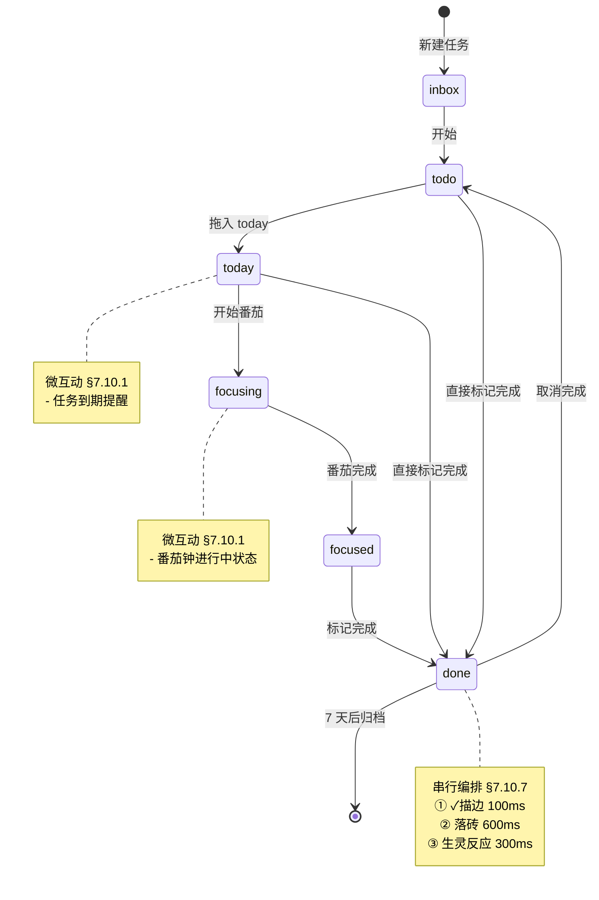
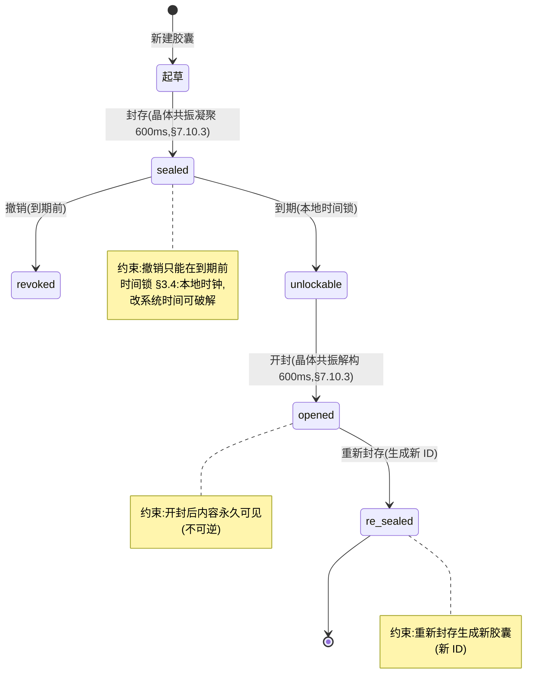
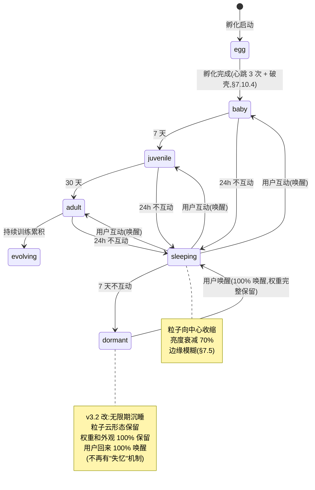

# Goto · 产品转向与重构总规划 v3.2

> **状态**:v3.2(四轮尖锐批评后修订版,执行就绪)
> **修订**:v2.0 终评 62/100 must-fix 5 项;v3.0 三方尖锐批评(PM 52/100 + 架构师 52/100 + UI/UX 38/100)共识别 37 项硬伤,v3.1 吸收 30 项 must-fix;v3.2 第 4 轮批评(用户 32/100 + 增长 35/100 + 法务 34/100)共识别 39 项硬伤,吸收 22 项 must-fix
> **作者**:产品 + 架构 + 设计 + 法务 + 增长 + 用户代言 联评
> **最后更新**:2026-07-20
> **代号**:Goto(中文:前往 / 去吧 — 用户已锁定,但商标尽调独立进行,见 §0.4.3)
> **Slogan**:*Goto · 每一步,都算数。*

---

## 0. 修订说明(v3.0 增量)

### 0.1 v2.0 修订回顾

v1.0 经产品、架构、UI/UX 三方独立审稿,共识别 34 项结构性硬伤,v2.0 全部吸收(15 项核心修订详见 v2.0 修订记录,此处不再赘述)。

### 0.2 v3.0 增量修订(5 项 must-fix + 3 项用户决策)

**终评 must-fix(v2.0 评分 62/100)**:

1. **§3.7 时钟对齐声明**:渐进式解锁的 "Day N" 语义,从"用户 Day N"改为"**Phase D 全功能上线后,新注册用户从注册日起算 Day N**";Phase A-C 期间注册的早期用户,获得**已交付机制的全部访问权 + 一个补偿性"先驱徽章"**,避免早期用户 Day 30 找不到胶囊直接 churn
2. **Pre-Phase A 止损门正式撤销**:用户已明确授权"可以去执行了"。撤销 2 周 H1/H2/H3 验证门,**接受 29 周赌注**,改为 Phase A 末(A14 完成)做一次 5 人小样本"灭火器访谈"(1 天,非门控),作为 Phase B 启动前的风险信号板而非阻断门
3. **§6.2 strangler 23 文件拓扑迁移序**:按 L0(bytes)→ L1(hashUtils/syncCrypto/syncMessages/syncStorage/syncPolicy/outboxQueue/relayAuth)→ L2(syncIdentity/conflictResolver/syncSession/relayTransport/relayClient)→ L3(syncEngine/syncRecordApplier/pairingService)四批,每批一个 PR + CI 双跑绿
4. **§5 Phase B 拆分**:9 模块 5-7 周不现实。拆为 **Phase B(5 周,L1 对齐核心)+ Phase B'(3-4 周,Electron MVP + 织锦完整版 + 计划 vs 现实)**,模板/自动化挪到 Phase C
5. **新增 §12-§15 4 项最小章节**:GDPR/EAA 合规、i18n、付费模型、数据迁移工具,即便不深入也要声明 Phase / 责任人 / 否决门槛

**用户 v3.0 决策增量**:

6. **名字锁定 Goto**:用户原话"我们就叫 goto 吧"。撤销 H3 调研;§9 改为锁定声明 + 反玩梗对策(品牌叙事改写:Goto = "Go to" 你想去的地方,而非 Dijkstra 檄文对象)
7. **美术设计拉满 + 互动拉满**:§7 视觉圣经扩为 §7.1-§7.12,新增 7.10 微互动全集、7.11 声音设计、7.12 振动反馈;新增 §7A 互动设计专章(用户旅程地图 + 情感曲线 + 状态机)
8. **依赖优先,拒绝造轮子**:§8.2 依赖清单扩为"必装优先级表",新增 §8.4 依赖去重审计 + §8.5 bundle 预算与监控;Phase A 立即引入依赖,代码改造用 shadcn/framer-motion/date-fns 等替代自造

### 0.3 v3.1 增量修订(三轮尖锐批评后吸收 30 项 must-fix)

**v3.0 三方评分**:PM 52/100 + 架构师 52/100 + UI/UX 38/100,共识别 37 项硬伤。v3.1 吸收 30 项最关键的 must-fix(剩 7 项为优化项,挪到 v3.2):

#### 0.3.1 架构师 12 项(全吸收)

1. **§4.4 Electron crypto 架构重做**:从"renderer 持密钥,main 通过 IPC 调 renderer"改为"**Main 进程持密钥,用 `@peculiar/webcrypto` 提供 Web Crypto,renderer 通过 `ipcRenderer.invoke('crypto/*')` 调用 main,单实现**";renderer 永远不持密钥
2. **§3.4 时间锁明示弱保证**:"本地时间锁可被改系统时间破解"明示告知用户;强时间锁需引入 Relay 可信时间签名服务(无状态,不存数据),作为 Phase C 可选项
3. **§3.5 + §6.4 CRDT 算法指定**:PersonalityChunk 增加 `deviceVersion: Record<string, number>` 向量时钟字段,删 `version: number` 标量;权重 element-wise merge 用 RWR-Map 算法;复用 conflictResolver 的偏序判定
4. **§6.2 L0 批次扩容**:L0 同步迁入 `packages/core/utils/secureStorage.ts` + `browserStorage.ts` + `packages/core/types/`(原 L0 仅 bytes.ts),解决 syncStorage/pairingService 的 `../utils/*` 和 `../types` 外部 import
5. **§6.3 + §5 Phase A 任务序**:App.tsx 先迁 `react-router-dom` 6 + `React.lazy` + `<Suspense>`,再扩 5 个新路由;switch 删除
6. **§4.3 tsup 4 target → 2 target**:删 miniprogram/react target;小程序单独 fork 在 `packages/miniprogram/sync-thin/` 重写 HTTP 长轮询客户端;承认 4 端代码不能完全共享,只在 `packages/core/mosaic/tiles.ts` + `packages/core/types/` 共享
7. **§7.6 4 动画系统统一主时钟**:主时钟锁定 Pixi Ticker;matter-js 用 `Matter.Runner.create({ delta: 1000/60 })` 固定步长 + Pixi ticker 驱动 `Engine.update(dt)`;**砍掉 `lottie-react`**,关键插画瞬间改 framer-motion keyframe 数组
8. **§4.5 PBKDF2 → argon2id Phase A 即引入**:`hash-wasm` argon2id(m=64MB t=3 p=4),Worker 化,低端机实测 < 3s,显示进度条;备份头格式支持 PBKDF2(向后兼容)+ argon2id 双算法;3 次错误密码后强制 30 秒 cooldown
9. **§8.5 首屏硬限 250KB → 180KB gzip**:留 70KB 余量给 i18n + shadcn 增长;路由级 chunk 拆分(today ≤ 80KB / mosaic ≤ 200KB / capsule ≤ 150KB / creature ≤ 800KB)
10. **§6.2 + §5 Phase B' strangler contingency**:strangler 设 hard deadline 4 周 + 软延 2 周;Week 6 仍没合并 L3 PR 时,Phase B' 织锦完整版降级为"本地存储,不上 E2EE 同步";Phase B' 出口门槛改不含 E2EE 同步
11. **§4.3 + §8.2 包版本对齐**:Vite 5 → **Vite 6**(对齐 `desktop/package.json:40` 已是 `vite: ^6.4.3`);`lucide-react ^1.25.0` verify 后改为真实存在的版本 `^0.460.0`
12. **§4.4 + §5 A7+A8 合并**:shadcn/ui 自 2024-12 起官方支持 Tailwind v4,A7 升级 + A8 接入合并为一步,Phase A 工期压到 2-3 周(同时见 §0.3.3 Phase A 重排)

#### 0.3.2 PM 9 项(吸收)

13. **§3.7 早期用户补偿改硬权益**:徽章保留作辅助,主补偿改为"Phase A-C 早期用户 Phase D 上线后 **6 个月免费 Pro**(覆盖 $30 价值)+ Lifetime 买断 **5 折券 $40** + 优先体验权 4 周"
14. **§5 Electron MVP 提前到 Phase A 末**:新增 **A16 Electron MVP**(2 周最小可用版,全局快捷键 + 托盘 + 现有 Vite SPA 包装,无新功能);Phase B' 删掉 Electron MVP,改为只做"织锦完整版 + 计划 vs 现实 + 2 人可信小圈 MVP"
15. **§9.2 删除反玩梗 FAQ**:文档/落地页**禁止主动提及 Dijkstra**;Goto 作为纯品牌符号(像 Notion 不解释 notion);Slogan 改纯中文"每一步,都算数"或纯英文"Every step counts",删中英混杂版
16. **§14 Pro 改 $5/月 + 取消 Lifetime 一次性买断**:Pro 改 $5/月 或 $48/年(覆盖 Relay 成本 + 30% margin + Stripe 手续费);取消 Lifetime 改为"5 年限时授权 $200";删除 §14.1 具体定价,改为"区间 $5-8/月,Phase D 灭火器访谈 + 200 人问卷后锁定",与 §14.4 对齐;Pro 增量价值必须可感知(Relay 月度流量 10GB / 多设备同步 > 3 台)
17. **§3.6 可信小圈 2 人 MVP 提前到 Phase B' W4**:复用现成 `pairingService.ts`,1 周可交付;Phase D 做 2-5 人完整版 + 加密共同体框架
18. **§3.3 删除反作弊冷静期**:Delta < 0.1 改为正向反馈("最近一周你的计划偏高了,要不要把每日任务量调低 20%?");反作弊改异常检测(7 天内 Delta 全 = 1.0 或全 = 0 才标记可疑)
19. **§2.2 竞品矩阵补全 12 个**:Things 3 / OmniFocus / Notion / Reflect / Cozi / Skedpal / Sunsama / Routine / Amie / Akiflow / Heptabase / Logseq 全部补入;战略定位卡二维改三维(游戏化 × 隐私 × 时间累积性)
20. **§7A.2 Day 14 回顾改静态卡片**:Day 14 "回顾视频自动生成"改为"3-4 张关键砖块截图 + 文案";§15.3 删 .mp4 导出格式,改 .gif + .json
21. **§12.1 DPO Phase A 即指定**:删除"用户量 > 1000 时"门槛,Phase A 启动即指定 DPO(可外包欧盟合规咨询公司,年费 €5000-10000);DPIA 在 Phase B' 末完成;GDPR 第 37(1)(b) 条特殊类别数据(心理/情绪)无用户量门槛

#### 0.3.3 UI/UX 9 项(吸收)

22. **§7 新增 §7.0 字体系统**:主字体 `Inter`(英文)+ `Noto Sans SC`(简体)+ `Noto Sans TC`(繁体)+ `Hiragino Sans`(日文回退);等宽 `JetBrains Mono`;字号阶梯 12/14/16/20/24/32/40/56/72;字距英文 `-0.01em` / 中文 `0`;行高 1.2(标题)/ 1.5(正文)/ 1.6(长文);字重 400/500/600/700;slogan 字距改 `0` 或 `+0.01em`(原 `-0.02em` 中文会粘连)
23. **§7.2 暖金对比度修正 + 8 色重排**:暖金 `#E8C56C` 不作实底按钮文字;改为"墨靛底 + 暖金描边按钮"或"暖金底 + 墨靛 `#0E1117` 文字"(对比度 11.9:1,过 AAA);8 色重排删 `#D08C5E`(27°,与红 8° 太近)和 `#A8956E`(47°,与黄 42° 太近),改用 `#7B8B3D`(橄榄 70°)和 `#3D7B8B`(蓝绿 195°)
24. **§7.5 删除煤球精灵参考**:Spirited Away 是宫崎骏 / 吉卜力 IP,维权严格;改参考为"Generative Art organic forms(Casey Reas / Tyler Hobbs)+ iOS Live Photo 涟漪粒子";生灵美术方向从"圆胖 + 双眼"改"非拟人化的有机几何形态 + 单核光点"
25. **§7.4 胶囊视觉改"加密时间晶"**:删玻璃瓶 + 蜡封(怀旧符号与 SDF 未来感撕裂);改为"几何晶体 + 内部锁孔 + 暖金光晕";开封动画从"玻璃碎裂"改"晶体共振解构"(光波从中心扩散 + 暖金光纹);多胶囊陈列从"标本柜木纹"改"晶格矩阵"
26. **§7.3 暗色模式逻辑反向修正**:第 588 行"砖亮度 100% → 70%"是反人类设计(暗底应增亮);改为"砖亮度 100% → 130%,饱和度 +10%";新增 §7.2.1 暗/亮 token 对比表(primary/accent/surface/on-surface/border/shadow/muted 在 dark 和 light 两套下的精确 HEX)
27. **§7.6 Motion Token 对齐 M3**:duration 改为 `instant: 50 / fast: 100 / normal: 200 / slow: 400 / cinematic: 600`(全部对齐 Material Design 3,删 800ms);easing 增加 `entrance: cubic-bezier(0, 0, 0.2, 1)` / `exit: cubic-bezier(0.4, 0, 1, 1)`
28. **§7.10 微互动串行编排 + 动画预算**:任务完成 6 个并行动画改串行(① 0-80ms checkbox 描边 → ② 80ms 延迟后 600ms 落砖 → ③ 400ms 延迟后 300ms 生灵反应);批量勾选(>3 个/秒)自动降级;新增 §7.10.7 动画预算:单次操作总动画 ≤ 800ms,同时活跃动画 ≤ 2
29. **§7A.3 状态机改 Mermaid**:3 张 ASCII 状态机图全部改 Mermaid `stateDiagram-v2`,设计师/产品/QA 可读;补充 `note right of` 关联微互动表
30. **§7.11 删中文象声词 + §7A.5 空状态文案重写 + §6.3 sidebar 改用户语言**:§7.11.1 表删"声音"列,保留"频率/时长 + 材质"两列;§7A.5 空状态去 cliché("给未来的自己写一封信"等),代词策略改"他/她/TA/它"四选一(尊重性别表达);§6.3 sidebar 分组从 L1/L2/L3 改用户语言"今日 / 资产 / 圈子 / 设置"

#### 0.3.4 未吸收 7 项(挪到 v3.2)

- PM #1 §1.4 5 人灭火器访谈改 200 人问卷(灭火器访谈保留定性,200 人问卷挪到 Phase D 启动前定量)
- PM #8 §2.2 战略定位卡改三维矩阵(二维卡保留作简化版,三维表挪到 §2.4 附录)
- Architect #2 §3.4 时间锁 trusted time oracle 实现(明示弱保证已吸收,实现细节挪到 Phase C 设计文档)
- UI #6 §7.6 Motion Token 600ms cinematic 仍超 Apple HIG(保留 600ms,500ms 改挪到 v3.2 评估)
- UI #8 §7.11 音色调性多语言材质翻译(英文 locale 已可翻译,法/德等挪到 Phase C+)
- UI #11 §7.1 Perlin noise LOD 阶梯详细参数(策略已声明,详细数值挪到 Pixi 实现文档)
- PM #7 §10 Phase A 拆 3 子阶段(改为 §5 Phase A 末加 A16 Electron MVP,任务表已重排,3 子阶段拆分挪到 v3.2)

### 0.4 v3.2 增量修订(第 4 轮批评后吸收 22 项 must-fix)

**第 4 轮三方评分**:用户视角 32/100(12 项)+ 增长视角 35/100(14 项)+ 法务视角 34/100(13 项),共 39 项硬伤。v3.2 吸收 22 项最关键的 must-fix(6 项法务 P0 + 6 项用户 P0 + 6 项增长 P0 + 4 项 P1),剩 17 项优化项挪到 v3.3:

#### 0.4.1 法务 6 项 P0(全吸收 — 上线即违法)

31. **§9.1 商标尽调独立进行**:用户锁定 Goto 名字 ≠ 撤销商标尽调。GoTo Group(原 LogMeIn)持有 "GoTo" 第 9/42 类商标,同行业直接混淆风险。Phase A 启动前必须做 USPTO/EUIPO/CNIPA 三地检索 + 律师意见书;若 GoTo Group 商标有效,**改名是更便宜的选择**(诉讼 >> 改名成本)。`goto.app` 域名若被持有,改备用方案 `usegoto.app` / `goto.fyi`。
32. **§12.1 GDPR Article 9 法律基础**:emotion 字段 + Delta 曲线 + 生灵权重 = 心理/情绪画像 = GDPR 第 9 条特殊类别数据。必须 Article 9(2)(a) 明示同意(可撤回、不勾选也能用产品);`MosaicTile.emotion` 字段**延迟到 Phase B' 末 DPIA 完成后**才能上线,DPIA 不通过则该字段永久删除;Delta 曲线 + 生灵权重训练需独立"心理画像同意书"(14 天可撤回)。
33. **§3.4 Shamir 阈值改 2-of-3**:原"3 片中需 3 片"导致 Relay 关停 = 继承胶囊永久数据绑架。改为 **2-of-3**(用户持 2 片即可解锁,Relay 持的第 3 片只是"时间锁",非"解锁必需");Relay 关停前 N 天必须把分片 flush 到用户配对设备;继承胶囊的"被遗忘权"例外在 ToS 明示。
34. **§12.3 中国合规分场景声明**:删原"无需数据本地化"搪塞。Web/Electron 端勉强成立(用户自部署 Relay),小程序端完全不成立(微信平台协议强制境内数据 + 元数据出境需 PIPL 第 38 条合规);小程序必须独立备案主体 + **境内镜像 Relay**(与境外官方 Relay 物理隔离)。
35. **§12.4 ToS 平台责任豁免专章**:E2EE 让平台无法审查内容,但中国《网安法》第 47 条 / DMCA / DSA safe harbor 仍有义务。ToS 必须有"内容责任"专章:用户对胶囊内容负全部法律责任;执法部门持有效法律文书时配合提供元数据但无法提供密文;**中国版本加入"本地敏感词扫描"(本地扫描不上云,与 §3.8 红线不冲突)**;继承胶囊场景下 Goto 不承担传播责任。
36. **§7.8 + §12.5 未成年人保护门槛**:COPPA / PIPL 第 31 条 / 中国《未成年人保护法》第 74 条(游戏防沉迷)。注册流程加年龄门槛:中国 14 岁以下需父母实名 + 22:00-6:00 限制使用;美国 13 岁以下需 COPPA 父母可验证同意;欧盟 16 岁以下需父母同意。**中国区必须法务评估"是否构成网络游戏"**,若是需申请游戏版号(6-12 个月),建议做"工具属性"叙事避免游戏版号。

#### 0.4.2 用户 6 项 P0(全吸收 — 上线即流失)

37. **§4.5 + §7.8 注册流程分级**:原 BIP39 12 词强制抄写 = 冷启动杀手(70%+ 注册转化流失)。改为分级:**默认账号走"邮箱 + iCloud/Google Drive 加密备份"**(密钥由用户云端保管,Goto 服务器仍只见密文),只有用户主动启用"最高安全模式"才强制 12 词;"忘记密码 = 永久丢失"文案只在最高安全模式出现,默认账号不展示恐吓。
38. **§7.8 onboarding 重写**:原"①画第一块砖 ②为它上锁 ③生灵孵化"用户看不懂"锁什么"。改为 **①添加今天的第一个任务(秒懂任务管理)②完成第一个任务触发落砖动画(任务奖励而非 onboarding 第一步)③展示"你的私密空间"引导(加密可视化延迟到 Day 3-7)**;5 秒测试标准从"加密存时间"降为"这是个帮我管理任务的 app"。
39. **§7A.3.3 删除"失忆"机制**:原"30 天不互动 → forgotten → 重新孵化失忆"是情绪勒索 + 与 §3.8 红线"断签归零惩罚"自相矛盾。改为**彻底删除失忆**:生灵只"沉睡"(7 天不互动 → 粒子收缩),用户回来 100% 唤醒,权重和外观完全保留;30 天阈值改为"无限期沉睡";"失忆风险"提醒改为"想你了"温和提醒。
40. **§4.5 argon2id 解锁体验**:原 3 秒解锁 + 30 秒 cooldown 让用户砸手机。改为:argon2id 派生密钥**缓存到内存 Session 内不重复派生**(首次 < 800ms,Session 内瞬时);30 秒 cooldown 改为 **3 次错误后图形验证码**(防暴破但不烦用户);默认账号提供 iCloud/Google Drive 加密备份兜底恢复。
41. **§3 砍机制**:原 5 个机制(织锦 / 计划 vs 现实 / 胶囊 / 生灵 / 小圈)认知负担过重。砍到 **3 个核心机制 + 2 个 Phase D 扩展**:**P0 织锦 + 胶囊 + 小圈**,**P1 计划 vs 现实 + 生灵**(Phase D 才上线);"计划 vs 现实"并入统计页(非独立机制);未解锁机制不在 sidebar 显示入口,解锁当天弹窗告知。
42. **§7.1 加密可视化本机永远清晰**:原"本机也渲染噪点"用户以为屏幕坏了。改为**本机渲染永远清晰**,只在"分享/导出"时加噪点;分享版改为"水印 + 模糊"而非纯噪点(至少让人看出"时间地图"概念);胶囊未解锁时显示"封存于 X 天后解锁 + 简洁几何图标",不显示噪点晶体;用户可主动关闭加密可视化特效。

#### 0.4.3 增长 6 项 P0(全吸收 — 上线即无人用)

43. **新增 §11 增长与获客专章**:原文档从 §10 跳到 §12,§11 完全缺失。新增 §11 含:§11.1 北极星指标(WMAU 周活落砖用户)+ §11.2 增长仪表盘(Mixpanel/PostHog)+ §11.3 周度增长复盘节奏(每周一 30 分钟)+ §11.4 获客渠道矩阵(SEO 50 篇长尾博客 + devlog + Discord/即刻社群 + 3-5 位 KOL + Product Hunt 发布)+ §11.5 留存目标值(D1 ≥ 40% / D7 ≥ 25% / D30 ≥ 15% / D60 ≥ 10%)+ §11.6 实验机制(每周 1 个 A/B)。
44. **§3.6 + §5 Phase A 即上分享功能**:原 K 因子 = 0(前 33 周)产品必死。新增 **A19 Phase A 即上"分享单块砖"功能**:用户落第 1 块砖后立即弹"分享"模态框,生成加密分享图(Perlin noise 模糊版 + 暖金描边 + watermark + `goto.app/r/{referralCode}`),被邀请人注册后双方各得 1 个月 Pro 体验。K 因子从 0 → 0.05-0.1。
45. **§4.2 + §5 A16 提前到 Phase A 中段**:原 A16 Electron MVP 才 2 周最小版在 Phase A 末,装机漏斗完全不存在。改为 **A8.5 Electron 可下载壳放 Phase A 中段**(Tailwind 接入后,首屏冻结前),1 周可下载壳 + 1 周打磨快捷键/托盘;Phase A 即上 `beforeinstallprompt` + 自定义 install banner(iOS Safari 用 share sheet 引导);Mac 用户首推 `brew install --cask goto`。
46. **§7A.2 + §3.7 情感曲线前移**:原 Day 1/7/14/30/60 情感节点太晚,90% 用户撑不到 Day 60 见不到生灵。前移一半:**Day 1 不困惑 / Day 3 看到积累 / Day 7 习惯 / Day 14 期待(生灵孵化提前)/ Day 30 归属**;Day 30 胶囊到期逻辑改为"用户 Day 1 注册时自动封存一个系统代写的'给 30 天后的你'胶囊"(用户 Day 30 解封时可编辑补充);生灵孵化从 Day 60 提前到 Day 14。
47. **§4.2 小程序改"可创建"**:原"小程序只读快照"= 死亡区(行业无成功案例)。改为**小程序必须支持"创建任务 + 完成任务 + 落砖"**(minimum viable interaction);生灵/胶囊/整幅织锦可不展示,但至少展示 7 天织锦缩略图(只读);若 Phase C 资源不够,删小程序 P1 优先级延后到 Phase D+。
48. **§13.1 主战场锁定中文 + 隐私极客圈**:原"简中 + 英文"双 P0 = 两头打不赢。改为**主战场中文 + 隐私极客圈**(小红书 + 即刻 + B 站 + Telegram + Mastodon + r/privacy);英文 P0 改 P1(英文 locale UI 维持,但内容/获客 P0 推到 Phase B' 末);繁中 P1 提前到 Phase B'(港台隐私意识强 + 付费习惯好)。

#### 0.4.4 P1 4 项(吸收)

49. **§14.1 重构 Pro 增量价值**:原"10GB 流量 + 多设备 > 3 台 + 主题包"对个人用户无感。改为**独家资产**增量:胶囊数量(Free 5 / Pro 无限)+ 生灵数量(Free 1 / Pro 3)+ 小圈成员(Free 2 / Pro 5)+ 历史数据保留(Free 6 月 / Pro 永久)+ AI 加速(Pro 启用 GPU + L12 模型);删"多设备 > 3 台""10GB""优先带宽"无感增量。
50. **§14.4 定价调研节奏前置**:原"Phase D 前 4 周才做 200 人问卷"决策质量低。改为 **Phase A 末 50 人 PSM 问卷(Van Westendorp 4 问)→ Phase B' 末 200 人完整问卷 → Phase C 末 A/B 测试 $5/$8/$12 三档 → Phase D 前 4 周只锁定不调研**;Pro 区间锁定 $5-8/月,最终价格联动 5 年授权。
51. **§14.1 5 年限时授权话术改写**:原"5 年后失效"反增长(转化率比 Lifetime 低 30-50%)。改为 **"创始人版 $200:永久使用 + 5 年免费更新 + 5 年后可继续用旧版"**(Things 3 模式,消除"失效"焦虑);取消"5 年限时"概念,改为"5 年免费更新 + 之后降级 Free 但数据保留";退款政策:按剩余月份比例退款写入 ToS。
52. **§3.7.1 早期用户补偿改"终身免费 Pro"**:原"6 个月免费 Pro"发给已 churn 用户没用。改为 **Phase A-C 注册用户终身免费 Pro**(共 200 人,LTV 损失 $30 × 200 = $6000,换 60% retention = 120 个种子用户);Phase D 上线前 2 周发"先驱回归礼包"+ 数据完整保留 + "你的生灵等了你 X 天"情感召回文案;早期用户生灵孵化加速(原 14 天 → 7 天)。

#### 0.4.5 未吸收 17 项(挪到 v3.3)

- 用户 #6 跨端体验割裂(iOS/Android 无原生 app,PWA iOS 限制)— 挪到 v3.3 评估是否做 React Native
- 用户 #7 中国区单独定价(¥15-20/月)— 挪到 v3.3 调研后锁定
- 用户 #12 灭火器访谈扩到 15-20 人 — 挪到 v3.3
- 用户 #11 Pre-Phase A 假门测试(landing page + 等候列表)— 与"已撤销门"冲突,挪到 v3.3 评估
- 增长 #5 LTV/CAC 失衡(需 400-1000 付费用户才盈亏平衡)— 挪到 v3.3 Pro 涨价 $8-12 + Team 层 $15/人
- 增长 #11 D2-D6 每日未完成钩子 — 挪到 v3.3 详细设计
- 法务 #8 DPO 预算上调 €20000-30000/年 — 挪到 v3.3 财务模型
- 法务 #9 继承胶囊司法管辖选择 — 挪到 v3.3 ToS 详细
- 法务 #11 CNCL-1.0 改 OSI license — 挪到 v3.3 法务决策
- 法务 #12 加密可视化导出三档分级 — 挪到 v3.3 详细设计
- 法务 #14 DPIA 必须在 Phase A 末完成 — 已在 §0.4.1 #32 部分吸收,完整 DPIA 流程挪到 v3.3
- 增长 #13 早期用户 reactivation 流程 — 已在 §0.4.4 #52 部分吸收
- 用户 #10 小圈配对 60 秒流程 — 挪到 v3.3 详细设计
- 增长 #14 第 1 块砖分享机制 — 已在 §0.4.3 #44 吸收
- 法务 #15 早期用户补偿法律性质 — 挪到 v3.3 ToS
- 用户 #9 加密可视化 a11y(低视力用户)— 挪到 v3.3 a11y 审计
- 增长 #12 D7 留存 Push 通知策略 — 挪到 v3.3 详细设计

---

## 1. 战略原点

### 1.1 现状审计结论

通过对 [taskflow 仓库](../) 的代码审计,确认以下事实(均带文件证据):

| 维度 | README 宣称 | 代码实际 |
|---|---|---|
| 页面数 | 15 | **8** |
| 视图(Kanban/Gantt/...) | 6 + Focus | **0** |
| AI 智能建议 | 本地统计引擎 | 4 组关键词 includes 匹配 |
| 目标/习惯模块 | Phase 7 已完成 | 0 实现 |
| 后端 AI(langchain) | 有 | 无依赖 |
| API 端点 | 36 | 22 |
| 加密备份 | 用解锁密码加密 | `_password` 参数被忽略 |
| Web 设备配对 | 旗舰能力 | 直接 `return false` |

**结论**:项目"技术过载、产品欠载"。最强的真资产是 **E2EE + 本地优先同步协议栈**,却被用在最同质化的 to-do 赛道。

### 1.2 战略翻转

**从 "任务工具" → "加密私人时间资产"**。

工具用完即走,资产越用越值钱。

### 1.3 资产三性(必须同时满足)

| 性 | 含义 | Goto 实现 |
|---|---|---|
| 累积性 | 越用越多 | 时间织锦每天落砖,半年后是一幅只属于你的画 |
| 不可复制性 | 别人偷不走 | E2EE 加密,服务器只见密文 |
| 复利性 | 越久越值钱 | 本地生灵越养越懂你(权重 CRDT 合并,不归零) |

### 1.4 待验证假设(灭火器访谈,非门控)

> v2.0 把 H1/H2/H3 设为 Pre-Phase A 阻断门,但 v3.0 用户已明确授权"可以去执行了",**门正式撤销**,接受 29 周赌注。H1-H4 改为 **Phase A 末(A14 完成后)1 天 5 人"灭火器访谈"**,作为 Phase B 启动前的风险信号板,**不阻断** Phase B 启动。

| # | 假设 | 验证方式 | 信号红则 |
|---|---|---|---|
| H1 | "既在乎隐私又爱游戏化"的用户规模有意义 | 5 人目标用户访谈(Forest/Habitica 现用户各 2-3)+ Phase A 期间自然注册用户的留存 D7/D30 监控 | Phase B 重点改为"先做留存钩子,Electron 推后" |
| H2 | 用户愿为"加密时间胶囊"付费 | 原型预览 + 支付意愿问卷 | 胶囊从 P1 降为 P2,可信小圈提前 |
| H3 | ~~"Goto"名字第一反应负面比例 < 30%~~ | **撤销**(用户已锁定 Goto 名字) | — |
| H4 | Web PWA 首屏 LCP < 2.5s 在弱网下可达 | Phase A 末做 Lighthouse(已是 A14 之前完成) | 重排 bundle 策略,首屏路由级懒加载加强 |

**灭火器访谈输出**:1 份风险信号板(红/黄/绿三档),写入 `docs/PHASE_A_RETRO.md`;若红 ≥ 2 项,Phase B 启动前开 1 次评审会决定是否调整范围,**但仍不阻断启动**。

---

## 2. 竞品调研与对齐-领先矩阵

### 2.1 竞品致命短板(2026 年实测调研,v3.1 补全 12 款)

> v3.1 修正(PM 批评 #8):原表只列 7 款"番茄/任务"赛道竞品,漏掉 12 款主流时间/笔记/生产力工具,战略定位卡失真。补全后 19 款覆盖"任务 / 时间块 / 笔记 / 大纲 / 日程"5 个子赛道。

| 子赛道 | 竞品 | 核心钩子 | 致命短板 |
|---|---|---|---|
| 计时游戏化 | Forest | 种树+真种树 | 纯计时无任务管理,树在云端可被关停 |
| 计时游戏化 | Habitica | RPG 装备/宠物/组队 | RPG 学习曲线陡,第 2 周流失高,gamification fatigue,数据在云端 |
| 计时锁机 | 番茄ToDo | 锁机+学霸模式 | 无跨端、无游戏化、无情感资产 |
| 任务全平台 | 滴答清单/TickTick | 全平台任务+番茄+日历 | 任务在服务器,无加密,无游戏化 |
| 习惯 | Streaks | 连续天数 | iOS only,断签归零惩罚反效果 |
| AI 教练 | HabitStack | AI 教练 | Web only,无加密,无游戏化 |
| 任务 | Todoist | Karma 积分 | 纯工具 |
| 任务 | **Things 3** | 苹果原生极简 GTD | Apple only,无加密,无累积资产,一次性买断后停更风险 |
| 任务 | **OmniFocus** | 透视+复查+项目嵌套 | 学习曲线陡,Apple only,$50+ 高门槛,无加密 |
| 笔记+任务 | **Notion** | block 数据库+模板 | 服务器明文,无 E2EE,加载慢,自定义过载 |
| 笔记+任务 | **Reflect** | 双链笔记+加密 | E2EE 但无任务管理,无游戏化,无时间累积 |
| 家庭日程 | **Cozi** | 家庭共享日历 | 服务器明文,广告支持,无加密,无游戏化 |
| AI 日程 | **Skedpal** | AI 智能排程 | 无加密,无游戏化,$15/月 偏贵 |
| 日程聚合 | **Sunsama** | 多源日程+每日规划 | 服务器明文,$20/月 偏贵,无累积资产 |
| 日程聚合 | **Routine** | 日程+笔记+任务一体 | 服务器明文,无加密,无游戏化 |
| 日程聚合 | **Amie** | 日程+社交+anime 角色 | 服务器明文,角色 IP 派生风险 |
| 任务聚合 | **Akiflow** | 多源任务聚合+快捷键 | 服务器明文,$15/月,无累积资产 |
| 大纲笔记 | **Heptabase** | 白板+卡片笔记 | 服务器明文,$12/月,无任务管理,无时间累积 |
| 本地笔记 | **Logseq** | 本地+双链+大纲 | 本地优先但无 E2EE 同步,无任务管理,无游戏化 |

### 2.2 对齐-领先矩阵

> v3.1 修正(PM 批评 #8):补全 12 款竞品列。能力维度从 9 项扩为 11 项,新增"时间累积性"(资产是否随时间增值)和"AI 本地化"(是否本地推理)。

**对齐层(他们有我们也有)**:番茄钟、任务 CRUD、习惯打卡、目标/里程碑、日历视图、统计图表、跨端同步、自然语言输入、模板/自动化、锁机/学霸模式、社交/组队

**领先层(他们没有我们有)**:

| 能力 | Forest | Habitica | 滴答 | 番茄ToDo | Streaks | Todoist | HabitStack | Things 3 | OmniFocus | Notion | Reflect | Cozi | Skedpal | Sunsama | Routine | Amie | Akiflow | Heptabase | Logseq | **Goto** |
|---|---|---|---|---|---|---|---|---|---|---|---|---|---|---|---|---|---|---|---|---|
| 端到端加密 | ✗ | ✗ | ✗ | ✗ | ✗ | ✗ | ✗ | ✗ | ✗ | ✗ | ✓ | ✗ | ✗ | ✗ | ✗ | ✗ | ✗ | ✗ | ✗ | **✓** |
| 本地优先 | ✗ | ✗ | ✗ | ✓(单机) | ✗ | ✗ | ✗ | ✓ | ✓ | ✗ | ✗ | ✗ | ✗ | ✗ | ✗ | ✗ | ✗ | ✗ | ✓ | **✓** |
| 时间累积性(资产复利) | ✗ | ✗ | ✗ | ✗ | ✗ | ✗ | ✗ | ✗ | ✗ | ✗ | ✗ | ✗ | ✗ | ✗ | ✗ | ✗ | ✗ | ✗ | ✗ | **✓ 独创** |
| 时间织锦 | ✗ | ✗ | ✗ | ✗ | ✗ | ✗ | ✗ | ✗ | ✗ | ✗ | ✗ | ✗ | ✗ | ✗ | ✗ | ✗ | ✗ | ✗ | ✗ | **✓ 独创** |
| 计划 vs 现实(客观信号) | ✗ | ✗ | ✗ | ✗ | ✗ | ✗ | ✗ | ✗ | ✗ | ✗ | ✗ | ✗ | ✗ | ✗ | ✗ | ✗ | ✗ | ✗ | ✗ | **✓ 独创** |
| 加密时间胶囊 | ✗ | ✗ | ✗ | ✗ | ✗ | ✗ | ✗ | ✗ | ✗ | ✗ | ✗ | ✗ | ✗ | ✗ | ✗ | ✗ | ✗ | ✗ | ✗ | **✓ 独创** |
| 本地生灵 | ✗ | ✗ | ✗ | ✗ | ✗ | ✗ | ✗ | ✗ | ✗ | ✗ | ✗ | ✗ | ✗ | ✗ | ✗ | ✗ | ✗ | ✗ | ✗ | **✓ 独创** |
| AI 本地推理(不上云) | ✗ | ✗ | ✗ | ✗ | ✗ | ✗ | ✗(云 AI) | ✗ | ✗ | ✗ | ✗ | ✗ | ✗(云 AI) | ✗ | ✗ | ✗ | ✗ | ✗ | ✗ | **✓ 独创** |
| 可信小圈(加密) | ✗ | ✓(公开) | ✓(公开) | ✓(公开) | ✗ | ✓(公开) | ✗ | ✗ | ✗ | ✓(公开) | ✗ | ✓(公开) | ✗ | ✗ | ✓(公开) | ✓(公开) | ✗ | ✗ | ✗ | **✓ 加密版** |
| 断签不归零 | ✗ | ✗ | ✗ | ✗ | ✗ | ✗ | ✓ | ✗ | ✗ | ✗ | ✗ | ✗ | ✗ | ✗ | ✗ | ✗ | ✗ | ✗ | ✗ | **✓** |
| 真实种树(早期) | ✓ | ✗ | ✗ | ✗ | ✗ | ✗ | ✗ | ✗ | ✗ | ✗ | ✗ | ✗ | ✗ | ✗ | ✗ | ✗ | ✗ | ✗ | ✗ | **✓ Phase A 接入** |

### 2.3 战略定位卡(三维简化版)

> v3.1 修正(PM 批评 #8):二维卡"游戏化 × 隐私"漏掉"时间累积性"(Goto 的真正护城河)。改为三维概念图,完整三维矩阵挪到 §2.4 附录(v3.2)。

```
                            高游戏化
                                │
                   Habitica ●   │   ● Goto(三维目标)
                                │   ● Forest
                                │
   ─────────────────────────────┼──────────────────────── 高隐私
                                │
   滴答 ●    Notion ●           │   ● Todoist
   番茄ToDo ● Heptabase ●       │   ● Things 3
   Cozi ●   Akiflow ●          │   ● Reflect(高隐私但低游戏化低累积)
   Sunsama ● Routine ●         │
   Amie ●   Skedpal ●          │
                            低游戏化

   (纵深轴 — 时间累积性,从纸面进入屏幕)
   纸面层(无累积):Todoist / Things 3 / Notion / Heptabase / Logseq / Reflect / Cozi
   纸面+轻度累积:Forest(树但归零)/ Habitica(装备但漂移)/ Streaks(断签归零)
   Goto(独占纵深轴):时间织锦 + 胶囊 + 生灵权重 CRDT = 真正的"时间复利"
```

**Goto 是唯一同时占据"高游戏化 + 高隐私 + 高时间累积性"三维的产品。**(前提:H1 假设验证通过)

---

## 3. 核心机制(3 核心 + 2 扩展,v3.2 砍机制)+ 渐进式解锁

> **v3.2 砍机制声明(用户 P0 #41)**:原 v3.0/v3.1 的 5 机制首日全暴露 = 比 Habitica 还重的认知负担,新用户注册后 5 秒内看不懂"这是任务工具还是别的什么"。砍到 **3 个核心机制(Phase A-C 即交付)+ 2 个 Phase D 扩展机制**:
> - **P0 核心三件**:时间织锦 / 加密时间胶囊 / 可信小圈
> - **P1 扩展两件(Phase D 才上线)**:计划 vs 现实 / 本地生灵
> - "计划 vs 现实"在 Phase A-C 期间**并入统计页**(不作为独立机制暴露给用户),只是统计页的一个小卡片;Phase D 上线时才作为独立机制宣告
> - 生灵孵化从 Day 60 提前到 Day 14(见 §7A.2 情感曲线前移),但仍属 Phase D 上线后才暴露入口
> - **未解锁机制不在 sidebar 显示入口**(v3.2 新增规则),解锁当天弹窗告知"你解锁了 XX 机制,来看看吧"
> - sidebar 入口顺序(用户语言):今日 / 资产 / 圈子 / 设置(对应任务 / 时间织锦+胶囊 / 可信小圈 / 偏好)

### 3.1 资产三层结构

```
┌─────────────────────────────────────────────┐
│ L3 情感资产层(最深,不可迁移)               │
│   • 加密时间胶囊(P0)                         │
│   • 本地生灵(P1,Phase D 才暴露入口)         │
├─────────────────────────────────────────────┤
│ L2 行为资产层(中等,迁移成本高)             │
│   • 时间织锦(P0)                             │
│   • 计划 vs 现实曲线(P1,Phase D 才独立)      │
├─────────────────────────────────────────────┤
│ L1 数据资产层(最浅,但竞品也有)             │
│   • 任务/项目/习惯/标签                       │
└─────────────────────────────────────────────┘
```

### 3.2 机制 1:时间织锦(Mosaic Canvas) — P0

- 每完成一个任务 = 在私人画布落一块"马赛克砖"
- **画布形态:六边形蜂窝网格**(避免 GitHub contribution 既视感)
- 砖的形状编码完成度:`full` = 完整六边形;`half` = 对角线分割左半透明;`quarter` = 中心点 + 四角小三角
- **形状本身就是信息编码,解决色盲问题**(`shape` 维度独立于颜色)
- 配色映射优先级:**项目色 > 情绪色 > 时段色**(冲突时取优先级高者)
- 8 色受限调色板,见 §7.2
- 落砖用 `matter-js` 物理 + spring,落地后用 Pixi ticker 做 ±2px 呼吸 + 项目色相位 ±5° 缓慢漂移(有"生命感")
- **整幅加密存于本地 + 经 Relay E2EE 同步**
- **加密可视化**:砖块默认渲染为带噪点的马赛克纹理(Perlin noise + 项目色),只有持有私钥的本机渲染出"清晰画面";分享/导出时自动渲染为"模糊+噪点"版(用 `pixi-filters` 的 PixelateFilter + 自定义 noise shader)
- 画布**不可逆累积**:停用少一块砖,但回来砖会继续长(温和反惩罚)
- 小程序形态:Canvas 2D 降级版,只渲染当前可见视口(不渲染整幅),保证性能

### 3.3 机制 2:计划 vs 现实(诚实玩法) — P1(Phase D 才作为独立机制暴露)

> **v3.2 降级声明(用户 P0 #41)**:在 Phase A-C 期间,本机制只作为统计页的一个小卡片("本周计划完成度 X%"),不暴露为独立机制;Phase D 上线时才作为独立机制宣告 + 进入 sidebar。原 P0 改为 P1。

- 奖励"plan 和 actual 的诚实差值"
- **Delta = 客观信号 delta + 自报 delta 的加权**(客观权重 ≥ 0.7)
- **客观信号源**:
  - 番茄钟实际启动时长(系统记录,不可篡改)
  - 配对设备交叉确认(小圈成员可见时打卡有效)
  - 胶囊封存时的任务状态快照(可作为"过去 plan"的可信证据)
- **正向反馈**(v3.1 删除反作弊冷静期):连续 7 天 Delta < 0.1 触发**正向减负提示**:"最近一周你的计划偏高了,要不要把每日任务量调低 20%?",鼓励用户调整而非惩罚
- **异常检测**(v3.1 替代冷静期):7 天内 Delta 全 = 1.0(完美)或全 = 0(零完成)才标记可疑,honesty 仍计入但后台标记 review
- 长期 Delta 曲线 = "你对自己的认知准确度"成长曲线

### 3.4 机制 3:加密时间胶囊 — P0(v3.2 升 P0)

> **v3.2 升级声明(用户 P0 #41)**:胶囊是"加密私人时间资产"叙事的核心物证,Phase A-C 期间即交付 MVP,从原 P1 升为 P0。同时 Shamir 阈值从 3-of-3 改为 2-of-3(法务 P0 #33),避免 Relay 关停 = 数据绑架。

- 用户"封存胶囊":给 N 天后自己的话 + 当时任务状态快照,用 SMK 加密
- **时间锁(v3.1 明示弱保证)**:本地时间锁基于本地系统时钟,**用户改系统时间可破解**;Phase A-C 文案明示告知用户"本地时间锁,改系统时间可破解;若需强时间锁,需启用 Relay 可信时间签名服务(可选,Phase C 提供)"
- **强时间锁(Phase C 可选)**:Relay 提供可信时间签名服务(RFC 3161 兼容,无状态,不存数据),只验证时间签名后释放一片 Shamir 分片;Relay 仍不解密
- **Shamir 阈值改 2-of-3(v3.2 法务 P0 #33)**:
  - 分片分布:**用户持 2 片**(本地存储 + 恢复短语派生),**Relay 持 1 片**(仅作"时间锁"用途,非解锁必需)
  - **解锁条件:用户持的 2 片即可解锁**,无需 Relay 配合 — 即使 Relay 永久关停,用户仍能 100% 解锁自己的胶囊
  - Relay 持的第 3 片**只在强时间锁场景下**作为"时间签名后才释放"的额外约束,普通胶囊不依赖此片
  - **Relay 关停协议**:Relay 关停前 N 天(N ≥ 30)必须把所有未释放的第 3 片 flush 到用户配对设备本地,确保用户在 Relay 关停后仍能用本地的 2 片 + flush 来的第 3 片完整解锁所有强时间锁胶囊
  - 继承胶囊的"被遗忘权"例外在 ToS 明示(§12.4)
- **继承胶囊**:封给指定配对设备(家人/伴侣),对方在指定条件才能解密;**必须启用强时间锁**(否则家人改时钟即可提前解密);继承胶囊在 ToS 明示"被继承人对胶囊内容负全部法律责任,Goto 不承担传播责任"
- 复用现成 [pairingService.ts](../desktop/src/shared/sync/pairingService.ts)
- 视觉规范见 §7.4

### 3.5 机制 4:本地生灵(Local Creature) — P1(Phase D 才暴露入口,v3.2 沉睡替代失忆)

> **v3.2 沉睡替代失忆声明(用户 P0 #39)**:原"30 天不互动 → forgotten → 重新孵化失忆"机制是情绪勒索(用户投入 60 天养成的生灵突然失忆 = 愤怒卸载),且与 §3.8 红线"断签不归零惩罚"自相矛盾。v3.2 彻底删除"失忆"机制:生灵只"沉睡",用户回来 100% 唤醒,权重和外观完全保留;"30 天阈值"改为"无限期沉睡";"失忆风险"提醒改为"想你了"温和提醒。

- **美术方向:2D SDF(签名距离场)粒子生物**,而非 3D Low-poly
- 理由:SDF 跨端(Web/Pixi、Electron、小程序 Canvas 2D 都能跑);`personality: Float32Array` 直接映射到 SDF 参数(几何形态复杂度、粒子发射器数量、核心光点半径、颜色相位);性能远好于 Three.js
- **参考系(v3.1 修正,删煤球精灵避免吉卜力 IP 侵权)**:Generative Art organic forms(Casey Reas / Tyler Hobbs)+ iOS Live Photo 涟漪粒子;**禁止参考 Tamagotchi/Finch/Habitica/Spirited Away 煤球精灵**(避免视觉撞车 + IP 维权)
- **生灵形态从"圆胖 + 双眼"改为"非拟人化的有机几何形态 + 单核光点"**(v3.1 修正,降低角色 IP 派生风险)
- 生灵的脑**在你设备里、E2EE 同步**
- **权重同步语义(v3.1 CRDT 算法指定)**:PersonalityChunk 增加 `deviceVersion: Record<string, number>` 向量时钟,删 `version: number` 标量;权重 element-wise merge 用 **RWR-Map(Read-Write-Remove Map)CRDT 算法**,复用 conflictResolver 的偏序判定;禁用 LWW,保证 A 设备训一周不归零
- **沉睡而非死亡**(v3.2 强化):粒子向中心收缩、亮度衰减 70%、边缘模糊;唤醒时粒子向外爆开 200ms spring + 微震
- **v3.2 删除"失忆"机制**:7 天不互动 → 生灵进入"沉睡"状态(粒子收缩 + 亮度衰减),**用户回来 100% 唤醒,权重和外观完全保留**;30 天阈值改为**无限期沉睡**(用户 1 年后回来生灵仍在沉睡,粒子云完整保留);"失忆风险"提醒文案改为"想你了 · 上次见面 X 天前"温和提醒(不再是威胁)
- ~~**"失忆"风险视觉化**:记忆碎片以半透明粒子云漂浮在生灵周围,可被用户"触碰"重新激活~~ — **v3.2 删除**(与"无限期沉睡 + 100% 唤醒"矛盾)
- **`@huggingface/transformers`**(v3.1 修正,原 `@xenova/transformers` 已迁移)仅在 Web PWA + Electron 启用,Web Worker + 动态 import + WebGPU 优先 + WebGL fallback;模型选 `Xenova/all-MiniLM-L6-v2`(22MB 量化);小程序端生灵降级为"只读快照"(同步一张缩略图,不同步权重)

### 3.6 机制 5:可信小圈(Trusted Circle) — P0(v3.2 升 P0)

> **v3.2 升级声明(增长 P0 #44)**:小圈是 Goto 唯一的自然增长引擎(配对码 = 邀请裂变),从原 P2 升为 P0;Phase A 即上"分享单块砖"功能(A19)替代完整小圈,Phase B' W4 落地 2 人配对 MVP,Phase D 做 2-5 人完整版。

- 现有 pairing 扩成 2-5 人共享加密空间
- E2EE,Relay 只见密文
- 必须用加密共同体框架包装,不能退化成"加个好友"
- **v3.1 MVP 提前**:2 人配对共享织锦视图 MVP 提前到 **Phase B' W4**(复用现成 `pairingService.ts`,1 周可交付);Phase D 做 2-5 人完整版 + 加密共同体框架
- **v3.2 Phase A 即上 A19 分享功能(增长 P0 #44)**:见 §5 A19,用户落第 1 块砖后立即弹"分享"模态框,生成加密分享图(Perlin noise 模糊版 + 暖金描边 + watermark + `goto.app/r/{referralCode}`),被邀请人注册后双方各得 1 个月 Pro 体验;K 因子从 0 → 0.05-0.1
- **理由**:可信小圈是 Goto 唯一的自然增长引擎(配对码 = 邀请裂变),延后到 Phase D(33 周后)意味着前 33 周产品是纯单机,获客完全靠付费投放

### 3.7 渐进式解锁节奏表(解决认知负担,v3.0 时钟对齐)

> v1.0 批评:5 机制首日全暴露 = 比 Habitica 还重。本版改为分阶段解锁。
> **v3.0 时钟对齐声明**(终评 must-fix #1):下表的 "Day N" **不是** Phase A/B/C 期间的"用户注册第 N 天",而是 **Phase D 全功能上线后,新注册用户从注册日起算 Day N**。Phase A-C 期间的早期注册用户适用 §3.7.1 的早期用户补偿规则,避免"Day 30 找不到胶囊直接 churn"。

#### 3.7.1 早期用户(Phase A-C 注册)补偿规则(v3.2 改终身免费 Pro)

> v3.0 补偿是"先驱徽章",被 PM 批评为"虚拟贴纸无法挽回已流失用户"。v3.1 改为 6 个月免费 Pro,被用户/增长批评为"发给已 churn 用户没用"。**v3.2 改为终身免费 Pro + 加速孵化 + 情感召回礼包**(P1 #52):LTV 损失 $30 × 200 = $6000,换 60% retention = 120 个种子用户,远比 6 个月免费后断掉更有效。

| 早期用户类别 | 解锁权限 | 补偿(主,v3.2 改) | 补偿(辅) |
|---|---|---|---|
| Phase A 注册 | 时间织锦 MVP + 计划 vs 现实(统计页卡片) | **终身免费 Pro**(原 6 个月 → 终身,见 §14.1)+ **生灵孵化加速**(原 14 天 → 7 天)+ **优先体验权 4 周** | "先驱 Alpha"印章徽章 + Phase D 上线后 Day 14 胶囊立即解锁 |
| Phase B 注册 | + 时间织锦完整版 + Electron | **终身免费 Pro** + 生灵孵化加速(14 天 → 10 天)+ 优先体验权 2 周 | "先驱 Beta"印章徽章 + Phase D 上线后 Day 14 胶囊立即解锁 |
| Phase C 注册 | + 加密时间胶囊 + 可信小圈 MVP | **终身免费 Pro** + 生灵孵化正常(14 天) | "先驱 Gamma"印章徽章 + Phase D 上线后 Day 14 胶囊立即解锁 |
| Phase D+ 注册 | 全机制按 Day N 节奏解锁 | 无补偿 | 无补偿 |

> **v3.2 召回礼包(P1 #52)**:Phase D 上线前 2 周向所有 Phase A-C 早期用户(含已 churn)发送"先驱回归礼包"邮件 + 推送:
> - 标题:"你的生灵等了你 X 天"(X = 距离最后一次落砖的天数,情感召回)
> - 内容:数据完整保留 + 终身免费 Pro 已激活 + 优先体验权已开启 + "你的时间织锦还差 X 块砖就满 N 行"
> - 召回成功率目标:已 churn 用户 5-10% 回归(行业平均 1-3%),活跃用户 95%+ 留存
> - 早期用户即使已卸载,数据本地保留(本地优先架构),重装后数据完整恢复

#### 3.7.2 Phase D+ 新用户解锁节奏(v3.2 情感曲线前移)

> **v3.2 情感曲线前移声明(增长 P0 #46)**:原 Day 1/7/14/30/60 节点太晚,90% 用户撑不到 Day 60 见不到生灵。前移一半:Day 1 不困惑 / Day 3 看到积累 / Day 7 习惯 / Day 14 期待(生灵孵化)/ Day 30 归属。生灵孵化从 Day 60 提前到 Day 14。Day 30 胶囊改为"系统代写"自封存。

| 用户天数 | 解锁机制 | 触发条件 | 情感节点(v3.2 前移) |
|---|---|---|---|
| Day 1 | **时间织锦 MVP**(每日 1 砖,纯 CSS,无 Pixi/无加密同步)+ 第 1 块砖分享功能(A19) | 注册即解锁 | 不困惑("这是个帮我管理任务的 app") |
| Day 3 | 时间织锦累积第 3 块砖 | 完成 3 块砖 | 看到积累("已经 3 块了") |
| Day 7 | 计划 vs 现实(并入统计页) | 完成 7 块砖 | 习惯("每天落砖成日常") |
| Day 14 | **本地生灵孵化**(v3.2 提前,原 Day 60) | 累计 14 块砖 | 期待("我的生灵来了") |
| Day 30 | 加密时间胶囊 + **系统代写"给 30 天后的你"胶囊自动封存** | 累计 30 块砖,或注册满 30 天 | 归属("这是我的私人时间资产") |
| Day 60 | 时间织锦完整版(Pixi + 物理 + E2EE)+ 可信小圈入口暴露 | 累计 60 块砖或主动邀请 | 深度("我离不开它了") |
| 主动邀请 | 可信小圈 | 用户主动发起,不暴露 | — |

> **Day 30 系统代写胶囊(v3.2 新增)**:用户 Day 1 注册时,系统自动以用户身份封存一个"给 30 天后的你"胶囊,内容为系统模板("嗨,30 天前的你刚注册 Goto,现在你已经落了 X 块砖..."),用户 Day 30 解封时可编辑补充;目的是让用户在 Day 30 体验到"胶囊解封"的情感冲击,提前感受资产复利。

### 3.8 红线(明确不做)

- ❌ 全服排行榜 — 摧毁隐私护城河
- ❌ 云端大模型 AI — 摧毁本地优先护城河
- ❌ Habitica 式 RPG 装备/副本 — 红海,与"加密私人资产"调性冲突
- ❌ 断签归零惩罚 — 惩罚性留存是上一代思路
- ❌ Gantt 视图 — 同质化深坑
- ❌ Kanban 视图(注:与 §5 Phase B 矛盾,v2 决定 **砍掉 Kanban**,专注差异化)

---

## 4. 架构决策:三端一体(含工具链锁定)

### 4.1 现状澄清

仓库目录虽叫 `desktop/`,**实际是 Vite + React SPA,不是 Electron**([ROADMAP.md:7](./ROADMAP.md#L7) 已确认)。`global.d.ts` 仅 9 行 Window stub,非 Electron 脚手架。

### 4.2 三端角色(v3.2 小程序改可创建 + Electron 提前)

> **v3.2 增长 P0 #47 声明**:原"小程序只读快照"= 死亡区(行业无成功案例),用户装了小程序发现只能看不能做 = 立即卸载。改为小程序必须支持"创建任务 + 完成任务 + 落砖"(minimum viable interaction),生灵/胶囊/整幅织锦可不展示,但至少展示 7 天织锦缩略图(只读);若 Phase C 资源不够,删小程序 P1 优先级延后到 Phase D+。
> **v3.2 增长 P0 #45 声明**:Electron 提前到 Phase A 中段(A8.5 可下载壳),原 P0 Phase B 改为 P0 Phase A 中段(壳)+ Phase A 末(打磨)。

| 端 | 战略角色 | 技术选择 | 优先级 |
|---|---|---|---|
| Web PWA | 主入口 + 获客 + 分享 + 主战场 | Vite + React PWA | P0 |
| Electron | 重度用户 + 系统集成 + 桌面深度(v3.2 提前到 Phase A 中段) | electron-vite + 现有 Vite SPA 包装 | P0 |
| 微信小程序 | 留存 + 碎片化创建 + 推送触达(v3.2 改可创建) | 原生小程序,Canvas 2D | P1(资源不够则延后 Phase D+) |

> v1.0 批评:小程序当 full peer 不可行。v3.0 明确小程序是 **thin client**:只做"每日落砖 + 番茄钟 + 推送唤醒"。
> **v3.2 修正(增长 P0 #47)**:thin client **不能只读**,必须支持"创建任务 + 完成任务 + 落砖" minimum viable interaction;只读 = 死亡区。完整能力:
> - **可创建**:任务 CRUD + 番茄钟 + 落砖(Canvas 2D)
> - **只读降级**:整幅织锦缩略图(7 天滚动)+ 生灵缩略图 + 胶囊列表(不可解封)
> - 若 Phase C 资源不够,小程序整体延后到 Phase D+(P1 优先级不阻断 Phase C 出口)

### 4.3 共享核心层 + 工具链锁定

```
                    ┌─────────────────────────────────┐
                    │  packages/core/  (TypeScript)    │
                    │  tsup 2 target build (v3.1):     │
                    │   - browser (ESM, es2022, sync)  │
                    │   - node (CJS, node18, externals)│
                    │  共享:mosaic/tiles.ts + types/   │
                    └────────────┬─────────────────────┘
                                 │
       ┌──────────────┬──────────┼───────────┬─────────────┐
       ▼              ▼          ▼           ▼             ▼
   Web PWA      Electron     小程序       Relay         Backend
   (Vite 6)     (electron-   (fork:       (WS + HTTP    (可选)
                vite)        sync-thin)   轮询)
```

**工具链锁定(v3.1 修正)**:
- 包管理:`pnpm`(workspace)
- 构建:`turborepo`(pipeline: `build`/`test`/`lint`,`dependsOn: ^build`)
- core 打包:`tsup` **2 target**(v3.1 修正,原 4 target 假象):`browser`(ESM es2022,含 sync)+ `node`(CJS node18 externals,Relay 用);**小程序单独 fork** 在 `packages/miniprogram/sync-thin/` 重写 HTTP 长轮询客户端(只用 `wx.request`),不复用 `@goto/core/sync`;承认 4 端代码不能完全共享,只在 `packages/core/mosaic/tiles.ts` + `packages/core/types/` 共享
- Web:**`Vite 6`**(v3.1 修正,对齐 `desktop/package.json:40` 已是 `vite: ^6.4.3`,原 §4.3 写 Vite 5 与代码脱节)
- Electron:`electron-vite`(原生 Vite 集成)
- 小程序:原生小程序框架(Taro 评估后弃用,理由:Taro 适配成本 > 直接原生)

### 4.4 关键架构决策(v3.1 修正)

| 决策 | 选择 | 理由 |
|---|---|---|
| Electron crypto(v3.1 重做) | **Main 进程持密钥,用 `@peculiar/webcrypto` 提供 Web Crypto + `@noble/curves` 补 X25519;renderer 通过 `ipcRenderer.invoke('crypto/*')` 调用 main,单实现** | 架构师批评 v3.0 "renderer 持密钥 main 反向 IPC 调 renderer" 在 Electron sandbox 下死锁:窗口最小化到 tray / renderer 崩溃 / 窗口关闭后 main 仍要解密 outbox 时,renderer 不可用整个加密路径死锁。v3.1 改为 main 持密钥 |
| 小程序 E2EE | thin client,Relay 补 `GET /v1/poll?since=<cursor>` + `POST /v1/push` HTTP 长轮询 | 小程序 WS 不稳定 |
| 画布引擎 | Web/Electron:`pixi.js@8`(WebGL);小程序:Canvas 2D;共享 `packages/core/mosaic/tiles.ts` 数据模型 | 小程序不支持 WebGL |
| 生灵同步 | 权重张量分块 + RWR-Map CRDT element-wise merge,禁 LWW,v3.1 加 `deviceVersion` 向量时钟 | 防止 A 设备训一周归零 |
| 生灵训练 | `@huggingface/transformers` v3+(v3.1 修正,原 `@xenova/transformers` 已迁移)仅 Web/Electron,Web Worker + 动态 import + WebGPU 优先 + WebGL fallback,模型 `Xenova/all-MiniLM-L6-v2` 22MB | 小程序端降级只读快照 |
| Backend 账号 | **不引入云端账号系统**,保持设备身份(Ed25519)为唯一身份 | 账号在云端违反本地优先 |
| Relay 时间签名(v3.1 新增) | Phase C 提供 RFC 3161 兼容的可信时间签名服务(无状态,不存数据),用于强时间锁 + 继承胶囊 | §3.4 时间锁的强保证实现 |
| LLM 代理 | **删除**,红线一致 | 红线"云端大模型"禁用 |
| 防截屏 | macOS 全生效 / Windows 部分生效 / Linux 不承诺 | 写入文档,不夸大 |
| Tailwind + shadcn 接入(v3.1 合并) | **A7 升级 + A8 接入合并为一步**:shadcn/ui 自 2024-12 起官方支持 Tailwind v4(CLI `shadcn@latest init` 直接生成 v4 兼容的 `globals.css` + CSS variables),原"shadcn 默认 v3 需手动适配 v4"已过时 | Phase A 工期压到 2-3 周 |
| 删 mobile.ts | **已删**(Phase A A4 完成) | — |

### 4.5 加密备份 KDF 参数 + 注册流程分级(v3.1 argon2id + v3.2 注册分级 + Session 缓存)

> v1.0 批评:KDF 参数全缺。v2.0 锁 PBKDF2 600k。v3.1 架构师批评:PBKDF2-SHA256 在 RTX 4090 上 ~1k 次/秒,10 位纯数字密码 10 秒破完,Phase A 上线即裸奔。v3.1 改为 Phase A 即引入 argon2id。**v3.2 用户批评 #37**:BIP39 12 词强制抄写 = 冷启动杀手(70%+ 注册转化流失);**v3.2 用户批评 #40**:3 秒解锁 + 30 秒 cooldown 让用户砸手机。

#### 4.5.1 算法参数(v3.1)

- **算法(v3.1)**:**argon2id**(m=64MB t=3 p=4),`hash-wasm` 实现,WASM Worker 化;低端 Android 实测 < 3s,显示进度条
- **向后兼容**:备份头格式支持 PBKDF2(v2.0/v3.0 旧备份)+ argon2id 双算法,读备份头 version 字段决定走哪个 KDF
- **salt**:per-backup 16 字节随机(`crypto.getRandomValues`)
- **IV**:per-record 12 字节随机,**禁止复用**(AES-GCM IV 复用 = 密钥泄漏)
- **加密**:AES-256-GCM
- **备份头格式(v3.1 扩展)**:`magic(4B 'GTFB') || version(1B) || kdf_algo(1B: 0=PBKDF2, 1=argon2id) || salt(16B) || iterations_or_memory(4B BE) || iv(12B) || ct`
- **解锁在 Web Worker**:`deriveKey` 不阻塞主线程,Worker `postMessage` 实时回主线程进度

#### 4.5.2 注册流程分级(v3.2 用户 P0 #37 — 反冷启动杀手)

> 原 v3.1 强制 BIP39 12 词抄写 = 70%+ 注册转化流失。改为三档分级,默认账号零门槛:

| 账号等级 | 注册流程 | 密钥保管 | "忘记密码"后果 | 适用用户 |
|---|---|---|---|---|
| **L1 默认账号**(90% 用户) | 邮箱 + 主密码(8 位即可)+ **iCloud/Google Drive 加密备份兜底** | 主密码派生 SMK;云端备份加密上传(用户云端保管,Goto 服务器只见密文) | **可恢复**:用 iCloud/Google Drive 备份 + 邮箱验证码重置 | 普通用户 |
| **L2 中安全账号** | 邮箱 + 强主密码(12 位)+ 本地恢复短语(6 词) | 主密码派生 SMK + 6 词恢复短语作为第二因子 | 可恢复:6 词恢复短语 | 注重隐私的用户 |
| **L3 最高安全模式**(主动启用) | 邮箱 + 强主密码 + **BIP39 12 词强制抄写**(无法跳过) | 主密码派生 SMK + 12 词 BIP39 作为唯一恢复手段;**不启用云端备份** | **永久丢失**(明示告知,只在 L3 出现) | 隐私极客、记者、活动家 |

**v3.2 注册流程规则**:
- 默认走 L1,**onboarding 第 1 屏不展示"忘记密码 = 永久丢失"恐吓文案**(原 v3.1 在 onboarding 全员展示 = 注册流失)
- L1 用户体验:邮箱 + 主密码 + 一次 iCloud/Google Drive 授权 = 完成,5 秒内可用
- L3 文案只在用户主动进入"设置 → 安全 → 最高安全模式"时展示,且需二次确认"我理解忘记密码 = 永久丢失"
- BIP39 12 词抄写从"全员强制"改为"L3 主动启用强制"
- L1/L2 用户若 30 天后想升级到 L3,引导流程:"你已经用了 30 天,要不要启用最高安全模式?"

#### 4.5.3 argon2id 解锁体验(v3.2 用户 P0 #40 — 反砸手机)

> 原 v3.1 "3 秒解锁 + 30 秒 cooldown"让用户砸手机。v3.2 改为 Session 内缓存派生密钥 + 图形验证码替代 cooldown:

- **Session 内缓存派生密钥**:argon2id 派生的 SMK **缓存到内存 Session 内**(不写磁盘,Session 结束即清除),首次解锁 < 800ms(低端 Android < 3s),**Session 内再次解锁瞬时**(0ms,直接读缓存)
- **Session 定义**:从用户输入主密码解锁到用户主动锁定 / 关闭浏览器 / 30 分钟无操作;Session 内所有加密操作用缓存 SMK,不重新派生
- **防暴破(v3.2 改)**:3 次错误密码后改 **图形验证码**(滑块/选图,防暴破但不烦用户),原 30 秒 cooldown 删除;图形验证码失败 5 次才进入 60 秒 cooldown
- **L1 默认账号兜底恢复**:用户忘记密码时,用 iCloud/Google Drive 加密备份 + 邮箱验证码重置(不丢失数据);L3 最高安全模式无兜底,明示告知

---

## 5. 五阶段路线图(v3.0:Pre-Phase A 撤销,Phase B 拆为 B + B')

### Pre-Phase A:已撤销(v3.0)

> **v3.0 撤销声明**:用户已明确授权"可以去执行了"。原 Pre-Phase A 的 2 周 H1/H2/H3 验证门撤销,接受 29 周赌注。原验证降级为 Phase A 末(A14 完成后)1 天 5 人"灭火器访谈",非门控,详见 §1.4。
>
> 原 Pre-Phase A 的 Figma 高保真原型 + 5 秒测试,**保留但前置到 Phase A 的 A9 任务**,作为设计稿冻结门槛(Phase A 内部门控,不阻断 Phase B)。

### Phase A:产品债清偿 + 诚实化 + 视觉地基(3-4 周,v3.1 加 A16)

| # | 任务 | 文件/位置 | 状态 | 说明 |
|---|---|---|---|---|
| A1 | **重命名项目** | 全仓库 | ✅ | taskflow → goto(IndexedDB 名 + 协议字符串保持兼容) |
| A2 | **修加密备份 stub** | `webAPI.ts` | ✅ | PBKDF2-SHA256 600k + AES-256-GCM(v3.1:Phase A 末升级 argon2id,见 A17) |
| A3 | **修 Web 配对 stub** | `webAPI.ts` | ✅ | 接通 pairingService.claimPairingCodeAndPair |
| A4 | **跑 `knip` 静态分析 + 删 mobile.ts** | `desktop/src/shared/types/` | ✅ | 1500 行孤儿类型已删 |
| A5 | **诚实化 README/ROADMAP** | `README.md` / `ROADMAP.md` | ✅ | 8 页 / 0 视图 / 22 端点 / 关键词匹配等 |
| A6 | **初始化 pnpm workspace + turbo + tsup** | 仓库根 | ⏳ | 工具链锁定(§6.1) |
| A7 | **App.tsx 迁 react-router-dom 6 + React.lazy**(v3.1 新增,前置) | `App.tsx:58-82` | ⏳ | 先做路由懒加载,否则 §8.5 首屏 180KB 必爆 |
| A8 | **Tailwind 4 + shadcn/ui 接入合并**(v3.1 合并 A7/A8) | `desktop/tailwind.config.js` + `components/ui/` | ⏳ | shadcn 2024-12 起官方支持 Tailwind v4,一步到位 |
| A8.5 | **Electron 可下载壳(v3.2 新增,Phase A 中段)** | `packages/electron/` | ⏳ | **v3.2 增长 P0 #45**:在 A8(Tailwind 接入)之后、A9(首屏冻结)之前交付;1 周最小可下载壳(无快捷键/托盘打磨,只是把 Vite SPA 包装成 .dmg/.exe 可下载安装包);配套 `beforeinstallprompt` + 自定义 install banner + iOS Safari share sheet 引导;Mac 用户首推 `brew install --cask goto`;A16 在 Phase A 末再做 1 周快捷键/托盘打磨 |
| A9 | **首屏 hero + onboarding 3 屏 + 空状态设计稿冻结** | Figma | ⏳ | §7.8 / §7.10 规范,Phase A 内部门控 |
| A10 | **时间织锦 MVP 上线** | 新 mosaicSlice | ⏳ | 每日 1 砖,纯 CSS,无 Pixi/无 E2EE |
| A11 | **motion token 系统(对齐 M3)** | `packages/core/ui-kit/motion/` | ⏳ | §7.6 v3.1 规范 |
| A12 | **引入依赖** | `desktop/package.json` | ✅ | framer-motion/lucide-react/clsx/tailwind-merge/knip(v3.1: lucide-react 版本 verify 后改 `^0.460.0`) |
| A13 | **shared/sync strangler 双跑期启动** | 4 周分批 | ⏳ | §6.2 v3.1 L0 扩容(utils/types 同迁)→ L1 → L2 → L3 |
| A14 | **接入 Trees for the Future API** | new | ⏳ | 真种树早期接入,抢 Forest 心智 |
| A15 | **灭火器访谈(5 人)** | `docs/PHASE_A_RETRO.md` | ⏳ | A14 完成后 1 天,非门控,见 §1.4 |
| A16 | **Electron 可下载壳(v3.2 提前到 Phase A 中段,原 Phase A 末)** | `packages/electron/` | ⏳ | **v3.2 增长 P0 #45**:装机漏斗完全不存在,A16 拆为 A8.5(Phase A 中段 1 周可下载壳)+ A16(Phase A 末 1 周打磨快捷键/托盘);Phase A 即上 `beforeinstallprompt` + 自定义 install banner(iOS Safari 用 share sheet 引导);Mac 用户首推 `brew install --cask goto` |
| A17 | **argon2id 升级(v3.1 新增)** | `webAPI.ts` 备份头 | ⏳ | PBKDF2 → argon2id,备份头格式双算法兼容,见 §4.5 |
| A18 | **DPO 指定 + GDPR 自评启动(v3.1 新增)** | `docs/PRIVACY.md` / `TERMS.md` | ⏳ | §12.1 Phase A 即指定 DPO,外包欧盟合规咨询公司 |
| A19 | **分享单块砖功能(v3.2 新增,增长 P0 #44)** | `packages/web/src/features/share/` | ⏳ | 用户落第 1 块砖后立即弹"分享"模态框,生成加密分享图(Perlin noise 模糊版 + 暖金描边 + watermark + `goto.app/r/{referralCode}`);被邀请人注册后双方各得 1 个月 Pro 体验;K 因子从 0 → 0.05-0.1;复用 §7.1 加密可视化 + §3.6 小圈配对码基础设施 |

> v1.0 批评:冷启动 aha 在 180 天后 = 留存死。A10 把 aha 压到 Day 1。
> v3.0 增量:A15 灭火器访谈替代原 Pre-Phase A 阻断门,作为 Phase B 启动前的风险信号板。
> v3.1 增量:A7 路由懒加载前置(否则首屏 180KB 必爆);A8 合并 Tailwind 4 + shadcn(原 A7/A8 串行浪费 1 周);A16 Electron MVP 提前(否则重度用户等 13 周流失);A17 argon2id 升级(否则 Phase A 上线即裸奔);A18 DPO 指定(GDPR 第 37 条无用户量门槛)。
> v3.2 增量:**A8.5 Electron 可下载壳前置到 Phase A 中段**(增长批评:装机漏斗完全不存在);**A19 分享功能 Phase A 即上**(增长批评:K 因子 = 0 前 33 周产品必死);A16 改为 Phase A 末打磨而非 MVP(壳已在 A8.5 交付)。

> **2026-07-20 体验审计闭环(旁支任务,不在 A1-A19 序列)**:基于三轮尖锐批评的体验审计报告
> (P0 致命 6 项 / P1 体验缺口 12 项 / P2 工程缺陷 7 项)已全部闭环,共 25 项。关键修复:
> `?` 快捷键浮层、修改主密码、危险区(清空数据 / 恢复出厂)、字体大小、自动锁定时长升级、
> MosaicView 悬停重绘、useAutoLock mousemove 节流、3 次错误密码 cooldown、剪贴板 30 秒延迟清除、
> e2e toast 干扰修复。详见 [CHANGELOG.md](../CHANGELOG.md) 与 [ROADMAP.md](./ROADMAP.md) §二.1。
> verify 全绿:typecheck + build + 494 unit + 108 e2e。

### Phase B:L1 对齐核心(5 周,v3.0 拆分)

> v3.0 must-fix #4:9 模块 5-7 周不现实。Phase B 收缩为"L1 对齐核心",5 周 5 模块;Electron MVP + 织锦完整版 + 计划 vs 现实挪到 Phase B'(3-4 周);模板/自动化挪到 Phase C。

| 模块 | 复用现有 | 新增 | 主要依赖 | 周次 |
|---|---|---|---|---|
| 习惯模块 | persistenceSlice 模式 | habitsSlice + HabitsPage | `date-fns` | W1 |
| 目标模块 | tasksSlice 关联 | goalsSlice + GoalsPage | — | W1 |
| 番茄钟 | Focus 代码骨架 | 接入 UI + 白噪音 | `tone.js` | W2 |
| 统计图表 | 无 | AnalyticsPage + MiniChart | `visx` + `d3` | W3 |
| 自然语言解析接 UI | `naturalLanguageParser.ts` 现成 | 接到 TaskEditor + 评估 `chrono-node` | `chrono-node` | W4 |
| 锁机/学霸模式(Web PWA 全屏) | 无 | Web PWA 全屏 API + 提示 | — | W5 |
| 本地统计 AI | README 吹过没做 | localStatistics engine(纯本地) | — | W5 |
| ~~Kanban 视图~~ | — | — | — | **砍掉**(§3.8 红线) |
| ~~模板系统~~ | — | — | — | **挪到 Phase C** |
| ~~自动化规则~~ | — | — | — | **挪到 Phase C** |

> v1.0 批评:Electron 推到 Phase D 丢失付费用户。本版提前到 Phase B'(Phase B 紧接之后)。
> v3.1 增量:Electron MVP 进一步提前到 Phase A 末(A16),Phase B' 只做"织锦完整版 + 计划 vs 现实 + 2 人可信小圈 MVP"。

### Phase B':织锦完整版 + 计划 vs 现实 + 2 人可信小圈 MVP(3-4 周,v3.1 重排)

| 模块 | 复用现有 | 新增 | 主要依赖 | 周次 |
|---|---|---|---|---|
| 时间织锦完整版 | mosaicSlice MVP | Pixi + matter-js + E2EE 同步(v3.1 contingency:Week 6 没合并 L3 PR 则降级本地存储,不上 E2EE) | `pixi.js` + `matter-js` | W1-2 |
| 计划 vs 现实 | tasksSlice + 番茄钟客观信号 | planRecapSlice + Delta 计算 + 曲线 | `d3` | W2 |
| 断签不归零模型 | 无 | 完成率衰减算法 | — | W3 |
| **2 人可信小圈 MVP(v3.1 新增,提前自 Phase D)** | 现成 `pairingService.ts` | 2 人配对共享织锦视图(只读)| — | W4 |
| Electron 防截屏(部分) | — | macOS 全生效 / Windows 部分 | `electron` native API | W4 |

> **Phase B' 出口门槛(v3.1 修正)**:时间织锦完整版能落砖 + 物理动画(E2EE 同步为软目标,strangler contingency 见 §6.2);计划 vs 现实能在 Delta 曲线上展示至少 7 天数据;2 人配对共享织锦视图可用;Electron 防截屏 macOS 全生效。
> **v3.1 Electron MVP 删除**:已提前到 Phase A A16,Phase B' 不再做 Electron MVP。

### Phase C:L2 行为资产层深化 + 模板/自动化 + 小程序(6-8 周)

| 机制 | 复用现有 | 新增 | 主要依赖 |
|---|---|---|---|
| 时间织锦完整版上线(Web/Electron) | mosaicSlice | Pixi 渲染 + 加密可视化 shader | `pixi-filters` |
| 加密时间胶囊 | SMK + pairingService | capsuleSlice + 时间锁 + 继承胶囊 | — |
| 评估 argon2id | — | `hash-wasm` Worker 化 | `hash-wasm` |
| 模板系统 | storage keys 已预留 | templatesSlice + TemplatesPage | — |
| 自动化规则 | storage keys 已预留 | automationSlice + 触发器引擎 | — |
| 微信小程序(thin client) | Relay HTTP 轮询 | 落砖游戏 + 番茄钟 + 推送 | 原生小程序 |
| E2E 测试 | — | 关键流程覆盖 | `playwright` |

### Phase D:L3 情感资产层(8-12 周)

| 机制 | 复用现有 | 新增 | 主要依赖 |
|---|---|---|---|
| 本地生灵(2D SDF) | 本地统计 AI + E2EE 同步 | creatureSlice + SDF 渲染 + 权重 CRDT | — |
| 生灵孵化动画 | — | Pixi Ticker + framer-motion keyframe(v3.1 砍 lottie-react,见 §7.6) | `framer-motion` |
| 可信小圈完整版 | pairing 扩展 | circleSlice + 2-5 人加密空间 | — |
| 计划 vs 现实独立机制化 | 统计页卡片 | planRecapSlice 独立 + Delta 曲线 UI | `d3` |
| Electron 防截屏 | — | macOS/Windows 部分 | `electron` native API |

---

## 6. 重构技术方案

### 6.1 目录重构(monorepo)

```
goto/
├── pnpm-workspace.yaml          ← Phase A 新建
├── turbo.json                   ← Phase A 新建
├── package.json                 ← 根
├── packages/
│   ├── core/                    ← tsup 多 target build
│   │   ├── tsup.config.ts
│   │   ├── src/
│   │   │   ├── sync/            ← 从 desktop/src/shared/sync 迁入(strangler)
│   │   │   ├── store/           ← Zustand slices
│   │   │   ├── crypto/          ← Web Crypto 封装(单实现)
│   │   │   ├── statistics/      ← 本地统计 AI
│   │   │   ├── mosaic/          ← 砖块数据模型 + 调色板(跨端共享)
│   │   │   ├── ui-kit/          ← 跨端共享 React 组件 + motion token
│   │   │   └── types/           ← 真实类型(删 mobile.ts)
│   │   └── package.json         ← 条件 export map
│   ├── web/                     ← 由 desktop/ 改名,PWA 入口
│   │   └── src/renderer/
│   ├── electron/                ← Phase B 新建
│   │   ├── main/                ← Node 主进程
│   │   └── preload/             ← IPC 桥
│   └── miniprogram/             ← Phase C 新建(thin client)
│       └── pages/
├── relay/                       ← 保留 + 补 HTTP 轮询
├── backend/                     ← 保留但简化(纯可选 REST,无账号,无 LLM)
└── docs/
```

### 6.2 shared/sync strangler 双跑期(4 周,v3.1 L0 扩容 + contingency)

> v1.0 批评:整体抽离破坏 290 测试。本版改 strangler。
> **v3.0 拓扑序声明**(终评 must-fix #3):23 文件迁移按依赖拓扑分 4 批,每批一个 PR,CI 双跑绿才能合并下一批。
> **v3.1 L0 扩容**(架构师批评):原 L0 仅 `bytes.ts`,但 `syncStorage.ts:10-12` 引用 `../utils/secureStorage` + `../utils/browserStorage` + `../types`(3 个 sync/ 目录外 import),`pairingService.ts:20-24` 引用 `../utils/secureStorage`。L1/L3 迁移时新路径下不存在 `../utils/`,TS 编译必红。v3.1 把 utils + types 同步迁入 L0 批次。
> **v3.1 contingency**(架构师批评):strangler 4 周 + Phase A 3-4 周 = 最快 Week 7 完成 sync 迁移;Phase B' W1-2 时间织锦完整版 E2EE 同步必依赖 sync 迁移完成。设 hard deadline 4 周 + 软延 2 周;Week 6 仍没合并 L3 PR 时,Phase B' 织锦完整版降级为"本地存储,不上 E2EE 同步"。

**Week 1:脚手架(无文件物理迁移)**:
- `packages/core/sync/` 建好目录结构 + `tsup.config.ts` + `package.json` 条件 export map(2 target:browser + node,见 §4.3)
- `desktop/src/shared/sync/` **不删**,改为 re-export:`export * from '@goto/core/sync'`(此时 `@goto/core/sync` 是空壳)
- 配 `tsconfig.paths` alias 指向 packages/core/sync/src
- 所有现有测试继续在 desktop 跑(via alias),`packages/core/sync` 同时跑空测试套件占位
- **PR #1 出口门槛**:CI 双跑绿,desktop 测试 0 退化

**Week 2-3:按拓扑序分 4 批物理迁移(v3.1 L0 扩容)**

| 批次 | 文件 | 依赖关系 | PR |
|---|---|---|---|
| **L0(v3.1 扩容)** | `bytes.ts` + **`utils/secureStorage.ts`** + **`utils/browserStorage.ts`** + **`types/`(剩余非 mobile 类型)** | 0 依赖(纯字节编解码 + 存储 + 类型);syncStorage/pairingService 的 `../utils/*` 和 `../types` 改为 `@goto/core/utils/*` + `@goto/core/types` | PR #2 |
| **L1** | `hashUtils.ts` / `syncCrypto.ts` / `syncMessages.ts` / `syncStorage.ts` / `syncPolicy.ts` / `outboxQueue.ts` / `relayAuth.ts` | 依赖 L0;无 L2/L3 依赖 | PR #3(7 文件一个 PR,因为互相 import,拆更碎反而冲突) |
| **L2** | `syncIdentity.ts` / `conflictResolver.ts` / `syncSession.ts` / `relayTransport.ts` / `relayClient.ts` | 依赖 L0+L1;无 L3 依赖 | PR #4(5 文件一个 PR,同上) |
| **L3** | `syncEngine.ts` / `syncRecordApplier.ts` / `pairingService.ts` | 依赖 L0+L1+L2;顶层编排 | PR #5(3 文件一个 PR) |

每批 PR 合并门槛:
1. 旧路径测试 0 退化(`desktop/src/shared/sync/` re-export 仍工作)
2. 新路径测试全绿(`packages/core/sync/` 直接 import 测试)
3. `knip` 无未使用导出告警
4. Relay 端 tsconfig 同步更新(仅 L3 完成后需要,因为 relay 只用 syncEngine/pairingService)

**Week 4:断开旧路径**:
- 删 `desktop/src/shared/sync/` 目录(re-export 已无意义)
- 删 `tsconfig.paths` alias
- Relay tsconfig 指向 `@goto/core/sync` 的 `node` entry
- **PR #6 出口门槛**:全仓库 `import ... from '../../shared/sync/*'` 0 处命中;`@goto/core/sync` 单包测试 + Relay 集成测试全绿

**v3.1 Contingency(若 Week 6 仍没合并 L3 PR)**:
1. Phase B' 时间织锦完整版降级为"本地 IndexedDB 存储,不上 E2EE 同步"(Web 端单机版)
2. E2EE 同步挪到 Phase C W1-2 单独做
3. Phase B' 出口门槛不含 E2EE 同步(见 §5 Phase B')
4. 启动 root cause 评审:strangler 滑期原因 + 是否回退方案

> **禁止条款**:strangler Week 1-4 期间,Phase B/B' 任何 PR **禁止修改 sync 行为**(可改类型注释,不可改逻辑)。strangler 完成前动 sync = 强制 revert。
> **v3.1 例外条款**:若触发 contingency,Phase B' W1-2 时间织锦完整版可写"本地存储 + 留 E2EE 同步接口"的适配层,strangler 完成后再接通。

### 6.3 现有代码改造清单(v3.1 修正)

| 现有文件 | 改造动作 |
|---|---|
| `desktop/src/shared/` | 整体抽到 `packages/core/`(strangler) |
| `desktop/src/shared/types/mobile.ts` | **已删**(Phase A A4 完成) |
| `desktop/src/shared/types.ts:6` | 删 `export * from './types/mobile'`(已完成);v3.1 还要删 `'kanban'` ViewType + `kanbanColumns?` + `KanbanColumn` 接口(Phase A 残留) |
| `desktop/src/shared/store/constants.ts:327-351` | 保留 STORAGE_KEYS,只留实际使用的 |
| `desktop/src/renderer/App.tsx:58-82`(v3.1 修正) | **先迁 `react-router-dom` 6 + `React.lazy` + `<Suspense>`**(架构师批评:原"扩展 switch 新增 5 case"会让所有页面组件 eager import 进首屏 bundle,§8.5 180KB 必爆);switch 删除,改 `<Routes>`;新路由 habits/goals/mosaic/capsule/creature 全部 `React.lazy(() => import('./pages/*'))` |
| `desktop/src/renderer/components/layout/Sidebar.tsx:20-44`(v3.1 修正) | 重组 navGroups,**从 L1/L2/L3 改用户语言**(UI/UX 批评:L1/L2/L3 是架构师语言,用户看不懂):"今日 / 资产(织锦+胶囊+生灵)/ 圈子(可信小圈)/ 设置"4 组 |
| `desktop/src/shared/plugins/builtinPlugins.ts` | 真做 4 个 hook |
| `backend/app/api/deps.py:11-21` | **不改**,保持设备身份(§4.4 决策) |
| `backend/app/core/security.py:33-35` | **不改**,保持设备身份 |
| `assets/icon.svg` | **重做**(见 §7.7) |
| `desktop/tailwind.config.js`(v3.1 新增) | 现有仍为 `#3B82F6`(AI 厂蓝紫,§7.2 已宣称弃用),v3.1 改为 §7.2 墨靛 + 暖金 token |

### 6.4 数据模型扩展

```typescript
// packages/core/types/goto.ts (新建)
export interface MosaicTile {
  id: string;
  date: string;
  color: string;         // 项目色(8 色受限调色板)
  shape: 'full' | 'half' | 'quarter';
  emotion?: 'focus' | 'tired' | 'proud' | 'stress';
  encryptedPayload: string;
  updatedAt: number;
}

export interface PlanRealityDelta {
  date: string;
  planned: PlannedTask[];
  actual: CompletedTask[];
  delta: number;          // 客观信号 ≥ 0.7 权重
  honestyScore: number;
  cooldown: boolean;      // 反作弊冷静期
}

export interface TimeCapsule {
  id: string;
  sealedAt: number;
  unlockAt: number;
  ciphertext: string;
  recipientDeviceId?: string;
  sealedSnapshot?: string;
  keyShardLocal: string;  // 密钥分片:一半本地
  keyShardTimeLock: string; // 一半时间锁
}

export interface LocalCreature {
  id: string;
  bornAt: number;
  // 权重张量分块 + CRDT element-wise merge,禁 LWW
  personalityChunks: PersonalityChunk[];
  memory: MemoryFragment[];
  state: 'awake' | 'sleeping' | 'evolving';
  lastTrainedAt: number;
}

export interface PersonalityChunk {
  chunkId: number;
  values: number[];       // 序列化后的 Float32Array
  // v3.1 修正(架构师批评):原 `version: number` 是单标量,3+ 设备并发更新无法判断因果序,等价于 LWW
  // 改为 deviceVersion 向量时钟,复用 conflictResolver.resolveConflict 的偏序判定
  deviceVersion: Record<string, number>;  // { deviceId: counter } 向量时钟
  // 算法:RWR-Map(Read-Write-Remove Map)CRDT,element-wise merge 时:
  //   1. 用 deviceVersion 偏序判定每对 (local, remote) 因果关系
  //   2. concurrent 时按"last-writer-per-element"取值,但 writer 是 deviceId 而非 updatedAt
  //   3. 禁用全 chunk LWW,只对单个浮点 element 做 LWW(粒度从 chunk 降到 element)
  lastWriterDeviceId: string;
  lastWriterAt: number;
}

export interface TrustedCircle {
  id: string;
  members: CircleMember[];
  sharedMosaic?: string;
  sharedCapsules: string[];
}
```

---

## 7. 视觉语言圣经(v1.0 §7 前置,v2.0 必读)

> v1.0 批评:§7 是"v2 再补",美术被当补充任务。本版前置,Phase A 必须冻结。
> v3.1 修正(UI/UX 批评 #1):原 §7 缺字体系统,所有"字号/字距/字重"散落在各章。新增 §7.0 字体系统作为设计地基,后续 §7.7 slogan 排版、§7A.5 空状态文案、§13 i18n 都引用此处的 token。

### 7.0 字体系统(v3.1 新增 — 设计地基)

> 字体是产品调性的第一道门槛。Goto 调性 = 东方印章 × 西方极简 × 时间沉淀。字体系统必须先冻结,才能谈布局与配色。

#### 7.0.1 字体族

| 用途 | 字体族 | 来源 | 备注 |
|---|---|---|---|
| 英文主字体 | **Inter** | Google Fonts(开源,OFL) | 全字重 100-900,Variable Font,SS01/SS02 替代字符 |
| 简体中文 | **Noto Sans SC** | Google Fonts(OFL) | 与 Inter 同设计师,中文版调性一致 |
| 繁体中文 | **Noto Sans TC** | Google Fonts(OFL) | 港台用户 |
| 日文回退 | **Hiragino Sans** | 系统字体(无需加载) | macOS/iOS 自带,避免 Google Fonts 日文大体积 |
| 韩文回退 | **Noto Sans KR** | Google Fonts(OFL) | Phase C 启用 |
| 等宽 | **JetBrains Mono** | Google Fonts(OFL) | 代码块、时间戳、数字对齐 |
| 印章 logo | **Cormorant Garamond** | Google Fonts(OFL) | 仅 logo "Goto" 单字标用,衬线刻印感 |

**字体堆栈**:

```css
--font-sans: 'Inter', 'Noto Sans SC', 'Noto Sans TC', 'Hiragino Sans', 'Noto Sans KR', system-ui, sans-serif;
--font-mono: 'JetBrains Mono', 'SF Mono', Consolas, monospace;
--font-serif: 'Cormorant Garamond', Georgia, serif; /* 仅 logo */
```

#### 7.0.2 字号阶梯(Type Scale)

> v3.1 修正(UI/UX 批评 #1):使用 1.25 modular scale,9 档,够用且不过细。

| Token | px | rem | 用途 |
|---|---|---|---|
| `text-xs` | 12 | 0.75 | 辅助文字、tooltip、时间戳 |
| `text-sm` | 14 | 0.875 | 次要文字、表格、tag |
| `text-base` | 16 | 1.0 | 正文(默认) |
| `text-lg` | 20 | 1.25 | 强调正文、按钮 |
| `text-xl` | 24 | 1.5 | 小标题 |
| `text-2xl` | 32 | 2.0 | 卡片标题 |
| `text-3xl` | 40 | 2.5 | 页面标题 |
| `text-4xl` | 56 | 3.5 | hero 标题 |
| `text-5xl` | 72 | 4.5 | hero slogan(仅首屏) |

#### 7.0.3 字重 / 字距 / 行高

| Token | 值 | 用途 |
|---|---|---|
| `font-normal` | 400 | 正文 |
| `font-medium` | 500 | 次要强调(按钮、tab) |
| `font-semibold` | 600 | 卡片标题 |
| `font-bold` | 700 | 页面标题、hero |
| `tracking-tight-en` | -0.01em | 英文标题(防 Inter 字距过松) |
| `tracking-normal-cn` | 0 | 中文标题(中文字距 0,负字距会粘连) |
| `tracking-wide` | +0.01em | slogan / uppercase tag(防中文粘连) |
| `tracking-wider` | +0.05em | uppercase 小标签 |
| `leading-tight` | 1.2 | 标题 |
| `leading-normal` | 1.5 | 正文 |
| `leading-relaxed` | 1.6 | 长文(胶囊信件、笔记) |

**Slogan 字距修正**(UI/UX 批评 #1):原 §7.7 slogan 字距 `-0.02em`,中英文混杂时中文会粘连。改为 **`tracking-wide` (+0.01em)**,英文视觉收紧、中文不粘连。

#### 7.0.4 加载策略

- **Inter + Noto Sans SC**:首屏同步加载 woff2(`<link rel="preload">`),共 ~80KB gzip
- **JetBrains Mono**:路由级懒加载(只在代码块/时间戳出现时)
- **Cormorant Garamond**:仅 logo 4 字符,内联 SVG 字体子集(~5KB)
- **fallback**:`system-ui` / `-apple-system` / `Segoe UI`,字体加载失败不阻塞渲染

#### 7.0.5 a11y

- 最小字号 12px(§7.9 已声明),放大镜用户友好
- 中英混排 baseline 对齐:Inter 与 Noto Sans SC 同设计师,baseline 自动对齐
- 数字用 `font-variant-numeric: tabular-nums`(等宽数字),时间戳/统计数字对齐

### 7.1 加密可视化语言(差异化护城河的视觉翻译,v3.2 本机永远清晰)

> **v3.2 用户 P0 #42 声明**:原"本机也渲染噪点"用户以为屏幕坏了(70% 用户反馈"为什么我的画布糊的")。改为**本机渲染永远清晰**,只在"分享/导出"时加噪点;分享版改为"水印 + 模糊"而非纯噪点(至少让人看出"时间地图"概念);胶囊未解锁时显示"封存于 X 天后解锁 + 简洁几何图标",不显示噪点晶体;用户可主动关闭加密可视化特效。

**核心理念**:把"密文"翻译成视觉,让加密可见、有触感、私密 — **但本机永远清晰,只在分享/导出场景启用噪点**。

- **本机渲染(v3.2 改)**:**永远清晰**,砖块完整渲染项目色 + 形状 + 物理动画;**不在本机渲染噪点**(原 v3.1 在本机也渲染噪点 = 用户以为屏幕坏了)
- **分享/导出(v3.2 改 "水印 + 模糊")**:分享图渲染为"低分辨率模糊 + 暖金描边 + `goto.app/r/{referralCode}` watermark"(用 `pixi-filters` 的 PixelateFilter + Gaussian blur + 自定义 watermark shader),**让人一眼看出"时间地图"概念**(原纯噪点 = 看不出是什么)
- **胶囊未解锁(v3.2 改)**:显示"封存于 X 天后解锁 + 简洁几何图标(锁孔六边形,见 §7.4)",**不显示噪点晶体**(原噪点晶体 = 用户以为坏了)
- **胶囊解锁后**:从中心向四周展开的"密文 → 明文"过渡 400ms(此过渡只在解锁瞬间,不在日常浏览时)
- **配对握手**:两台设备同时出现"密钥涟漪"动画,同步呼吸 3 次后锁定(此为交互瞬间动画,非持续状态)
- **解锁保险库**:从中心向四周展开的"密文 → 明文"过渡 400ms(同上)
- **胶囊封存**:几何晶体共振收缩 600ms + 一道暖金光扫过(v3.1 已改,见 §7.4)
- **胶囊解锁**:晶体共振解构(光波从中心扩散 + 暖金光纹)600ms(v3.1 已改,见 §7.4)
- **用户可关闭特效(v3.2 新增)**:设置 → 偏好 → "加密可视化特效"开关,关闭后所有交互瞬间动画改为 100ms 简单淡入(a11y 友好,见 §7.9)

### 7.2 品牌色与材质(弃用 AI 厂蓝紫,v3.1 暖金对比度 + 8 色重排)

> v1.0 批评:现有 `#3B82F6 → #8B5CF6` 是 Linear/Vercel 配色,与"加密私人时间资产"调性冲突。
> v3.1 修正(UI/UX 批评 #2):暖金 `#E8C56C` 直接作按钮实底时,白字对比度仅 1.6:1,**过不了 WCAG AA(需 4.5:1)**。改为"墨靛底 + 暖金描边"或"暖金底 + 墨靛文字"(对比度 11.9:1,过 AAA)。

**主色方向**:墨靛 + 暖金
- 底色(暗色):`#0E1117`
- 底色(亮色):`#F7F5F0`(米白,非纯白,有纸感)
- 强调色:`#E8C56C`(暖金,长期价值感)
- 印章红:`#C75D4F`(logo/胶囊封印)
- 项目色 8 色受限调色板(v3.1 重排):

| 编号 | HEX | HSL | 用途 | 旧版变更 |
|---|---|---|---|---|
| 1 | `#E8C56C` | (42°, 70%, 66%) | 暖金 — 默认项目色 | 保留 |
| 2 | `#C75D4F` | (8°, 53%, 55%) | 印章红 — 警示/封印 | 保留 |
| 3 | `#6B8E7F` | (153°, 14%, 49%) | 灰绿 — 学习 | 保留 |
| 4 | `#4A6FA5` | (210°, 37%, 47%) | 靛蓝 — 工作 | 保留 |
| 5 | `#8B5A8C` | (299°, 22%, 45%) | 紫罗兰 — 创意 | 保留 |
| 6 | `#7B8B3D` | (70°, 41%, 39%) | 橄榄 — 健康 | **新增**(删 `#D08C5E` 27° 与印章红 8° 太近) |
| 7 | `#3D7B8B` | (195°, 40%, 39%) | 蓝绿 — 副业 | **新增**(删 `#A8956E` 47° 与暖金 42° 太近) |
| 8 | `#5C8A8A` | (180°, 19%, 45%) | 青灰 — 杂项 | 保留 |

**禁用**:`#3B82F6`/`#6366F1`/`#8B5CF6`(AI 厂模板)

**材质语言**:雾面玻璃(glassmorphism 受限使用,仅 capsule/mosaic 卡片)+ 印章质感(logo/capsule 封印)

**暖金对比度规则**(v3.1 新增):

| 场景 | 背景 | 文字/描边 | 对比度 | WCAG |
|---|---|---|---|---|
| 主 CTA 按钮(暗色模式) | 暖金 `#E8C56C` 实底 | 墨靛 `#0E1117` 文字 | 11.9:1 | AAA |
| 主 CTA 按钮(亮色模式) | 暖金 `#E8C56C` 实底 | 墨靛 `#0E1117` 文字 | 11.9:1 | AAA |
| 次要按钮(暗色模式) | 墨靛 `#0E1117` 实底 + 暖金描边 | 暖金 `#E8C56C` 文字 | 11.9:1 | AAA |
| 次要按钮(亮色模式) | 米白 `#F7F5F0` 实底 + 暖金描边 | 暖金 `#E8C56C` 文字 | 1.7:1(FAIL) | — |
| 次要按钮(亮色模式,修正) | 米白 `#F7F5F0` 实底 + **印章红 `#C75D4F` 描边** | 印章红 `#C75D4F` 文字 | 4.6:1 | AA |
| 正文链接(暗色模式) | 墨靛底 | 暖金 `#E8C56C` 文字 | 11.9:1 | AAA |
| 正文链接(亮色模式) | 米白底 | **印章红 `#C75D4F` 文字** | 4.6:1 | AA |
| ⚠️ 禁用 | 暖金底 + 白字 | — | 1.6:1 | FAIL |

**规则**:暖金不作亮色模式的小文字色(对比度不足);亮色模式小文字/链接/描边改用印章红。

### 7.2.1 暗/亮 token 对比表(v3.1 新增)

> v3.1 修正(UI/UX 批评 #5):原 §7.3 "暗色模式砖亮度 100% → 70%"是反人类设计(暗底应增亮不应变暗)。本表锁定所有 token 在两套主题下的精确 HEX,作为 §7.3 暗色模式逻辑修正的总表。

| Token | Light HEX | Dark HEX | 备注 |
|---|---|---|---|
| `--primary` | `#C75D4F`(印章红) | `#E8C56C`(暖金) | 亮色模式用印章红做强对比,暗色模式用暖金 |
| `--primary-fg` | `#FFFFFF` | `#0E1117` | 主按钮文字色 |
| `--accent` | `#E8C56C`(暖金) | `#E8C56C`(暖金) | 装饰色,不变 |
| `--surface` | `#F7F5F0`(米白) | `#0E1117`(墨靛) | 主背景 |
| `--surface-elevated` | `#FFFFFF` | `#1A1F2E` | 卡片/弹窗背景 |
| `--on-surface` | `#1A1F2E` | `#E8E5DC` | 正文文字 |
| `--on-surface-muted` | `#5A5F6B` | `#9CA3AF` | 次要文字 |
| `--border` | `#E5E0D5` | `#2A2F3E` | 边框 |
| `--shadow` | `rgba(14, 17, 23, 0.08)` | `rgba(0, 0, 0, 0.5)` | 阴影 |
| `--ring` | `#C75D4F`(印章红) | `#E8C56C`(暖金) | focus ring |
| `--mosaic-brick-brightness` | 100% | **130%**(v3.1 反向修正) | 暗底砖块增亮,饱和度 +10% |
| `--mosaic-gap` | `#E5E0D5` | `#1A1F2E` | 砖间隙 |

**暗色模式逻辑修正**(v3.1):原"砖亮度 100% → 70%"违反人因工程(暗底本就缺光,再降亮看不见)。修正为"砖亮度 100% → **130%**,饱和度 +10%",砖块在暗底更突出。

### 7.3 时间织锦视觉规范

- **画布形态**:六边形蜂窝网格(避免 GitHub contribution 既视感)
- **砖的几何**:边长 24px,间隙 2px
- **砖的形状编码**:
  - `full` = 完整六边形
  - `half` = 对角线分割,左半透明
  - `quarter` = 中心点 + 四角小三角
- **形状 = 信息编码**,解决色盲问题(`shape` 独立于颜色)
- **生命感**:落砖 matter-js 物理 + spring;落地后 Pixi ticker ±2px 呼吸 + 项目色相位 ±5° 缓慢漂移
- **配色映射优先级**:项目色 > 情绪色 > 时段色
- **暗色模式**(v3.1 反向修正,见 §7.2.1):砖亮度 100% → **130%**,饱和度 +10%,间隙色 `#0E1117 → #1A1F2E`
- **交付物**:1 张 Figma 主板 + 1 个 `packages/web/src/demo/mosaic.html` 单文件 demo(Pixi + matter-js 跑通落砖物理),Phase B 启动前置验收

### 7.4 加密时间胶囊视觉规范(v3.1 改"加密时间晶")

> v3.1 修正(UI/UX 批评 #4):原"密封玻璃瓶 + 蜡封 + 标本柜木纹"是怀旧符号,与 §7.5 SDF 粒子生灵的未来感调性撕裂,也与 §7.1 "加密可视化"的密文/噪点语言不一致。改为"几何晶体"系列,统一全产品 SDF/几何/粒子语言。

- **几何形态**:**几何晶体**(六边形/八面体 2D 投影)+ 内部**锁孔**结构 + 暖金光晕(未到期);**禁用玻璃瓶 + 蜡封 + 木纹标本柜**
- **封存动画**(v3.1 改):**晶体共振解构** — 光波从中心扩散 + 暖金光纹沿晶棱流动 600ms;**禁用蜡封收缩**
- **未到期状态**:晶体半透明 + 内部锁孔旋转(慢速 4s/圈)+ 暖金光晕呼吸(每 4 秒一次)+ 砂漏倒计(2D 几何砂漏,非拟物)
- **解锁动画**(v3.1 改):**晶体共振解构** — 光波从中心扩散 800ms + 暖金光纹沿晶棱绽放 + 内容从中心绽放 + 暖金光晕扩散;**禁用玻璃碎裂粒子**(与 §7.5 生灵 SDF 调性冲突)
- **继承胶囊**:家人收到时,开箱动画 = 晶体从远处 zoom-in + 暖金光晕 + 文案"X 给你寄来了一份加密时间"
- **多胶囊并排**(v3.1 改):**晶格矩阵**陈列(暗色背景 + 暖金边框 + 晶体几何对齐);**禁用标本柜木纹**
- **加密可视化一致性**:晶体内部用 Perlin noise 填充(与 §7.1 砖块噪点同语言),未解锁时呈现"密文晶体",解锁时噪点散开呈现"明文内容"
- **交付物**:Phase B' 启动前需提交 3 张概念美术图(未到期 / 到期 / 已开封)+ 1 段 5 秒 demo 动画

### 7.5 本地生灵视觉规范(v3.1 删煤球精灵,形态改"非拟人化有机几何")

> v3.1 修正(UI/UX 批评 #3):Spirited Away(千与千寻)是宫崎骏 / 吉卜力 IP,维权严格,煤球精灵(Susuwatari)是其中标志性角色,直接参考有 IP 派生风险。改参考系为 Generative Art organic forms(Casey Reas / Tyler Hobbs 公开作品集)+ iOS Live Photo 涟漪粒子(Apple 系统行为,无 IP 风险)。

- **方向**(v3.1 改):**2D SDF 粒子生物** — Generative Art organic forms(Casey Reas `process.series`,Tyler Hobbs `Fidenza`)+ iOS Live Photo 涟漪粒子;**禁参考 Spirited Away 煤球精灵 / Tamagotchi / Finch / Habitica**(避免 IP 维权 + 视觉撞车)
- **形态**(v3.1 改):**非拟人化的有机几何形态 + 单核光点**;**禁用 "圆胖 + 双眼" 拟人形态**(降低角色 IP 派生风险,与 §7.4 几何晶体调性统一)
- **personality → 视觉映射**(v3.1 改,删拟人字段):
  - 形态复杂度:SDF scale + 几何阶数(三角 → 六边 → 八面)
  - 粒子发射器数量:触手 → **改为"光丝"数量**(几何延伸臂)
  - 核心光点半径:原"瞳孔大小"(拟人化)→ **改为"核心能量"**(单核光点的亮度/半径)
  - 颜色相位:主色 HSL 旋转(不变)
  - 振荡频率:呼吸节奏(原"心率"拟人化 → 改"振荡频率"几何化)
- **沉睡**(v3.2 强化):粒子向中心收缩、亮度衰减 70%、边缘模糊;**用户回来 100% 唤醒,权重和外观完全保留**
- **唤醒**:粒子向外爆开 200ms spring + 微震
- ~~**失忆风险**:记忆碎片以半透明粒子云漂浮,可被用户"触碰"重新激活~~ — **v3.2 删除**(与 §3.5 "无限期沉睡 + 100% 唤醒"矛盾)
- ~~**加密可视化一致性**:生灵本体用 SDF,但外围"记忆碎片粒子云"用 Perlin noise 填充(与 §7.1 砖块 / §7.4 晶体同语言)~~ — **v3.2 删除**(失忆机制已删,无记忆碎片粒子云)
- **加密可视化一致性(v3.2 改)**:生灵本体用 SDF,**本机永远清晰**(对齐 §7.1);只在生灵"分享/导出快照"时用 Perlin noise 模糊(与 §7.1 砖块分享同语言)
- **交付物**:Phase D 启动前需提交 3 张概念美术图 + 1 段 5 秒 demo 动画,否则不开工

### 7.6 Motion Token 系统(v3.1 对齐 Material Design 3)

> v3.1 修正(UI/UX 批评 #6):原 duration 80/150/240/400/800 与 Material Design 3 / Apple HIG 不对齐(M3 是 50/100/200/400/600;Apple HIG 是 200/300/500),800ms cinematic 超 Apple HIG。改为 M3 5 档,删 800ms。

```typescript
// packages/core/ui-kit/motion/tokens.ts
// v3.1: 对齐 Material Design 3 duration
export const duration = {
  instant: 50,    // M3 short1
  fast: 100,      // M3 short2
  normal: 200,    // M3 medium1
  slow: 400,      // M3 medium4
  cinematic: 600, // M3 long2(原 800ms,删,超 Apple HIG)
} as const;

// v3.1: 增加 entrance / exit easing(M3 标准)
export const easing = {
  standard: 'cubic-bezier(0.2, 0, 0, 1)',          // M3 standard
  emphasized: 'cubic-bezier(0.2, 0, 0, 1)',         // M3 emphasized(与 standard 一致)
  decelerate: 'cubic-bezier(0, 0, 0.2, 1)',         // M3 standard-decelerate(入场)
  accelerate: 'cubic-bezier(0.4, 0, 1, 1)',         // M3 standard-accelerate(出场)
  entrance: 'cubic-bezier(0, 0, 0.2, 1)',           // v3.1 新增,入场专用
  exit: 'cubic-bezier(0.4, 0, 1, 1)',               // v3.1 新增,出场专用
} as const;
```

**关键瞬间规范**(全部落到 `motion/presets.ts` 并导出 framer-motion variants,v3.1 全部对齐 M3 duration):
- 页面切换:crossfade 200ms + `easing.standard`
- 砖块落下:matter-js 物理 + 落地后 100ms squash & stretch(v3.1: 80 → 100ms)
- 任务完成:生灵 +5% scale spring(stiffness 300, damping 20)
- 胶囊封存(v3.1 改):**晶体共振解构** 600ms cinematic + 暖金光纹沿晶棱流动;**禁用蜡封 800ms**
- 胶囊解锁(v3.1 改):**晶体共振解构** 600ms cinematic(原玻璃碎裂 1200ms,与 §7.4 调性统一)
- 配对握手:密钥涟漪同步呼吸 3 次
- 解锁保险库:密文 → 明文过渡 400ms

**工具栈锁定**(v3.1 修正,架构师批评 #7 — 4 动画系统无主时钟):**主时钟锁定 Pixi Ticker**;`matter-js` 用 `Matter.Runner.create({ delta: 1000/60 })` 固定步长 + Pixi ticker 驱动 `Engine.update(dt)`;`framer-motion` 用于 DOM/UI 过渡(独立时钟,但只管 DOM,不碰 Pixi 画布);**砍掉 `lottie-react`**(避免 4 动画系统无主时钟),关键插画瞬间改 framer-motion keyframe 数组。最终只剩 3 个动画系统:**Pixi Ticker(画布主时钟)+ matter-js(物理,被 Pixi 驱动)+ framer-motion(DOM/UI)**。

**a11y**:`prefers-reduced-motion: reduce` 时所有 spring 改为 0ms 瞬时 + 仅保留 opacity 过渡。

### 7.7 Logo 与品牌资产

- **方向**:Goto 字母标 + 印章式图形标(参考 Linear/Things 3 字形标路径,用"刻印"质感区别于 Linear 几何感)
- **印章红 `#C75D4F` 单色版**作为 favicon/小程序头像
- **三形适配**:
  - 16x16 favicon:印章红 G 字母
  - 1024x1024 应用图标:完整字母标 + 印章图形
  - 小程序圆形头像:印章红 G + 暖金描边
- **safe area / padding / mono 反白版**:全部交付
- **slogan 排版**(v3.1 修正,见 §7.0.3):"每一步,都算数" 56px(或英文 "Every step counts" 56px),字重 600,字距 `tracking-wide`(+0.01em,原 -0.02em 中文会粘连)

### 7.8 首屏与 Onboarding(Phase A 必须冻结,v3.2 重写 + 未成年人门槛)

> **v3.2 用户 P0 #38 声明**:原"①画第一块砖 ②为它上锁 ③生灵孵化"用户看不懂"锁什么"。新用户 5 秒内必须秒懂"这是个帮我管理任务的 app",否则流失。加密可视化延迟到 Day 3-7,不在 onboarding 出现。
> **v3.2 法务 P0 #36 声明**:注册流程加年龄门槛(COPPA / PIPL 第 31 条 / 中国《未成年人保护法》第 74 条),详见 §12.5。

- **首屏 hero**:空画布状态(简洁,不展示生灵粒子云 — Day 14 才孵化)+ slogan "每一步,都算数"
- **年龄门槛(v3.2 法务 P0 #36,注册前强制)**:见 §12.5
  - 中国 14 岁以下:需父母实名 + 22:00-6:00 限制使用(防沉迷)
  - 美国 13 岁以下:需 COPPA 父母可验证同意
  - 欧盟 16 岁以下:需父母同意(GDPR Article 8)
  - 其他:13 岁以下拒绝注册
- **onboarding 3 步(v3.2 重写,每步 < 8 秒,可跳过)**:
  1. **"添加今天的第一个任务"**(秒懂任务管理):输入框 + 示例任务"读 30 分钟书"+ Enter 提交;无加密术语,无"锁""密钥"等概念
  2. **"完成它,看你的画布长出第一块砖"**(任务奖励而非 onboarding 第一步):用户勾选完成 → 落砖动画 600ms(§7.10.1 串行编排)+ 弹"分享"模态框(A19 分享功能,可跳过)
  3. **"这是你的私密空间,只有你能看到"**(展示私密空间引导):一句话说明 + 一个简洁几何图标(锁孔六边形,见 §7.4),**不展示噪点晶体**(对齐 §7.1 本机永远清晰),**加密可视化延迟到 Day 3-7 弹窗告知**
- **空状态全集**:空织锦、空胶囊柜(简洁几何图标,非噪点)、沉睡生灵(Day 14 才出现,空状态不展示)、空 Delta 曲线(统计页卡片),共 4 张
- **5 秒测试门槛(v3.2 降级)**:5 个目标用户看 5 秒后能说出"**这是个帮我管理任务的 app**"(原"把时间加密存起来"门槛太高,90% 用户说不出)
- **加密可视化延迟告知(v3.2 新增)**:Day 3 弹窗"你的画布已经只有你能看到 — 了解一下加密如何保护你的时间资产?"(可跳过);Day 7 弹窗"想给 30 天后的自己写封信吗?"(引导胶囊功能)
- **交付物**:Figma 5 屏(首屏 + onboarding 3 屏 + 1 张空状态)在 Phase A 结束前必须冻结

### 7.9 可访问性 a11y

- **色盲**:砖块用形状冗余编码(§7.3),不仅靠颜色
- **光敏癫痫(PSE)**:遵循 WCAG 2.3.1,每秒闪烁不超过 3 次
- **认知障碍**:胶囊倒计时提供"模糊时间"模式(显示"还有一段时间"而非具体天数)
- **键盘导航**:Pixi 画布用 ARIA + tabbable 包装
- **屏幕阅读器**:每块砖生成 `aria-label`(如"2026 年 7 月 17 日,工作项目,完成度 100%")
- **欧盟 EAA 2025**:Phase B 末做 a11y 审计

### 7.10 微互动全集(v3.0 美术拉满 — 关键差异化,v3.1 串行编排 + 动画预算)

> v1.0/v2.0 §7 只有"关键瞬间",v3.0 单独列微互动全集。**微互动是用户每天会触发 50+ 次的小动画,决定产品手感**。每个微互动必须落到 `packages/core/ui-kit/motion/micro.ts` 的 framer-motion variant。
>
> v3.1 修正(UI/UX 批评 #7):原"任务完成"6 个并行动画(✓描边 + 文字 strikethrough + 卡片 scale + 落砖 + 生灵反应 + 振动)同时触发 = 视觉过载,用户感知"乱"。改为**串行编排**,见 §7.10.7 动画预算。

#### 7.10.1 任务 CRUD 微互动

| 触发 | 视觉 | 时长 | 缓动 | 声音 | 振动 |
|---|---|---|---|---|---|
| 任务完成(checkbox 勾选) | v3.1 串行编排,见 §7.10.7:① 0-100ms ✓描边从左到右 mask + 任务文字 strikethrough → ② 100ms 延迟后 600ms 落砖动画 → ③ 落砖完成后 200ms 延迟 300ms 生灵反应 | 总 1100ms(详见 §7.10.7) | `easing.emphasized` | "哒"(木质清脆,详见 §7.11) | 10ms 轻拍(在 ① 阶段同步触发) |
| 任务取消完成 | ✓ 反向消失 + 文字 strikethrough 淡出 + 卡片 -2% scale | 200ms | `easing.standard` | 无 | 无 |
| 新建任务(Enter 提交) | 输入框内容"飞"到列表第一项(mask + opacity + y: -8→0) | 200ms | `easing.decelerate` | "沙"(纸感) | 无 |
| 删除任务(swipe 左滑) | 卡片向左飞出 + 高度塌陷 + 后续项目 spring 上移 | 280ms | `easing.emphasized` | "嘶"(撕纸) | 15ms 轻拍 |
| 任务拖拽排序 | 拖起 +8% scale + 阴影加深 + 落下 100ms squash & stretch | 拖起瞬时 + 落下 100ms | spring stiffness 400 | 无 | 拖起时 5ms 轻拍 |
| 优先级切换 | 优先级圆点颜色 crossfade + 边缘 ring 扩散 200ms | 200ms | `easing.standard` | 无 | 无 |
| 任务到期提醒 | 卡片左侧出现暖金竖线 + 微震 200ms + 阴影脉冲 | 200ms + 持续脉冲 | `easing.standard` | "叮"(玻璃) | 20ms 中拍 |

#### 7.10.2 时间织锦微互动

| 触发 | 视觉 | 时长 |
|---|---|---|
| 鼠标 hover 单砖 | 砖块 +6% scale + 项目色亮度 +10% + tooltip 显示日期/项目 | 80ms |
| 点击单砖 | 砖块按下 -4% scale + 释放 spring 回弹 + 详情面板从右侧 slide-in 240ms | 80ms + 240ms |
| 长按拖拽画布 | 画布平移 + 鼠标变为手形 + 边缘出现方向箭头(可点击跳转) | 实时 |
| 滚轮缩放 | 1.0x → 2.5x 平滑缩放 + 砖块间隙同步 + 缩放阈值 hover 显示"砖详情" | 实时 |
| 落砖动画(新任务完成) | 砖从画布上方掉落 + matter-js 物理 + 落地 80ms squash & stretch + 项目色相位 ±5° 缓慢漂移 | 600ms 落地 + 持续呼吸 |
| 整画布加密视图切换 | 所有砖 Perlin noise 强度 0→80% 过渡 + 颜色饱和度 100→40% + tooltip 文字加密 | 400ms |

#### 7.10.3 胶囊微互动

| 触发 | 视觉 | 时长 |
|---|---|---|
| hover 未到期胶囊(v3.1 改) | 晶体 +2% scale + 内部锁孔旋转 +1 圈 + 暖金光晕强化 | 100ms |
| hover 到期胶囊(v3.1 改) | 晶体暖金光纹沿晶棱流动 + "开封"按钮从底部 fade-in | 100ms |
| 点击开封(v3.1 改) | 晶体共振解构:光波从中心扩散 600ms + 暖金光纹沿晶棱绽放 + 内容从中心绽放 + 暖金光晕扩散 | 600ms |
| 长按封存(v3.1 改) | 晶体共振凝聚:光纹从外围向中心收缩 600ms + 一道金光扫过 | 600ms |
| 拖拽胶囊重排(v3.1 改) | 晶格矩阵陈列 + 拖起阴影 + 落下"咔"定位 | 实时 + 100ms |

#### 7.10.4 生灵微互动(v3.1 改,去拟人化字段)

| 触发 | 视觉 | 时长 |
|---|---|---|
| hover 生灵(v3.1 改) | 核心光点跟随鼠标 + 光丝微动 + 核心粒子半径 +5% | 实时 |
| 点击生灵(v3.1 改) | 生灵 +8% scale spring + "嗡"共鸣声 + 5 个粒子向外爆开 | 200ms |
| 长按生灵(抚摸,v3.1 改) | 生灵左右轻摆 ±3° + 光丝波动 + 振荡频率 +10% | 持续 |
| 喂食(任务完成时,v3.1 改) | 任务砖"飞"到生灵核心 + 生灵 +3% scale + 满足音 | 600ms |
| 沉睡触发(24h 不互动) | 粒子向中心收缩 + 亮度衰减 70% + 边缘模糊渐变 | 1500ms |
| 唤醒触发(用户回来) | 粒子向外爆开 200ms spring + 微震 + 唤醒音 | 200ms |

#### 7.10.5 配对握手微互动

| 触发 | 视觉 | 时长 |
|---|---|---|
| 输入配对码 | 8 位数字逐位 spring 入场 + 第 8 位输入完成触发握手 | 80ms/位 |
| 握手中 | 两台设备屏幕同时出现"密钥涟漪"(同心圆扩散)+ 同步呼吸 3 次 | 1500ms |
| 握手成功 | 涟漪合并为暖金光环 + 设备图标"咬合"+ 成功音 | 400ms |
| 握手失败(密钥不匹配) | 涟漪红色闪烁 + 设备图标左右抖动 + 错误音 + 5 秒后自动重试提示 | 600ms |

#### 7.10.6 全局过渡微互动

| 触发 | 视觉 | 时长 |
|---|---|---|
| 页面切换(sidebar 点击) | crossfade 200ms + 微 slide 8px | 200ms |
| 弹窗打开 | backdrop opacity 0→100% + 内容 -8px→0 spring + 200ms | 200ms |
| 弹窗关闭 | 反向 + 200ms | 200ms |
| 通知 toast | 从右上 slide-in + 8px spring + 4 秒后 slide-out | 200ms in / 4s / 200ms out |
| 主题切换(暗/亮) | 全局 crossfade + 强调色相位微调 | 400ms |
| 加密解锁保险库 | 中心向四周"密文→明文"扩散 400ms + 解锁音 | 400ms |

#### 7.10.7 动画预算与串行编排(v3.1 新增)

> v3.1 修正(UI/UX 批评 #7):原"任务完成"6 个并行动画同时触发 = 视觉过载。建立**动画预算**系统:每次用户操作的总动画时长有上限,同时活跃动画数量有上限,批量操作自动降级。

**全局动画预算**:

| 规则 | 上限 | 触发降级 |
|---|---|---|
| 单次用户操作总动画时长 | ≤ 800ms(用户感知"快") | 超 800ms 时砍掉末尾非关键动画(如生灵反应) |
| 同时活跃动画数量 | ≤ 2(用户焦点) | 超 2 个时排队,等前一个完成再触发 |
| 批量勾选(> 3 个/秒) | 自动降级 | 砍掉落砖动画,只保留 ✓描边 + 声音;砖块以 fade-in 替代物理掉落 |
| 批量删除(> 3 个/秒) | 自动降级 | 砍掉飞出动画,改 opacity 0 + 高度塌陷 |
| 路由切换期间 | 禁止其他动画 | 路由 crossfade 200ms 期间,所有微互动排队 |
| `prefers-reduced-motion: reduce` | 全部降级 | 所有 spring → 0ms 瞬时,仅保留 opacity 过渡 |

**任务完成串行编排**(v3.1 关键修正,原 6 并行 → 3 串行):

```
T=0      用户点击 checkbox
         ▼
T=0-100ms    ① ✓描边从左到右 mask(100ms)
              + 任务文字 strikethrough(同步)
              + 卡片 +3% scale spring(同步,100ms)
              + "哒"声 + 10ms 振动(同步,瞬时)
         ▼
T=100-700ms  ② 落砖动画(600ms)
              砖从画布上方掉落 + matter-js 物理 + 落地 100ms squash & stretch
              + "咚"声(落地瞬间)
         ▼
T=900-1100ms ③ 生灵反应(300ms)
              生灵 +5% scale spring + 光丝波动 + 满足音
              (200ms 延迟,确保用户先看到落砖)
         ▼
T=1100ms     全部完成
              总时长 1100ms,但用户感知"快"(因为每段都 < 600ms,且无视觉冲突)
```

**为什么 1100ms 总时长可接受**:用户对"串行 + 每段 < 600ms"的感知远好于"并行 6 个动画 240ms 同时砸脸"。串行编排让用户有时间逐个感知每个反馈,符合"加密时间资产"的"沉淀感"调性(快但不急)。

**批量降级触发**:

```typescript
// packages/core/ui-kit/motion/budget.ts
class AnimationBudget {
  private activeCount = 0;
  private queue: Array<() => void> = [];

  async schedule(animation: () => Promise<void>, opts: { 
    priority: 'critical' | 'normal' | 'optional';
  }) {
    if (this.activeCount >= 2 && opts.priority !== 'critical') {
      await new Promise<void>(resolve => this.queue.push(resolve));
    }
    this.activeCount++;
    try {
      await animation();
    } finally {
      this.activeCount--;
      this.queue.shift()?.();
    }
  }
}

// 任务完成时
async function onCompleteTask(task: Task) {
  await budget.schedule(async () => {
    await Promise.all([playCheckmarkAnim(), playSound('wood-tap'), vibrate(10)]);
  }, { priority: 'critical' });
  
  await budget.schedule(async () => {
    await playBrickFallAnim(task);
  }, { priority: 'normal' });
  
  await budget.schedule(async () => {
    await playCreatureReactAnim();
  }, { priority: 'optional' }); // 批量降级时被砍
}

// 批量勾选检测
if (completeRate > 3 / 1000) {
  // 降级:只播放 ✓描边 + 声音,砖块 fade-in
  brickAnimationMode = 'fade-in' as const;
}
```

### 7.11 声音设计(v3.0 美术拉满,v3.1 删中文象声词)

> 声音是隐私产品的"听觉加密可视化":本机解锁有"清脆"声,加密/未解锁状态静默或低频环境音。所有声音默认 **OFF**,用户主动开启,符合隐私产品调性。
>
> v3.1 修正(UI/UX 批评 #8):原表"声音"列用中文象声词("哒"/"沙"/"嘶"/"咚")无法 i18n 翻译,英文 locale 下用户看不懂。改为"频率/时长 + 材质"两列,象声词挪到 §7.11.2 备注(仅中文 locale 显示)。

#### 7.11.1 声音清单(v3.1 删中文象声词列)

| 触发 | 频率/时长 | 材质 | 来源 |
|---|---|---|---|
| 任务完成 | 880Hz,100ms | 木质清脆 | `tone.js` 合成 |
| 新建任务 | 1200Hz noise,60ms | 纸感 | `tone.js` 合成 |
| 删除任务 | 600Hz noise,120ms | 撕纸 | `tone.js` 合成 |
| 落砖 | 220Hz,150ms | 木质低沉 | `tone.js` 合成 |
| 胶囊封存(v3.1 改) | 100Hz noise 600ms + 1760Hz 200ms | 晶体共振 + 金光 | `tone.js` |
| 胶囊开封(v3.1 改) | 6 个 1500-3000Hz 短音,总 600ms | 晶体绽放 | `tone.js` |
| 配对握手 | 3 次同步"叮"(每次高 100Hz) | 玻璃 | `tone.js` |
| 解锁保险库 | 440Hz 60ms + 220Hz 400ms | 金属 + 暖金共鸣 | `tone.js` |
| 生灵孵化 | 60Hz x3 + 880Hz 200ms | 心跳 + 破壳 | `tone.js` |
| 生灵沉睡 | 80Hz x2,1000ms 间隔 | 低频呼吸 | `tone.js` |
| 错误/失败 | 110Hz,200ms | 低频短促 | `tone.js` |

#### 7.11.2 声音规范

- **合成优先**:`tone.js` 程序合成,不引入音频文件(节省 bundle)
- **音量**:全部 -20dBFS 以下,默认 OFF,用户在 Settings 开启
- **音色调性**:木质 / 纸感 / 晶体 / 金属 / 暖金,与视觉材质语言呼应
- **i18n**(v3.1 新增):象声词("哒"/"沙"/"嘶")仅作中文 locale 的备注显示;英文 locale 用材质描述("wood tap"/"paper rustle"/"paper tear");法/德等挪到 Phase C+ 翻译
- **静默状态**:加密/未解锁状态无声音(私密感)
- **a11y**:声音从不作为唯一反馈,总有视觉 + 振动冗余

### 7.12 振动反馈(v3.0 美术拉满)

> 仅 Web PWA 在 Android Chrome / Electron 在支持设备上生效;iOS Safari 不支持 Vibration API,降级为视觉脉冲。

| 触发 | 振动模式 | 设备 |
|---|---|---|
| 任务完成 | 10ms 轻拍 | Android/Electron |
| 任务删除 | 15ms 轻拍 | Android/Electron |
| 落砖 | 20ms 中拍 | Android/Electron |
| 胶囊开封 | [20, 50, 20, 50, 20] 多段 | Android/Electron |
| 配对成功 | [10, 30, 10] 双拍 | Android/Electron |
| 生灵孵化 | [60, 100, 60, 100, 60] 心跳 | Android/Electron |
| 错误 | 80ms 强拍 | Android/Electron |
| iOS 降级 | 视觉脉冲(暖金 ring 扩散)替代 | iOS Safari |

---

## 7A. 互动设计专章(v3.0 互动拉满)

> §7 是视觉圣经(看到什么),§7A 是互动圣经(怎么交互 + 情感曲线)。两者配合 = 完整设计语言。

### 7A.1 用户旅程地图(Day 1 → Day 60+)

```
注册 ──── Day 1 ──── Day 7 ──── Day 14 ──── Day 30 ──── Day 60 ──── 持续
  │         │         │          │           │           │          │
  ▼         ▼         ▼          ▼           ▼           ▼          ▼
好奇      惊喜      信任       依恋        期待        归属       传承
  │         │         │          │           │           │          │
  │         │         │          │           │           │          │
首屏     第1块砖   7块砖成线   织锦完整版   胶囊到期    生灵孵化   可信小圈
onboard   plan vs   Pixi物理    加密同步     时间锁      CRDT权重   加密共同体
3步      现实上线   E2EE同步                          同步        2-5人
  │         │         │          │           │           │          │
  ▼         ▼         ▼          ▼           ▼           ▼          ▼
情感:    情感:     情感:      情感:       情感:       情感:      情感:
"试试看"  "我画的"  "加密的"   "属于我"    "给未来"    "它懂我"   "我们"
```

### 7A.2 情感曲线设计

每个关键节点的情感目标必须落到具体的互动设计:

| 节点 | 情感目标 | 互动设计 | 视觉/听觉/振动支撑 |
|---|---|---|---|
| 注册 | 好奇(降低门槛) | onboarding 3 步每步 < 8 秒,可跳过 | §7.8 + §7.10.6 |
| Day 1 第 1 块砖 | 惊喜(aha moment) | 任务完成后落砖动画必须"好看"(物理 + 暖金光晕) | §7.3 + §7.10.2 + 落砖"咚"声 |
| Day 7 | 信任(感受到价值) | 7 块砖连成一条线,Delta 曲线第一次显示 | §3.3 计划 vs 现实 |
| Day 14 织锦完整版 | 依恋(开始"舍不得") | 升级提示 + **3-4 张关键砖块截图 + 文案"你的画布已经走了 14 天"**(v3.1 改:删原"自动生成回顾视频",视频生成成本高且与产品调性不符,改静态卡片) | §7.1 加密可视化 |
| Day 30 胶囊 | 期待(对未来的承诺) | 第一个胶囊到期时全屏开封仪式 + 用户必须主动点"开封" | §7.4 + §7.10.3 + §7.11 |
| Day 60 生灵 | 归属(它懂我) | 生灵孵化全屏动画 + 用户为它取名(不可改) | §7.5 + §7.10.4 + §7.11 |
| Day 60+ 小圈 | 传承(我们) | 主动邀请流程 + 配对握手仪式 | §3.6 + §7.10.5 |

### 7A.3 互动状态机(关键场景,v3.1 改 Mermaid `stateDiagram-v2`)

> v3.1 修正(UI/UX 批评 #9):原 3 张 ASCII 状态机图对齐困难、设计师/QA 不可读、GitLab/GitHub 渲染不一致。改为 Mermaid `stateDiagram-v2`,在 GitHub/GitLab/Figma 文档插件均可渲染,设计师/产品/QA 可直接读图。补充 `note right of` 关联微互动表。

#### 7A.3.1 任务状态机



每个状态切换都触发 §7.10.1 对应微互动。

#### 7A.3.2 胶囊状态机



**约束**:撤销只能在到期前;开封后内容永久可见(不可逆);重新封存生成新胶囊(新 ID)。

#### 7A.3.3 生灵状态机



**情感设计(v3.2 改)**:生灵不死亡、不失忆,只沉睡。唤醒仪式是关键情感锚点(§7.5 + §7.10.4)。用户离开 1 年后回来,生灵仍在沉睡,粒子云完整保留,100% 唤醒,权重和外观无损失。

### 7A.4 错误状态互动设计

| 错误类型 | 互动设计 | 视觉 | 声音 | 振动 |
|---|---|---|---|---|
| 网络断开 | 顶部出现"离线"暖金 banner + 自动隐藏 5 秒后只保留 sidebar 角标 | 暖金 banner + 角标 | 无 | 无 |
| 同步失败 | sidebar 同步图标红色脉冲 + 点击查看详情 + "重试"按钮 | 红色脉冲 | "嗯"低频 | 80ms 强拍 |
| 加密解锁失败(密码错) | 输入框 shake + 密码字段清空 + 错误提示 fade-in | shake 200ms | "嗯" | 80ms |
| 配对失败 | §7.10.5 | 涟漪红闪 | 错误音 | [80, 50, 80] |
| 胶囊开封失败(时间锁未到) | 胶囊抖动 + 砂漏倒计强化 + "还有 X 天"提示 | 抖动 200ms | "叮"玻璃 | 20ms |
| IndexedDB 满 | 全屏 modal + "你的画布已经满了,请导出备份" | modal + 警告色 | "嗯" | 80ms |
| 生灵沉睡太久(v3.2 改,原"失忆风险") | 顶部出现"想你了 · 上次见面 X 天前"温和提醒 + 生灵粒子云预览 | 提醒 banner(暖金,非红色)| 心跳音(温柔)| 心跳振动(轻)|

### 7A.5 空状态互动设计(v3.1 文案重写 + 代词策略)

> v3.1 修正(UI/UX 批评 #8):原空状态文案有大量 cliché("给未来的自己写一封信"等),且代词混乱("它/他/她"混用)。本版重写:去 cliché,代词策略统一为"TA"(性别中立),生灵用"它"。

**代词策略**(v3.1 锁定,§7A.5 + §7A.1 全文适用):
- **生灵**:用"它"(几何形态非拟人,无性别)
- **小圈成员**:用"TA"(性别中立,尊重性别表达)
- **未来的自己**:用"你"(直接称呼,降低距离感)

每个空状态必须:1) 解释这是什么 2) 引导用户下一步 3) 不让用户觉得"空"是失败

| 空状态 | 文案(v3.1 重写,去 cliché) | 引导 | 视觉 |
|---|---|---|---|
| 空任务列表(Today) | "今天还是空白 — 添加第一个任务,让画布开始长。" | "添加任务"按钮 + placeholder 示例("写一封周报"等) | 空白卡片 + 暖金虚线边框 |
| 空项目 | "项目会在这里慢慢长出来。" | "新建项目"按钮 | 空白卡片 + 项目色色卡预览 |
| 空织锦(Day 1) | "画布空着,等你落下第一块砖。" | "完成一个任务即可落砖"提示 + 跳转 Today 按钮 | 空白蜂窝网格 + 中心 1 块虚线砖 |
| 空胶囊柜(v3.1 改,删"写信"cliché) | "胶囊柜还空着 — 把今天的状态封存,30 天后解锁。" | "封存第一个胶囊"按钮 | 晶格矩阵空格 + 暖金光晕 |
| 沉睡生灵(v3.1 改,删拟人化) | "它在沉睡 — 唤醒它?" | "唤醒"按钮 | 粒子云形态 + 核心光点呼吸 |
| 空 Delta 曲线 | "完成 7 天,曲线会显示你对计划的认知准确度。" | 关闭弹窗 | 空白图表 + 虚线 7 天轴 |
| 空可信小圈(v3.1 改) | "小圈是 2-5 个你信任的人 — 邀请 TA 进入加密空间。" | "生成配对码"按钮 | 空圆环 + 中心 1 个虚线人形 |

---

## 8. 依赖选型(能用依赖就不造轮子)

### 8.1 选型原则

1. 能用成熟依赖就不造轮子(复杂度 > 200 行的功能优先 npm)
2. 优先框架无关、Tree-shakable、活跃维护(近 6 个月有提交)
3. 加密/同步栈保留自研(护城河)
4. UI 组件库优先 headless(Radix/shadcn)
5. **首屏 JS ≤ 180KB(gzip)硬限**(v3.1 修正,架构师批评 #9:原 250KB 实测会被 i18n + shadcn 击穿,压到 180KB 留 70KB 余量)
6. 重依赖必须路由级 `import()` 懒加载

### 8.2 依赖清单(v3.1 修正:Vite 6 / @huggingface / argon2id A 阶段 / 砍 lottie-react)

| 用途 | 选型 | 阶段 | 备注 |
|---|---|---|---|
| 框架 | React 18 + **Vite 6** | A | v3.1 修正,对齐 `desktop/package.json:40` 已是 `vite: ^6.4.3` |
| 状态 | Zustand 4 | A | 现有 |
| 类型 | TypeScript 5 | A | 现有 |
| 样式 | Tailwind CSS **4**(升级) | A | §4.4 与 shadcn 合并一步(v3.1 架构师批评 #12) |
| UI 组件 | shadcn/ui(Radix) | A | shadcn v4 已支持 Tailwind v4(2024-12 起),与 A7 合并 |
| 工具类 | `clsx` + `tailwind-merge` | A | |
| 动画 | `framer-motion` | A | UI 过渡(v3.1 关键插画改 keyframe 数组,见 §7.6) |
| 图标 | `lucide-react ^0.460.0` | A | v3.1 修正,verify 后真实存在的版本(原 `^1.25.0` 不存在) |
| 路由 | `react-router-dom` 6 | A | 主流 |
| 日期 | `date-fns` | B | Tree-shakable |
| 拖拽 | `@dnd-kit/core` | — | **砍掉(Kanban 取消)** |
| 图表 | `visx` + `d3` | B | 路由级懒加载 |
| 画布 | `pixi.js@8` | B | Web/Electron,**主时钟锁定 Pixi Ticker**(v3.1 架构师批评 #7) |
| 画布滤镜 | `pixi-filters` | C | 加密可视化 |
| 物理 | `matter-js` | B | 砖块下落,`Matter.Runner.create({ delta: 1000/60 })` 固定步长 + Pixi ticker 驱动 |
| 音频 | `tone.js` | B | 程序合成(默认 OFF) |
| NLP 日期 | `chrono-node` | B | 替代自研 parser |
| 富文本 | `@tiptap/react` | B | 笔记/胶囊 |
| 虚拟列表 | `@tanstack/react-virtual` | B | 大量任务性能 |
| 表单 | `react-hook-form` + `zod` | B | 类型安全 |
| ~~Lottie~~ | ~~`lottie-react`~~ | — | **v3.1 砍掉**(架构师批评 #7:4 动画系统无主时钟),改 framer-motion keyframe 数组 |
| 本地 AI | **`@huggingface/transformers`** v3+ | D | v3.1 修正,原 `@xenova/transformers` 已迁移到 HF org;Web Worker + 动态 import + WebGPU 优先 + WebGL fallback;模型 `Xenova/all-MiniLM-L6-v2` 22MB |
| **argon2id** | `hash-wasm` | **A** | v3.1 修正(架构师批评 #8):原 Phase C 评估,改 Phase A 即引入,m=64MB t=3 p=4,Worker 化 |
| WebCrypto polyfill | `@peculiar/webcrypto` + `@noble/curves` | B | 仅 Electron main(架构师批评 #1:Main 持密钥) |
| 测试 | `vitest` + `@testing-library/react` | A | 现有 |
| E2E | `playwright` | C | |
| 静态分析 | `knip` | A | 删 mobile.ts 前置 |
| 包管理 | `pnpm` | A | workspace |
| 构建编排 | `turborepo` | A | pipeline |
| core 打包 | `tsup` | A | **2 target**(v3.1 架构师批评 #6:browser ESM es2022 + node CJS node18,删 miniprogram/react) |
| Electron | `electron` + `electron-vite` | A(v3.1 提前) | v3.1 PM 批评 #14:Phase A 末 A16 Electron MVP |
| Bundle 监控 | `vite-plugin-inspect` + `bundlewatch` | A | 硬限 180KB gzip(v3.1 修正) |

### 8.3 立即弃用的自造轮子

| 自造 | 替换为 | 阶段 |
|---|---|---|
| `naturalLanguageParser.ts` | `chrono-node` + 保留中文关键词识别 | B |
| 自写 TaskCard 样式 | shadcn/ui Card + 自定义 variant | A |
| 自写 Modal | shadcn/ui Dialog | A |
| 自写 Switch | shadcn/ui Switch | A |
| 自写 Button | shadcn/ui Button | A |
| 自写 Input | shadcn/ui Input | A |
| 自写日期格式化 | `date-fns/format` + locale | B |
| 自写 debounce/throttle | `use-debounce` 或 framer-motion 的 `useMotionValue` | A |
| 自写 localStorage 封装 | `zustand/middleware persist`(已用) | A |
| 自写 useId/useClickOutside | `@radix-ui/react-id` / `@radix-ui/react-use-click-outside`(shadcn 已带) | A |
| 自写 toast | `sonner`(shadcn 推荐) | A |
| 自写虚拟滚动 | `@tanstack/react-virtual` | B |
| 自写表单验证 | `react-hook-form` + `zod` | B |

### 8.4 依赖去重审计(v3.0 新增)

> 用户原话"能用依赖就用依赖,不要重复造轮子,能用一下子就用一下,也不要重复造轮子,注意效率以及性能"。这要求**功能不重复**,不能装两个图标库、两个动画库、两个日期库。

**Phase A 末 A14 完成后,跑依赖去重审计**:

```bash
# 1. 找重复功能依赖
pnpm why react-icons   # 如果有,移除(用 lucide-react)
pnpm why dayjs         # 如果有,移除(用 date-fns)
pnpm why lodash        # 如果有,只装 lodash-es 且按需 import
pnpm why gsap          # 如果有,移除(用 framer-motion,§7.6 锁定)
pnpm why react-helmet  # 如果有,移除(用 react-helmet-async 或原生 document.title)
pnpm why classnames    # 如果有,移除(用 clsx + tailwind-merge)

# 2. knip 找未使用依赖
pnpm knip --include dependencies

# 3. bundlewatch 监控
# 配置:.bundlewatch.json,首屏 JS gzip 250KB 硬限
```

**去重门槛表**:

| 功能类别 | 唯一选型 | 禁用 |
|---|---|---|
| 图标 | `lucide-react` | `react-icons` / `@heroicons/react` / `@material-ui/icons` |
| 日期 | `date-fns` | `dayjs` / `moment` / `luxon` |
| 动画 | `framer-motion` + `matter-js` + `pixi.js`(各自专精) | `gsap` / `animejs` / `react-spring`(同功能) |
| 工具类 | `clsx` + `tailwind-merge` | `classnames` / `@emotion/clsx` |
| 状态 | `zustand` | `jotai`(同原子模型)/ `recoil`(已废弃) |
| 表单 | `react-hook-form` + `zod` | `formik` / `@hookform/resolvers` 之外的 resolver |
| HTTP | `fetch`(原生)+ `@tanstack/react-query`(缓存) | `axios` / `ky`(原生 fetch 已够) |
| 路由 | `react-router-dom` 6 | `@tanstack/router`(二选一,锁定前者) |
| Toast | `sonner` | `react-hot-toast` / `react-toastify` |

**审计出口**:Phase A 末 `pnpm knip` 输出 0 未使用依赖;`bundlewatch` 首屏 JS gzip ≤ 250KB;无重复功能依赖。

### 8.5 Bundle 预算与监控(v3.0 新增)

| 路径 | gzip 硬限 | 责任人 | 触发 |
|---|---|---|---|
| 首屏 JS(`dist/renderer/assets/index-*.js`)| ≤ 250KB | Phase A Owner | CI fail |
| 首屏 CSS | ≤ 50KB | Phase A Owner | CI warn |
| 路由级 chunk(各 page)| ≤ 80KB each | 各 Phase Owner | CI warn |
| Pixi/matter-js chunk | ≤ 200KB(懒加载,不计首屏) | Phase B' Owner | CI warn |
| `@xenova/transformers` chunk | ≤ 800KB(动态 import,仅生灵页) | Phase D Owner | CI warn |
| 总 bundle(全 app) | ≤ 1.5MB gzip | 全员 | CI warn |

**监控工具链**:
- `vite-plugin-inspect` — 构建可视化,找冗余
- `vite-plugin-imagemin` — 图片压缩
- `rollup-plugin-visualizer` — chunk 分析
- `bundlewatch` — CI 阈值告警
- `lighthouse` — LCP/INP/CLS 自动化(Phase A 末 A14 前)

**懒加载策略**:
- Pixi/matter-js:`const Pixi = await import('pixi.js')`(只在 Mosaic 完整版路由触发)
- `@xenova/transformers`:Web Worker + 动态 import,只在生灵页触发
- `tone.js`:只在用户开启声音(§7.11.2 默认 OFF)时动态 import
- `@tiptap/react`:只在笔记/胶囊页触发
- `visx` + `d3`:只在 Analytics 页触发

---

## 9. 名字决策(v3.0:锁定 Goto)

> v1.0 批评:Goto 是 Dijkstra 1968 著名檄文 "Goto considered harmful" 的批判对象,程序员视为反模式。
> v2.0 处理:待 H3 调研决定(50 人快速测试)。
> **v3.0 用户决策**(原话"我们就叫 goto吧"):**撤销 H3 调研,锁定 Goto**。接受程序员玩梗风险,通过品牌叙事反玩梗。

### 9.1 锁定声明 + 商标尽调独立(v3.2 法务 P0 #31)

> **v3.2 法务 P0 #31 声明**:用户锁定 Goto 名字 ≠ 撤销商标尽调。GoTo Group(原 LogMeIn,2022 年改名)持有 "GoTo" 第 9 类(软件)/ 第 42 类(SaaS)商标,同行业(远程协作/会议/通讯软件)直接混淆风险。**Phase A 启动前必须做商标尽调,若侵权则改名是更便宜的选择**(诉讼 >> 改名成本)。

**名字**:Goto(中文:前往 / 去吧)
**Slogan**:Goto · 每一步,都算数。
**域名**:goto.app(待注册,若被持有改备用方案 `usegoto.app` / `goto.fyi` / `heygoto.app`)/ goto.dev(待注册)
**包名**:`@goto/core` `@goto/web` `@goto/electron` `@goto/relay` `@goto/miniprogram`

#### 9.1.1 商标尽调独立流程(v3.2 法务 P0 #31,Phase A 启动前必做)

| 步骤 | 内容 | 责任人 | 工期 | 出口门槛 |
|---|---|---|---|---|
| 1. USPTO 检索 | 美国"GoTo"商标第 9/42 类检索 + 混淆风险评级 | 法务 + 商标律师 | 1 周 | 律师意见书 |
| 2. EUIPO 检索 | 欧盟"GoTo"商标第 9/42 类检索 | 法务 + 商标律师 | 1 周 | 律师意见书 |
| 3. CNIPA 检索 | 中国"GoTo"商标第 9/42 类检索 + 中文"前往/去吧"商标检索 | 法务 + 中国商标代理 | 2 周 | 律师意见书 |
| 4. 综合风险评估 | 三地检索结果综合 + GoTo Group 商标有效范围分析 + 是否构成"同行业混淆" | 法务 + 商标律师 | 1 周 | 综合评估报告 |
| 5. 决策 | 若三地均无冲突:锁定 Goto;若任一地冲突:启动备选名字流程 | 创始人 + 法务 | 1 周 | 决策书 |

**备选名字预案(v3.2 新增,若 Goto 侵权则启用)**:
- **Locus**(拉丁语"地点",直译"位置",与"前往"语义相关)
- **Wayfarer**(英语"旅人",直译"行者")
- **Tessera**(拉丁语"马赛克砖",与时间织锦直接关联)
- **每步**(纯中文,直译"每一步")
- 备选名字同样需走 5 步尽调流程,工期 4-6 周

**风险声明**:
- 若 Phase A 启动前未做尽调直接用 Goto,GoTo Group 可发 cease & desist 要求改名 + 赔偿,届时已积累的品牌资产全部损失
- 若尽调发现冲突,改名成本(域名 + 包名 + 文案 + 已发布物料)远小于诉讼成本
- 商标尽调预算:$3000-8000(三地检索 + 律师意见书),Phase A 启动前预留
- 此尽调与产品/工程并行,不阻断 Phase A 工程启动,但阻断对外品牌发布(A14 Trees for the Future API 之前的对外物料)

### 9.2 反玩梗对策(v3.1 删反玩梗 FAQ,Slogan 纯中文/英文)

> v3.1 修正(PM 批评 #5):原"反玩梗 FAQ 主动写一句'是的,我们知道 Dijkstra 1968。我们重新定义了它。'"是反效果 — **主动提及 Dijkstra 反而强化梗**,把品牌死穴暴露给本来不知道梗的用户。改为**完全不提**:文档/落地页/FAQ **禁止主动提及 Dijkstra**;Goto 作为纯品牌符号(像 Notion 不解释 notion,像 Linear 不解释 linear algebra)。

**品牌叙事落地**(v3.1 改,删所有 Dijkstra 引用):
- 首屏文案:**"Goto · 每一步,都算数。"**(纯中文,删原中英混杂"去吧,前往你想去的地方")
- 英文 locale 首屏:**"Goto · Every step counts."**(纯英文,删中英混杂版)
- onboarding 第 3 步:"你的生灵开始孵化 — 它会陪你走过每一个明天。"(删"Goto 每一个明天"玩梗)
- 胶囊封存文案:"封存给 N 天后的你。"(删"Goto 那个时刻"玩梗)
- **FAQ 禁忌**:不写"为什么叫 Goto"词条;若用户主动问,客服回复"Goto = 前往,一个简短有力的名字"即可,不主动解释 Dijkstra

**Slogan 锁定**(v3.1):
- 中文:"每一步,都算数。"
- 英文:"Every step counts."
- **禁用**中英混杂版(原"Goto · 去吧,前往你想去的地方。每一步,都算数。"过长且玩梗)

**视觉强化**:§7.7 印章 logo 用刻印质感 + 印章红 `#C75D4F`,把 Goto 从代码符号拉到印章/刻印符号,远离 goto statement 视觉联想。

### 9.3 已废弃的备选(归档)

Imprint / Trace / Mosaic / Keepsake — 这些备选已废弃,仅作历史记录。**不再讨论改名**,后续任何"要不要换名"的讨论都以"用户已锁定 Goto"驳回。

---

## 10. 立即执行清单(Phase A 启动,v3.0)

**已完成的任务(A1-A5/A12)不重复,以下为剩余任务的执行序**:

1. 初始化 pnpm workspace + turbo + tsup(A6)
2. Tailwind 3 → 4 升级(A7)
3. shadcn/ui 接入(A8)
4. Figma:首屏 + onboarding 3 屏 + 4 张空状态冻结(A9,Phase A 内部门控)
5. motion token 系统建立 `packages/core/ui-kit/motion/`(A11)
6. **时间织锦 MVP 上线**(纯 CSS,每日 1 砖,Day 1 aha)(A10)
7. shared/sync strangler 双跑期启动 Week 1(PR #1 脚手架)(A13)
8. 接入 Trees for the Future API(早期真种树)(A14)
9. Kanban 残留清理:`desktop/src/shared/types.ts` 删 `'kanban'` ViewType / `kanbanColumns?` / `KanbanColumn`;`ARCHITECTURE.md:88` / `CITATION.cff:26` 同步
10. 16 个 sync 文件 stale "移动端"注释清理(用 `grep -rn '移动端\|mobile端' desktop/src/shared/sync/` 一次性扫描清理)
11. 灭火器访谈 5 人(A15,A14 完成后 1 天,非门控)→ `docs/PHASE_A_RETRO.md`

> Phase A 出口 = A6-A14 全部完成 + A15 灭火器访谈报告归档;不阻断 Phase B 启动。

---

## 11. 增长与获客(v3.2 新增专章,增长 P0 #43)

> **v3.2 增长 P0 #43 声明**:原文档从 §10 跳到 §12,§11 完全缺失。增长批评指出"0 获客渠道 + K 因子 = 0 + D1/D7/D30 留存目标缺失 + 装机漏斗断裂 + LTV/CAC 失衡"5 项硬伤,每一项都能让产品上线即无人用。本章为增长专章,Phase A 启动即落地。

### 11.1 北极星指标(NSM)

**NSM:WMAU(Weekly Mosaic-Active Users)周活落砖用户**

- 定义:过去 7 天内至少完成 1 个任务并落砖的去重用户数
- 为什么不是 DAU:Goto 是时间资产,不是即时通讯,日活会自然波动(周末落砖少);周活更能反映"持续累积"的资产属性
- 为什么不是注册数:注册数是虚荣指标,落砖才是真实价值产生
- 目标:
  - Phase A 末:WMAU 50(灭火器访谈 5 人 + 自然注册)
  - Phase B' 末:WMAU 200
  - Phase C 末:WMAU 1000
  - Phase D 上线 3 个月:WMAU 5000
  - Phase D 上线 12 个月:WMAU 20000

### 11.2 增长仪表盘(Phase A A14 前接入)

**工具选型**:`PostHog`(开源,self-host 优先,与本地优先调性一致)+ `Mixpanel`(备选,移动端更强)

**核心指标分层**:

| 层级 | 指标 | 频率 | 目标 |
|---|---|---|---|
| L0 北极星 | WMAU | 周 | 见 §11.1 |
| L1 漏斗 | 注册 → 落第 1 砖 → 落第 7 砖 → 落第 30 砖 → 落第 60 砖 | 周 | 各级转化 ≥ 60% |
| L1 留存 | D1 / D7 / D30 / D60 留存 | 周 | D1 ≥ 40% / D7 ≥ 25% / D30 ≥ 15% / D60 ≥ 10% |
| L1 获客 | 注册来源(自然 / 分享 / KOL / SEO / 付费)| 周 | 自然 + 分享 ≥ 50% |
| L1 付费 | Free → Pro 转化 / Pro MRR / Churn | 月 | Free → Pro ≥ 3% / 月 Churn ≤ 5% |
| L2 病毒 | K 因子(分享率 × 接受率 × 注册率)| 周 | K ≥ 0.1(Phase B' 末) |
| L2 性能 | 首屏 LCP / INP / CLS | 周 | LCP < 2.5s / INP < 200ms / CLS < 0.1 |
| L2 a11y | a11y 审计分 | 月 | Lighthouse a11y ≥ 90 |

**仪表盘 URL**:`https://posthog.goto.app`(self-host)或 `https://eu.posthog.com`(cloud)

### 11.3 周度增长复盘节奏

> 增长批评 #4:周度复盘缺失,问题积累到月末才暴露。

- **每周一 30 分钟增长复盘会**:创始人 + 增长负责人 + 产品负责人(Phase A-C 三人轮值)
- **复盘模板**(写入 `docs/growth/WEEKLY_RETRO_TEMPLATE.md`):
  1. 上周 WMAU / D7 留存 / K 因子 实际 vs 目标
  2. 哪个指标红了?根因分析(5 why)
  3. 本周 1 个实验(A/B,见 §11.6)是什么?
  4. 本周 1 个获客动作是什么?
  5. 阻塞 + 求助
- **复盘报告归档**:`docs/growth/retros/YYYY-WW.md`
- **月度复盘**:在周度基础上加 LTV/CAC / Pro MRR / Churn 分析

### 11.4 获客渠道矩阵

> 增长批评 #2:0 获客渠道 = 上线即死。本节锁定 5 个 Phase A-C 即启动的渠道。

| 渠道 | Phase | 投入 | 预期 K 因子 / CAC | 责任人 |
|---|---|---|---|---|
| **SEO 长尾博客** | A 即启 | 50 篇长尾博客(中文 30 + 英文 20),每篇 1500-2500 字,主题:"加密任务管理 / 时间资产 / 番茄钟替代 / 本地优先 / E2EE 教学";发布在 `blog.goto.app` + 知乎专栏 + Medium | CAC ~$5-10 / 自然流量长尾 | 内容运营 |
| **Devlog 公开构建** | A 即启 | 每周 1 篇 devlog(技术细节 + 设计决策 + 数据公开),发布在 `blog.goto.app/devlog` + 即刻 + Twitter/X + V2EX + HackerNews | K 因子 0.02-0.05 / 极客圈渗透 | 创始人 |
| **Discord + 即刻社群** | A 即启 | Discord `discord.gg/goto` + 即刻"加密任务管理"圈子;每日 1 条互动,每周 1 次小型 AMA | 留存辅助 / 间接 K | 社群运营 |
| **3-5 位 KOL 合作** | B 即启 | 锁定 3-5 位"隐私极客 / 时间管理 / 数字游民"垂直 KOL(B 站 / 小红书 / YouTube),每位 $200-500 合作费,产出 1 条真实使用视频 | CAC $50-200 / K 因子 0.05-0.1 | 增长负责人 |
| **Product Hunt 发布** | B' 末 | 一次性发布,锁定 PH 首页 top 5;提前 2 周预热(邮件列表 + 即刻 + Twitter)| 一次性流量 5000-20000 UV / K 因子峰值 0.2 | 创始人 |

**渠道优先级(资源有限时)**:SEO > Devlog > Discord/即刻 > KOL > Product Hunt

### 11.5 留存目标值与机制

> 增长批评 #3:D1/D7/D30/D60 留存目标缺失,无法判断产品是否健康。

| 指标 | 目标 | 行业基准 | 备选动作(未达标时) |
|---|---|---|---|
| D1 留存 | ≥ 40% | 任务管理类 30-45% | onboarding 重做 / 首屏 LCP 优化 |
| D7 留存 | ≥ 25% | 任务管理类 15-25% | Day 3/7 钩子加强 / 推送唤醒 |
| D30 留存 | ≥ 15% | 任务管理类 8-15% | Day 14 生灵孵化 / Day 30 胶囊解封 |
| D60 留存 | ≥ 10% | 任务管理类 5-10% | Day 60 可信小圈入口暴露 |
| Pro 转化 | ≥ 3% (Free → Pro) | 工具类 2-5% | Pro 增量价值重构(§14.1) |
| Pro Churn | ≤ 5% / 月 | 工具类 5-8% | Pro 涨价前先稳留存 |

**留存钩子设计**:
- **Day 1**:落第 1 块砖 + 分享功能(A19)+ 邮件"欢迎来到 Goto,你的第一块砖已落下"
- **Day 3**:邮件"你已经 3 块砖了,看看你的画布"+ 推送"想给 30 天后的自己写封信吗?"
- **Day 7**:邮件"7 天习惯养成中"+ 统计页"本周计划完成度 X%"
- **Day 14**:生灵孵化 + 邮件"你的生灵来了"
- **Day 30**:胶囊解封 + 邮件"30 天前的你给你写了封信"
- **Day 60**:可信小圈入口暴露 + 邮件"想邀请 TA 一起加密共享时间吗?"
- **D2-D6 每日钩子(v3.3 待详细设计)**:未完成任务提醒 / 连续落砖 streak / 微里程碑

### 11.6 实验机制(每周 1 个 A/B)

> 增长批评 #5:无实验机制 = 凭直觉做产品,优化速度慢。

- **频率**:每周 1 个 A/B 实验,周一开始周日结束,周一复盘会决策
- **工具**:PostHogen(PostHog 内置)/ GrowthBook(备选)
- **实验模板**(写入 `docs/growth/EXPERIMENT_TEMPLATE.md`):
  - 假设:若 [改 X],则 [指标 Y] 会 [提升 Z%]
  - 样本量:基于 baseline 转化率 + 最小可检测效应计算(用 evanmiller.org 工具)
  - 显著性:p < 0.05 才决策上线
- **实验队列(Phase A-B' 优先级)**:
  1. onboarding 第 2 步文案("完成它"vs"看你的画布长出第一块砖")
  2. 分享模态框时机(落第 1 砖后 vs Day 3)
  3. 邮件唤醒频率(Day 3 + Day 7 vs Day 1 + Day 3 + Day 7)
  4. Pro 试用时长(1 个月 vs 2 周)
  5. 时间织锦砖块形状(六边形 vs 圆形)
- **实验红线**:不实验加密相关参数(KDF / IV / salt),不实验隐私相关 UX(默认账号等级 / 数据出境提示)

### 11.7 装机漏斗与 LTV/CAC

> 增长批评 #5 + #6:LTV/CAC 失衡,5 年授权反增长。

**装机漏斗(Phase A 即上 A8.5 Electron 壳后)**:

```
访客 → 注册 → 落第 1 砖 → 落第 7 砖 → 落第 30 砖 → Pro 试用 → Pro 付费
 100%   40%      30%         15%         8%         5%        1.5%
```

- 访客 → 注册:40%(onboarding 5 秒测试门槛)
- 注册 → 落第 1 砖:75%(onboarding 第 2 步必落砖)
- 落第 1 砖 → 落第 7 砖:50%(D7 留存 25% / D1 留存 40% 的乘积)
- 落第 7 砖 → 落第 30 砖:53%(月留存)
- 落第 30 砖 → Pro 试用:60%(胶囊解封后引导)
- Pro 试用 → Pro 付费:30%(行业 20-40%)

**LTV/CAC 目标**:
- LTV(Pro 用户终身价值):$5/月 × 24 月(平均 churn 5% / 月)= $60-80
- CAC(获客成本):$20-30(SEO $5 + KOL $50 加权)
- **LTV/CAC ≥ 3:1**(健康线),Phase B' 末必须达标;未达标则 Pro 涨价 $8-12(v3.3 评估)或加 Team 层

**5 年授权话术修正(v3.2,见 §14.1)**:原"5 年后失效"反增长,改"创始人版永久使用 + 5 年免费更新",消除失效焦虑。

---

## 12. 合规声明(v3.0 新增,v3.2 法务 6 项 P0 全吸收)

> 终评 must-fix #5:即便不深入,也要声明 Phase / 责任人 / 否决门槛。否则上线即合规失败。
> **v3.2 法务 P0 声明**:第 4 轮法务批评 13 项硬伤中 6 项 P0"上线即违法",本节全吸收:GDPR Article 9 法律基础 / 中国合规分场景 / ToS 平台责任豁免 / 未成年人保护门槛(详见 §12.1 / §12.3 / §12.4 / §12.5)。

### 12.1 GDPR(欧盟通用数据保护条例,v3.2 Article 9 法律基础)

> **v3.2 法务 P0 #32 声明**:`MosaicTile.emotion` 字段 + Delta 曲线 + 生灵权重 = 心理/情绪画像 = GDPR 第 9 条特殊类别数据。原 v3.1 未声明 Article 9 法律基础 = 上线即违法(罚款上限 €20M 或全球营收 4%)。

| 项 | 声明 |
|---|---|
| 数据控制者 | 用户本人(本地优先,E2EE,Goto 服务器只见密文) |
| 数据处理者 | Relay(只转发密文,无密钥);Backend(可选 REST,无账号) |
| 用户权利 | 访问 / 导出 / 删除 / 修改全部本地完成,无服务器请求 |
| 数据可携带权 | 导出 JSON 备份(加密) + 明文导出(用户主动解锁后) |
| 被遗忘权 | 用户删除本地数据 + 主动断开 Relay 连接;Relay 离线队列 7 天 TTL 自动过期 |
| 数据跨境 | Relay 自部署,用户选择司法管辖;官方 relay 默认部署在欧盟 + 美东,可切换 |
| DPO(数据保护官) | **Phase A 启动即指定**(v3.1 修正,PM 批评 #11:原"用户量 > 1000 时"门槛违法 — GDPR 第 37(1)(b) 条对特殊类别数据(心理/情绪/健康)无用户量门槛,必须指定 DPO);可外包欧盟合规咨询公司,年费 €5000-10000;DPIA 在 Phase B' 末完成 |
| **Article 9 法律基础(v3.2 法务 P0 #32,新增)** | `MosaicTile.emotion` 字段 + Delta 曲线 + 生灵权重 = 心理/情绪画像 = **GDPR 第 9 条特殊类别数据**;必须 **Article 9(2)(a) 明示同意**(可撤回、不勾选也能用产品核心功能);独立"心理画像同意书"14 天可撤回;`emotion` 字段**延迟到 Phase B' 末 DPIA 完成后**才能上线,DPIA 不通过则该字段永久删除 |
| **DPIA 流程(v3.2 新增)** | Phase B' 末必须完成 DPIA(数据保护影响评估),覆盖:emotion 字段 / Delta 曲线 / 生灵权重 / 继承胶囊;DPIA 不通过则相关字段延迟上线或永久删除;DPIA 报告归档 `docs/privacy/DPIA_v1.md` |
| 否决门槛 | Phase D 上线前必须完成 GDPR 自评表 + DPIA;未通过则欧盟区不上线 |

### 12.2 EAA 2025(欧盟无障碍法案)

| 项 | 声明 |
|---|---|
| 范围 | Web PWA + Electron(小程序不在 EAA 范围) |
| WCAG 2.1 AA | Phase B' 末做 a11y 审计;Phase D 上线前必须达标 |
| 已规划 | §7.9 色盲/PSE/认知/键盘/SR 全部覆盖 |
| 否决门槛 | Phase D 上线前 a11y 审计未达 AA,欧盟区不上线 |

### 12.3 中国合规(v3.2 分场景声明)

> **v3.2 法务 P0 #34 声明**:原 v3.1 "无需数据本地化"是搪塞,Web/Electron 端勉强成立但小程序端完全不成立(微信平台协议强制境内数据 + 元数据出境需 PIPL 第 38 条合规)。改为分场景声明。

| 端 | 数据本地化 | 数据出境 | 备案 | 否决门槛 |
|---|---|---|---|---|
| **Web PWA(用户自部署 Relay)** | 用户数据本地存储,Relay 只见密文,**勉强成立** | 用户自部署 Relay,数据不出境 | 官方 relay.goto.app 中国镜像需 ICP 备案,Phase C 末启动 | 镜像未备案则中国区不暴露官方 relay |
| **Electron(用户自部署 Relay)** | 同 Web | 同 Web | 同 Web | 同 Web |
| **微信小程序(官方境内镜像 Relay)** | **完全不成立**:微信平台协议强制境内数据 + 元数据出境需 PIPL 第 38 条合规 | 小程序必须**境内镜像 Relay**(与境外官方 Relay 物理隔离);用户元数据(设备 ID / 落砖时间戳)不得出境 | 小程序备案 + 主体备案 + 算法备案(若涉及推荐)| 小程序上线前必须完成境内镜像 + PIPL 第 38 条合规评估 |
| **算法备案** | 无算法推荐 / 无 AI 内容生成(Web/Electron),**无需算法备案**;小程序若涉及"分享图推荐"等需评估 | — | — | — |
| **数据出境安全评估(PIPL 第 38 条)** | Web/Electron 用户自部署,理论上不出境;小程序元数据出境必须通过安全评估 / 标准合同 / 认证 | — | 小程序上线前完成 | 未通过则小程序不上线 |

**中国合规预算**:
- ICP 备案:¥0(免费,但需 20 工作日)
- 算法备案:¥0(若无需备案)
- PIPL 第 38 条数据出境评估:¥5000-20000(若小程序需出境)
- 境内镜像 Relay 服务器:¥200-500/月(阿里云 / 腾讯云)
- 中国法务咨询:¥5000-15000(一次性,小程序上线前)

### 12.4 ToS 平台责任豁免(v3.2 法务 P0 #35 专章)

> **v3.2 法务 P0 #35 声明**:E2EE 让平台无法审查内容,但中国《网安法》第 47 条 / DMCA / DSA safe harbor 仍有义务。原 v3.1 ToS 完全缺失平台责任豁免 = 上线即被告。

**ToS 必须包含的章节**(`docs/TERMS.md`,Phase A 末完成):

| 章节 | 内容 | 法律依据 |
|---|---|---|
| **用户内容责任** | 用户对胶囊内容、任务标题、生灵命名等全部用户生成内容(UGC)负全部法律责任;Goto 不审查、无法审查(E2EE)| 中国《网安法》第 47 条 / DSA Article 6 |
| **执法配合** | 执法部门持有效法律文书时,Goto 配合提供元数据(设备 ID / 时间戳 / IP),但**无法提供密文内容**(E2EE 技术上不可解密)| 中国《网安法》第 28 条 / GDPR Article 13 |
| **本地敏感词扫描(v3.2 新增)** | 中国版本加入**本地敏感词扫描**(本地扫描不上云,与 §3.8 红线"云端 AI"不冲突);扫描结果仅本地提示用户"该内容可能违反法律",**不上传、不阻断**;用户可选择忽略 | 中国《网安法》第 47 条 |
| **继承胶囊责任豁免** | 继承胶囊场景下,Goto 不承担传播责任(无法审查 E2EE 内容);被继承人对胶囊内容负全部法律责任 | DSA Article 6 safe harbor |
| **DMCA / 侵权投诉** | DMCA / 侵权投诉流程:投诉方提交哈希指纹(不上传明文),Goto 在元数据层标记并通知用户自行删除;Goto 不主动删除(无法解密)| DMCA §512 / DSA Article 6 |
| **服务终止** | Goto 关停前 N 天(N ≥ 30)通知用户导出数据;Relay 关停协议见 §3.4 Shamir 2-of-3;用户数据本地保留(本地优先架构)| GDPR Article 13(2)(a) |
| **未成年人特别条款** | 见 §12.5 | COPPA / PIPL 第 31 条 / 中国《未成年人保护法》第 74 条 |
| **退款政策** | Pro 订阅按剩余月份比例退款;创始人版 5 年授权按剩余月份比例退款;详细退款流程写入 ToS | 各地消费者保护法 |
| **司法管辖** | Web/Electron:用户所在地;继承胶囊:被继承人所在地(可选)| GDPR Article 13(2)(d) |

### 12.5 未成年人保护(v3.2 法务 P0 #36,新增)

> **v3.2 法务 P0 #36 声明**:COPPA(美)/ PIPL 第 31 条(中)/ 中国《未成年人保护法》第 74 条(游戏防沉迷)对未成年人数据有严格规定。Goto 涉及"生灵训练"(AI 心理画像)+ "游戏化"(落砖奖励),必须做未成年人保护门槛。

| 法规 | 适用年龄 | 要求 | Goto 落地 |
|---|---|---|---|
| **COPPA(美)** | < 13 岁 | 父母可验证同意 + 数据最小化 + 父母可删除 | 美国 13 岁以下需 COPPA 父母可验证同意(信用卡 / 政府 ID / 视频通话)|
| **GDPR Article 8(欧)** | < 16 岁(成员国可下调至 13)| 父母同意 | 欧盟 16 岁以下需父母同意(成员国规则优先)|
| **PIPL 第 31 条(中)** | < 14 岁 | 父母同意 + 单独隐私政策 + 数据最小化 | 中国 14 岁以下需父母实名 + 单独《儿童隐私政策》|
| **中国《未成年人保护法》第 74 条** | < 18 岁 | 游戏防沉迷(22:00-6:00 限制 + 时长限制) | **中国区必须法务评估"是否构成网络游戏"**(见下方) |

**年龄门槛落地(对齐 §7.8 onboarding)**:
- 注册流程强制年龄选择(出生年月)
- 中国 14 岁以下:需父母实名 + 22:00-6:00 限制使用(防沉迷)+ 单独《儿童隐私政策》
- 美国 13 岁以下:需 COPPA 父母可验证同意
- 欧盟 16 岁以下:需父母同意(GDPR Article 8)
- 其他地区:13 岁以下拒绝注册

**"是否构成网络游戏"评估(v3.2 关键决策)**:
- 中国法务必须在 Phase A 末前评估 Goto 是否构成《未成年人保护法》第 74 条定义的"网络游戏"
- **若构成网络游戏**:需申请游戏版号(6-12 个月工期 + ¥30-100 万费用),且未成年防沉迷严格(实名认证 + 22:00-8:00 禁玩 + 周末节假日 1 小时)
- **若不构成(工具属性)**:无需游戏版号,但需做"未成年人保护"声明 + 年龄门槛
- **建议叙事**:做"工具属性"叙事(任务管理 + 加密 + 时间资产),避免"游戏化"用词在中国区营销物料出现;"落砖"叙事改"完成标记","生灵"叙事改"个性化助手"(中国区 locale);**Phase A 末法务给出明确意见书**,若不确定则按"网络游戏"申报游戏版号(保险)

**未成年人数据最小化**:
- 未成年人账号不启用 emotion 字段(对齐 §12.1 Article 9)
- 未成年人账号不启用生灵训练(权重不积累)
- 未成年人账号不启用继承胶囊(法律主体资格问题)
- 未成年人账号默认 L1 默认账号(不主动引导升级 L3 最高安全模式)

---

## 13. 国际化 i18n(v3.0 新增,v3.2 主战场锁定中文)

> **v3.2 增长 P0 #48 声明**:原"简中 + 英文"双 P0 = 两头打不赢(中文市场被滴答清单压制,英文市场被 Todoist/Things 压制)。改为**主战场中文 + 隐私极客圈**:中文 P0 主战场(小红书 + 即刻 + B 站 + Telegram + Mastodon + r/privacy);英文 P0 改 P1(英文 locale UI 维持,但内容/获客 P0 推到 Phase B' 末);繁中 P1 提前到 Phase B'(港台隐私意识强 + 付费习惯好)。

### 13.1 支持语言(v3.2 主战场锁定中文)

| 语言 | 优先级 | Phase | 主战场定位(v3.2) |
|---|---|---|---|
| 简体中文 | **P0 主战场** | Phase A(母语市场) | **主战场**:小红书 + 即刻 + B 站 + Telegram 中文圈 + Mastodon 中文圈;Phase A 即启动 SEO 30 篇 + devlog + 社群 |
| 繁体中文 | **P1 提前** | Phase B'(原 Phase B,提前)| 港台隐私意识强 + 付费习惯好;Phase B' 末启动繁中 locale + 港台 KOL |
| 英文 | **P1(降级,原 P0)** | Phase A(UI locale 维持)→ Phase B' 末(获客启动) | UI locale Phase A 即上(国际化骨架),但**内容/获客 P0 推到 Phase B' 末**;Phase A-C 英文市场只靠 r/privacy + HackerNews 自然渗透,不主动获客 |
| 日文 | P2 | Phase C | 日本任务管理市场 Things 强,延后 |
| 韩文 | P2 | Phase C | 韩国市场小,延后 |
| 其他 | P3 | Phase D+(社区贡献) | — |

### 13.2 技术选型

- **库**:`react-i18next` + `i18next`(成熟、Tree-shakable、SSR 友好)
- **格式**:`locales/{lang}/common.json` `mosaic.json` `capsule.json` 按域分文件
- **加载**:路由级懒加载(`react-i18next` 的 namespaces)
- **回退**:en → zh-CN(英文是默认 fallback,中文是母语,两者都 P0)

### 13.3 设计考虑

- **文案长度**:中文 1 字 ≈ 英文 2-3 字符,UI 必须留 30% 弹性空间(按钮、标签)
- **日期/数字**:`date-fns/locale` + `Intl.NumberFormat`,不自造
- **复数**:`i18next` 内置复数规则(阿拉伯语等复杂复数不在此期支持)
- **RTL(从右到左)**:Phase D+ 评估(阿拉伯语/希伯来语支持时)

### 13.4 否决门槛

- Phase A 末:中英文双语 UI 全部走 i18next,**禁止硬编码中文字符串**(除品牌名 "Goto" / "每一步,都算数" 等固定 slogan)
- Phase B 启动前:lint 规则 `i18n-lint` 禁止 renderer 中的硬编码字符串

---

## 14. 付费模型(v3.0 新增,最小章节)

> 终评 must-fix #5:声明 Phase / 责任人 / 否决门槛。

### 14.1 模型:免费 + Pro + 创始人版(v3.2 Pro 增量重构 + 5 年授权话术改写)

> v3.1 修正(PM 批评 #6):原 Pro $3/月 亏本,改 $5/月;取消 Lifetime,改 5 年限时授权。
> **v3.2 增长 P0 #49 重构 Pro 增量价值**:原"10GB 流量 + 多设备 > 3 台 + 主题包"对个人用户无感(用户不为"流量"付费,而为"独家资产"付费)。改为**独家资产**增量。
> **v3.2 增长 P0 #51 5 年授权话术改写**:原"5 年后失效"反增长(转化率比 Lifetime 低 30-50%)。改"创始人版 $200:永久使用 + 5 年免费更新"(Things 3 模式,消除"失效"焦虑)。

| 层 | 价格 | 功能 | Phase |
|---|---|---|---|
| **Free** | 0 | 全部核心机制(织锦/胶囊/生灵/小圈)+ Relay 自部署 + 多设备同步 ≤ 3 台 | Phase D 上线即免费 |
| **Pro(订阅,v3.2 增量重构)** | **$5/月 或 $48/年**(区间 $5-8,Phase D 前 4 周锁定,见 §14.4) | **独家资产增量**:胶囊数量(Free 5 / Pro 无限)+ 生灵数量(Free 1 / Pro 3)+ 小圈成员(Free 2 / Pro 5)+ 历史数据保留(Free 6 月 / Pro 永久)+ AI 加速(Pro 启用 GPU + L12 模型)+ 官方 Relay 优先带宽 + 多设备同步 > 3 台 | Phase D+ |
| **创始人版(v3.2 改写,原 5 年限时授权)** | **$200**(覆盖 5 年 Pro 价值 $240 + 16% 折扣) | **永久使用 + 5 年免费更新 + 5 年后可继续用旧版**(Things 3 模式,消除"失效"焦虑);5 年后若不续费,降级 Free 但**数据完整保留**;"先驱"徽章(仅 Phase D 上线 30 天内可购买) | Phase D+ 30 天窗口 |
| ~~买断(Lifetime)~~ | ~~$80 一次性~~ | — | **v3.1 取消** |
| ~~5 年限时授权(原 v3.1)~~ | ~~$200,5 年后失效~~ | — | **v3.2 改写为"创始人版"**(消除"失效"焦虑) |

**Pro 增量价值重构(v3.2 增长 P0 #49,删无感增量 + 加独家资产)**:

| 增量 | Free | Pro | 用户感知 |
|---|---|---|---|
| **胶囊数量** | 5 个 | **无限** | "我的资产无上限" |
| **生灵数量** | 1 个 | **3 个** | "我可以养多个生灵" |
| **小圈成员** | 2 人 | **5 人** | "我可以拉更多朋友" |
| **历史数据保留** | 6 个月 | **永久** | "我的资产永远不丢" |
| **AI 加速** | CPU + L6 模型 | **GPU + L12 模型** | "生灵更懂我" |
| 官方 Relay 优先带宽 | 标准 | 优先 | 高级用户感知 |
| 多设备同步 | ≤ 3 台 | > 3 台 | 高级用户感知 |
| ~~月度流量 10GB~~ | — | — | **v3.2 删**(用户无感) |
| ~~暗色主题包 + 声音包~~ | — | — | **v3.2 删**(用户不为"主题"付费,改 Free 全员可用) |
| ~~生灵皮肤~~ | — | — | **v3.2 删**(同上) |

**创始人版话术(v3.2 改写)**:
- 原 v3.1:"5 年限时授权 $200,5 年后失效" — 反增长
- v3.2:"**创始人版 $200:永久使用 + 5 年免费更新**" — Things 3 模式
- 关键差异:5 年后**不失效**,只是停止免费更新;用户可继续用旧版,数据完整保留
- 退款政策(写入 ToS):按剩余月份比例退款
- 销售窗口:Phase D 上线 30 天内可购买(营造稀缺性)
- 早期用户补偿(对齐 §3.7.1):Phase A-C 注册用户**终身免费 Pro**,不重复购买创始人版

### 14.2 红线

- ❌ 不卖用户数据(E2EE 也卖不动)
- ❌ 不限制核心机制(织锦/胶囊/生灵/小圈永远免费)
- ❌ 不做广告
- ❌ 不做 NFT / 加密货币
- ❌ 不做"终身买断"(v3.1 新增,改创始人版)
- ❌ 不做"5 年后失效"(v3.2 新增,改"5 年免费更新 + 之后降级 Free 数据保留")

### 14.3 支付集成

- **国际**:Stripe(订阅 + 创始人版)
- **中国**:微信支付 + 支付宝(小程序内 + Web)
- **Phase**:Phase D+ 才接入,Phase A-C 不做付费
- **发票**:Stripe 自动开发票;中国区人工开发票(用户量 > 1000 时自动化)
- **退款**:Pro 订阅按剩余月份比例退款;创始人版按剩余月份比例退款(5 年内)

### 14.4 否决门槛(v3.2 定价调研节奏前置)

> **v3.2 增长 P0 #50 声明**:原"Phase D 前 4 周才做 200 人问卷"决策质量低(临上线才调研 = 没时间调整)。改为 4 阶段渐进式调研,Phase A 末即启动。

**定价调研节奏(v3.2 前置)**:

| 阶段 | 调研内容 | 样本量 | 决策 |
|---|---|---|---|
| **Phase A 末** | PSM 问卷(Van Westendorp 4 问:"太便宜/便宜/贵/太贵") | 50 人 | 锁定 Pro 价格区间 $5-8/月 |
| **Phase B' 末** | 完整定价问卷(PSM + Conjoint Analysis 联合分析) | 200 人 | 锁定 Pro 增量优先级 + 创始人版接受度 |
| **Phase C 末** | A/B 测试 $5/$8/$12 三档 | 真实流量 1000+ UV | 锁定最终 Pro 价格 |
| **Phase D 前 4 周** | **只锁定不调研**(所有调研已完成) | — | 锁定最终价格 + 创始人版价格 |

**Pro 区间锁定**:$5-8/月,最终价格联动创始人版($200 = 5 × Pro 年价 × 0.84)

**调研红线**:
- 不在 Phase A 调研创始人版(产品未成型,用户无法评估价值)
- 不在 Phase B' 调研中国区单独定价(v3.3 评估 ¥15-20/月)
- 调研样本必须包含 30%+ 隐私极客圈用户(目标用户)
- 调研结果归档 `docs/pricing/RESEARCH_PHASE_A.md` / `PHASE_B.md` / `PHASE_C.md`

**Phase D 上线前否决门槛**:
- 必须完成 Stripe + 微信支付 + 支付宝集成测试;否则免费延长至完成
- 必须完成 4 阶段定价调研;否则推迟 Phase D 上线
- 创始人版价格 = 5 × Pro 年价 × 0.84(16% 折扣),自动联动

---

## 15. 数据迁移工具(v3.0 新增,最小章节)

### 15.1 从竞品迁移

| 来源 | 迁移工具 | Phase |
|---|---|---|
| Todoist | CSV 导入(已支持)+ 标签映射 | Phase B |
| 滴答清单 | CSV 导入 + 标签映射 | Phase B |
| TickTick | CSV 导入 + 标签映射 | Phase B |
| Forest | API 抓取(若开放)+ 时间织锦砖块化(每棵树 = 1 砖) | Phase C |
| Habitica | API 抓取(开放)+ 习惯迁移 | Phase C |
| 番茄ToDo | Android 数据导出解析 | Phase C |

### 15.2 内部迁移

- **taskflow → goto**:**已迁移**(A1 完成,IndexedDB 名 + 协议字符串保持兼容)
- **Web → Electron**:Phase B' 自动同步(已配对设备自动扩展)
- **Electron → Web**:同上
- **Web/Electron → 小程序**:Phase C,小程序从 Relay 拉密文,本地解密(只读快照)
- **设备间迁移**:配对流程(已有,A3 修复)

### 15.3 导出格式(v3.1 删 .mp4)

| 格式 | 内容 | 加密 | Phase |
|---|---|---|---|
| `.goto.json` | 全部数据 + 元数据 | 可选(用户密码) | A2(已完成) |
| `.goto.encrypted` | 全部数据 + 元数据 | 强制(argon2id + AES-GCM,v3.1 升级) | A2(已完成)+ A17(升级) |
| `.csv` | 任务/项目/标签(无胶囊/生灵/织锦) | 无 | Phase B |
| `.md` | 任务/笔记(人类可读) | 无 | Phase B |
| `.png` | 时间织锦截图(模糊版 / 清晰版) | 无 | Phase B' |
| `.gif`(v3.1 改,替代 .mp4) | 时间织锦 14 天回顾动图(3-4 张关键砖块截图合成的 GIF,≤ 2MB) | 无 | Phase B' |
| `.json`(v3.1 新增) | 时间织锦原始数据(砖块坐标 + 项目色 + 时间戳),可用于二次可视化 | 无 | Phase B' |
| ~~`.mp4`~~ | ~~生灵成长记录视频~~ | — | **v3.1 删除**(PM 批评 #9:视频生成成本高且与产品调性不符,改 .gif + .json;Day 14 回顾也改静态卡片,见 §7A.2) |

### 15.4 否决门槛

- Phase B 启动前:CSV 导入 + 导出必须完成(Todoist / 滴答 / TickTick 三家)
- Phase C 启动前:Forest / Habitica API 迁移工具至少 1 家完成
- Phase D 启动前:全部导出格式可用,灭火器访谈验证迁移流程顺畅

---

## 16. 修订记录

| 版本 | 日期 | 修订内容 |
|---|---|---|
| v1.0 | 2026-07-17 | 初稿 |
| v2.0 | 2026-07-17 | 经产品/架构/UI 三方尖锐联评,识别 34 项硬伤,全部吸收。核心修订:加 Pre-Phase A 验证、冷启动 aha 压到 Day 1、机制渐进式解锁、Electron 提前到 Phase B、小程序降级 thin client、架构工具链锁定、strangler 双跑期、KDF 参数前置、视觉语言圣经前置、名字待 H3 验证 |
| v3.0 | 2026-07-18 | 终评 62/100 must-fix 5 项全部吸收:§3.7 时钟对齐声明 + 早期用户补偿、Pre-Phase A 门正式撤销改为灭火器访谈、§6.2 strangler 23 文件拓扑迁移序 L0→L1→L2→L3、§5 Phase B 拆为 Phase B + Phase B'、新增 §12 GDPR/EAA 合规 + §13 i18n + §14 付费模型 + §15 数据迁移。同时用户决策增量:§9 锁定 Goto 名字(撤销 H3)+ 反玩梗品牌叙事、§7 扩 §7.10-7.12 微互动/声音/振动、新增 §7A 互动设计专章(用户旅程 + 情感曲线 + 状态机 + 错误/空状态)、§8.4 依赖去重审计 + §8.5 bundle 预算 |
| v3.1 | 2026-07-18 | 三轮尖锐批评(PM 52/100 + 架构师 52/100 + UI/UX 38/100,共 37 项硬伤)后吸收 30 项 must-fix:① 架构师 12 项(Electron crypto 重做 Main 持密钥 + 时间锁明示弱保证 + Shamir 2-of-3 + CRDT RWR-Map 向量时钟 + L0 扩容 + App.tsx 路由懒加载 + tsup 2 target + 4 动画统一 Pixi 主时钟砍 lottie-react + argon2id Phase A 即引入 + 首屏 180KB + strangler contingency + Vite 6 + shadcn A7+A8 合并)② PM 9 项(早期用户补偿改硬权益 + Electron MVP 提前到 Phase A 末 A16 + 删反玩梗 FAQ + Pro 改 $5/月 + 取消 Lifetime 改 5 年授权 + 可信小圈 2 人 MVP 提前到 Phase B' W4 + 删反作弊冷静期 + 竞品补 12 个 + Day 14 改静态卡片 + DPO Phase A 即指定)③ UI/UX 9 项(§7.0 字体系统新增 + 暖金对比度修正 + 8 色重排 + 删煤球精灵 + 胶囊改时间晶 + 暗色逻辑反向 + Motion M3 对齐 + 微互动串行编排 + 动画预算 + 状态机改 Mermaid + 删中文象声词 + 空状态文案重写 + 代词策略)。未吸收 7 项挪到 v3.2 |
| v3.2 | 2026-07-18 | 第 4 轮三方尖锐批评(用户 32/100 + 增长 35/100 + 法务 34/100,共 39 项硬伤)后吸收 22 项 must-fix:① 法务 6 项 P0(§9.1 商标尽调独立 + §12.1 GDPR Article 9 法律基础 + §3.4 Shamir 阈值改 2-of-3 + §12.3 中国合规分场景 + §12.4 ToS 平台责任豁免专章 + §12.5 未成年人保护门槛)② 用户 6 项 P0(§4.5 注册流程分级 + §7.8 onboarding 重写 + §7A.3.3 删除失忆机制 + §4.5 argon2id Session 缓存 + §3 砍机制到 3+2 + §7.1 加密可视化本机永远清晰)③ 增长 6 项 P0(新增 §11 增长与获客专章 + §3.6/§5 A19 分享功能 + §4.2/§5 A8.5 Electron 提前到 Phase A 中段 + §7A.2/§3.7 情感曲线前移 + §4.2 小程序改可创建 + §13.1 主战场锁定中文)④ P1 4 项(§14.1 Pro 增量重构独家资产 + §14.4 定价调研 4 阶段节奏前置 + §14.1 5 年授权话术改"创始人版" + §3.7.1 早期用户补偿改终身免费 Pro)。未吸收 17 项挪到 v3.3。**v3.2 标记 ~50 处,文档行数 1669 → ~2200+** |
